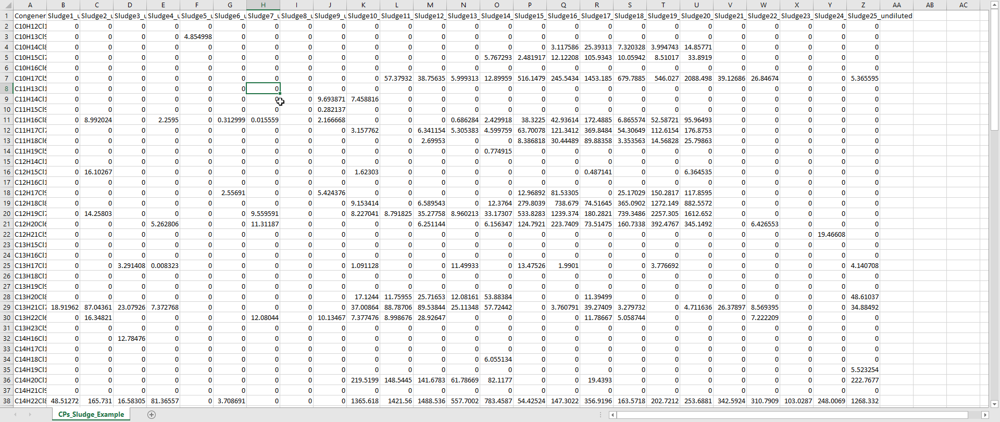
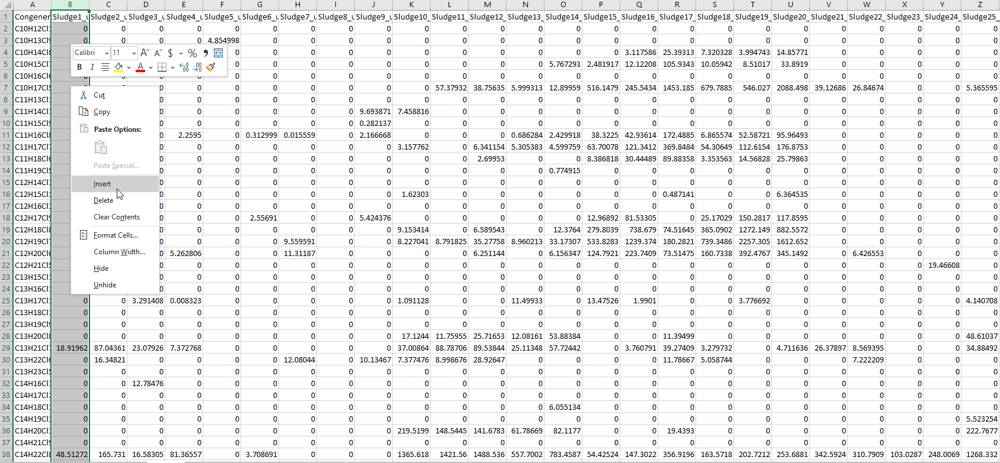
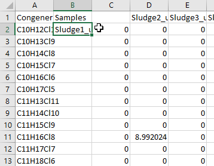
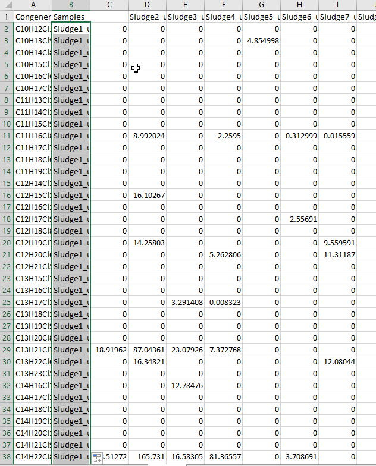
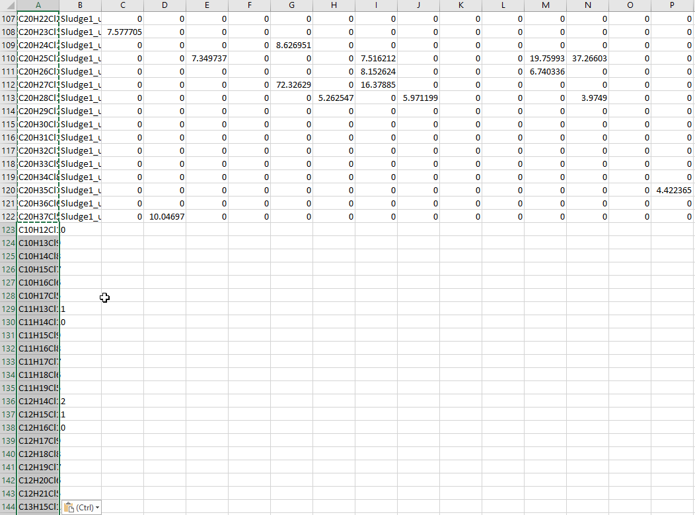
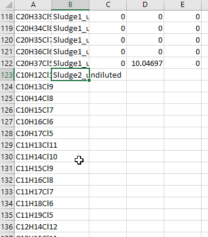
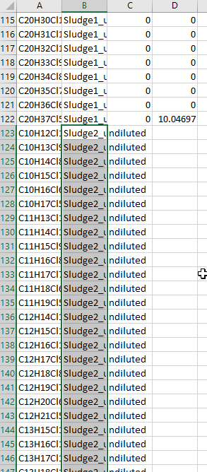
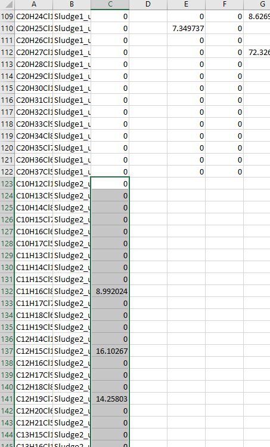
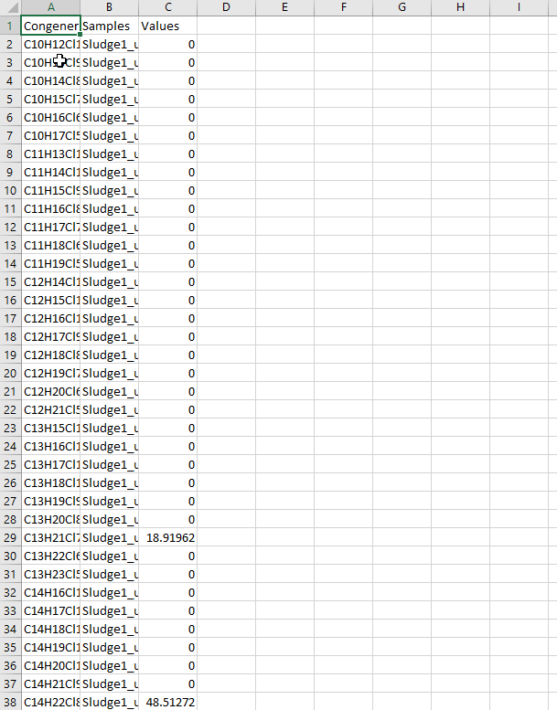

# Importing Data Into R

In this chapter we'll talk about how to organize your data in advance so that when you import it into R, you can go straight to making plots without having to run any additional code. 

## Long vs. Wide

As humans, we tend to prefer organizing data in "wide" format, meaning one column for each sample. This makes it easier to see everything in one place, but can make plotting tedious in both Excel and R.




What we need to do is convert our data into a format where all the numerical values are in one column, and all the sample names are in another column.


## Converting Data to Long Format in Excel

1. Insert a new column before your first data column (Click column letter, right-click within highlighted area, then click "Insert)


2. Add a title to this new column in the top cell (e.g. Samples)


3. Copy or drag the column header from your first data column into the second row of the column you just created. (i.e. Left 1 cell, down 1 cell)


4. Duplicate that cell until it fills the whole column (to the same number of rows as the rest of your data). The fastest way to do this is to hover the mouse over the bottom-right corner of the cell until the mouse turns into a small black crosshair icon. Double-click here and Excel should automatically fill the column with copies of that cell to the same number of rows as the adjacent columns. If this method does not work for you, you will instead have to copy and paste manually using Ctrl+C and Ctrl+V (or Cmd+C and Cmd+V if you're using a Mac).


5. Going back to the data column where you took the first sample label from, give it a new title (e.g. Values, Areas, Concentrations, etc.).


6. Now we start making the columns longer. For all the columns to the left of your "Samples" column, copy and paste the values (but NOT the header) below themselves in the same column, essentially duplicating the content of each of these columns.


7. Cut/drag the next sample header from the top row down to the first open cell of your "Samples" column.


8. Duplicate the cell with this sample title for the same number of rows as there are in the column(s) to the left of your "Samples" column, as before.


9. Cut and past the data from the corresponding column above into your "Values" column, below the previous data.


10. Repeat Steps 6 through 9 until all of your data (and corresponding headers) have been transferred to your "Samples" and "Values" columns. Delete any data left behind in all columns to the right of these two.


11. Make sure to save your file as a CSV, then copy and run the following code to import your long-formatted data into R.
``` {r, eval=FALSE}
library(tidyverse)
samples<-read_csv("your_file_name_here.csv")
```
``` {r, echo=FALSE, warning=FALSE, message=FALSE, error=FALSE}
library(tidyverse)
samples<-read_csv("data/CPs_Sludge_Example_long.csv")
print(samples)
```

## Converting Data to Long Format in R

1. Make sure your data file is saved as a CSV, then copy and run the following code to import the data into R.
``` {r, eval=FALSE}
library(tidyverse)
samples<-read_csv("your_file_name_here.csv")
```
I'll use the same data file as above to illustrate. This is what the data will look like right after running the above code:

``` {r, echo=FALSE, warning=FALSE, message=FALSE, error=FALSE}
library(tidyverse)
samples<-read_csv("data/CPs_Sludge_Example.csv")
print(samples)
```
2. Now we're going to use something called a "pivot" to convert our data from wide to long format. The "pivot_long" function we'll be using has 3 key parameters: cols, names_to, and values_to.

``` {r, eval=FALSE}
samples_long<-samples %>%
  pivot_longer(cols = !"Congener", names_to = "Sample", values_to = "Values")


```
 - *cols* tells the function which columns to pivot. Here I've used an exclamation mark to instead tell it to ignore the "Congener" column (i.e. pivot all columns EXCEPT for "Congener")
 - *names_to* is the name we wish to give to the column which will contain all the sample names which used to be headers
 - *values_to* is the name which will be assigned to the column which will contain all the data values

And this is the resulting long-form data:
``` {r, echo=FALSE}
samples_long<-samples %>%
  pivot_longer(cols= !"Congener", names_to="Sample", values_to="Values") %>%
  arrange(Sample, Congener) %>%
  print(n=30)

```
Not bad for only 2 steps, huh?

