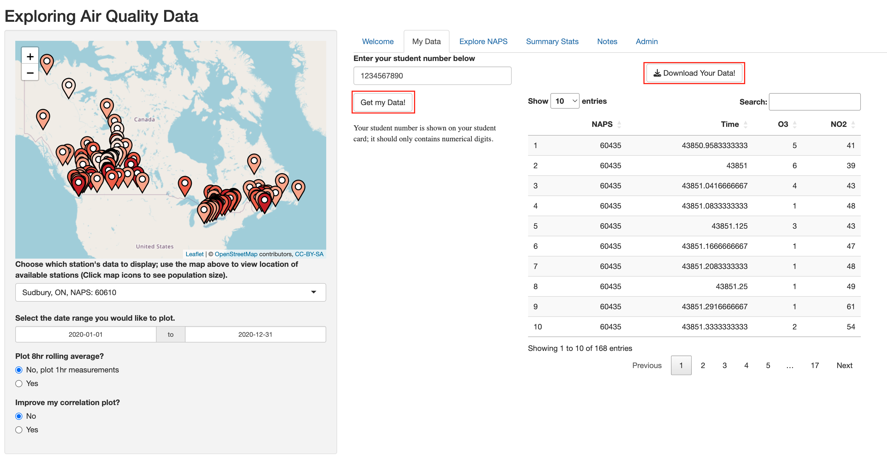
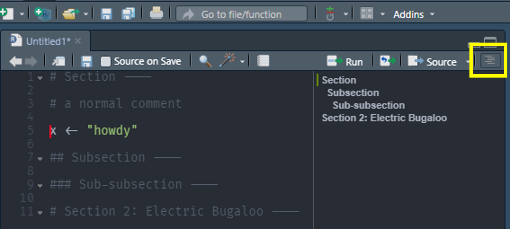
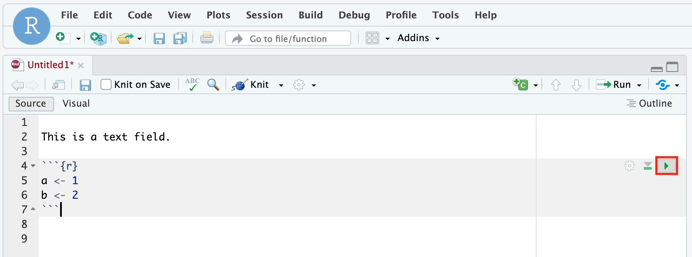
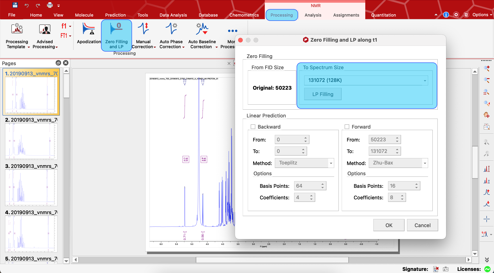

--- 
knit: "bookdown::render_book"
title: "R for Environmental Chemistry"
author: "David Hall, Steven Kutarna, Kristen Yeh, Hui Peng and Jessica D'eon"
date: "Last built on: `r Sys.Date()`"
url: 'https://uoftchem-teaching.github.io/R4EnvChem/'
site: bookdown::bookdown_site
description: "This is a proof-of-concept for a further full length textbook."
documentclass: book
always_allow_html: true
bibliography: references.bib

---


```{r}

library(tidyverse)
```

# Preface {-}

Howdy, 
  
This website is more-or-less the living result of a collaborative project between us. We're not trying to be an exhaustive resource for all environmental chemists. Rather, we're focusing on developing broadly applicable data science course content (tutorials and recipes) based in `R` chemistry courses and research. 

This book will is broken up into four sections: 

  - **Section 1: Getting Started in R** is a general guide for the complete novice that will help you install, setup, and run R code. 
  - **Section 2: How to Code in R** introduces the basics of R programming as well as a usual R workflow, and how to use R markdown to communciate your code with others. 
  - **Section 3: Data Wrangling** introduces data analysis workflows and showcases *how* you can use R and the `tidyverse` to import and clean up your data into a consistent format to tackle the vast majority of the data science/analysis problems you'll encounter in undergraduate environmental chemistry courses. 
  - **Section 4: Data Analysis Toolbox** provides code and theory behind the most common data analysis practices in environmental chemistry. These include linear regression analysis, a myriad of visualizations, etc. 
  - **Section 5: Notes for Env. Chem. Labs** consist of chapters specific to individual laboratory experiments. They rely upon knowledge from the previous three sections to introduce concepts unique to individual labs. 

We recommend that you read through Sections 1 and 2 in sequential order. These provide the foundation for the consistent data analysys workflow used throughout Sections 3 and 4. 

## Providing Feedback {-}

If you notice an error, mistake or if you have suggestions for adding features or improving the book, please reach out to us or flag an issue on [GitHub](https://github.com/UofTChem-Teaching/R4EnvChem/issues).

  - [Jessica D'eon](https://www.chemistry.utoronto.ca/people/directories/all-faculty/jessica-deon) at [jessica.deon@utoronto.ca](jessica.deon@utoronto.ca)
  
## Acknowlegements {-}

Additionally, we would like to thank Jeremy Gauthier, Andrew Folkerson, Mark Panas, and Stephanie Schneider for all of their comments, suggestions, and hard work integrating the concepts of this book into the *CHM410* Laboratory curriculum. 
  

  

<!--chapter:end:index.Rmd-->

<!-- This header creates the book section -->

# (PART\*) Part 1: Getting Started in R {.unnumbered}

# Intro to R and RStudio

You may have heard about the coding or the R programming language, but figuring out how to get started can be a hurdle; at least it was for us. In this guide, we will walk you through the process of setting up R and RStudio, both locally on your computer and remotely using the University of Toronto's JupyterHub R Studio server.

## R Language

**R** is the programming language we'll code in. R is hosted on the Comprehensive R Archive Network (CRAN) and is one of the most popular programming languages for statisticians and scientist alike due to its vast array of tools and packages.

A quick aside, but don't be intimidated by the term "coding". Coding is simply writing instructions for the computer to execute. The only catch is has to be in a language that both we, humans, and the computer can understand. For our needs we're using R, and like any language, R has it's own syntax, rules, and quirks which we'll cover in later chapters.

## RStudio

**RStudio** is a popular *integrated development environment (IDE)* specifically designed for working with R, providing a user-friendly interface and various productivity features. It's where you'll actually be typing your code and interacting with R. Again, R is a language, and you need somewhere to write it down to make use of it. Writing in English can be done with a pencil and notepad or a word processor filed with useful tools to help you write.

R and RStudio work in tandem to provide an efficient and seamless experience for data analysis, visualization, and model building. RStudio enhances the R workflow with features like code editing, interactive visualization, version control, and package management.

## Setting Up Your Environment

Students learning R have **two options**: working *locally* or *remotely*

*Working locally* involves installing R and RStudio on their computer, providing direct control over data and code without an internet connection. On the other hand, *working remotely* enables access to RStudio through a web browser, avoiding local installations and allowing collaboration. **We recommend working remotely**, leveraging platforms like the University of Toronto's JupyterHub for its convenience and stable R Studio environment, making learning R easier and more efficient. We will go into more details in the below paragraphs.

### Working Remotely (Recommended)

Working remotely means accessing R and RStudio from a remote server or cloud-based platform.

**UofT JupyterHub RStudio server**

To facilitate remote access to RStudio, the University of Toronto provides a JupyterHub R Studio server. This allows you to access RStudio from any web browser, eliminating the need for local installations. With this, you can perform data analysis, collaborate with others, and work on your R projects remotely with ease.

To get started, visit [UofT JupyterHub](https://r.datatools.utoronto.ca/). You will need to log in with your UofT credentials to access the RStudio environment.

-   While working remotely, you may need to upload data to the RStudio server or download analysis results. The RStudio interface allows you to upload files directly from your computer to the server and vice versa.
-   When working remotely, ensure that you save your R scripts and analysis files on the server. This will allow you to continue your work from any device with internet access.
-   Most R packages are pre-installed on the University of Toronto's R Studio server. However, if you require additional packages, we will soon learn how to install packages.

Remember that while working remotely, a stable internet connection is essential to ensure a smooth and uninterrupted experience. Additionally, always remember to save your work and log out properly after each session to maintain the security of your data. Happy coding!

### Working Locally

When you work locally, you need to install both R and RStudio on your personal computer or a machine that you physically have access to.

#### Downloading R and RStudio

You can download the latest build of **R** for your operating system [here](https://cloud.r-project.org/). Choose the appropriate version for your operating system (Windows, macOS, or Linux) and follow the installation instructions.

You can download the latest version of **RStudio** [here](https://www.rstudio.com/products/rstudio/download/#download).

Once you have both R and RStudio downloaded, go ahead and open up RStudio.

## Using RStudio

When you open your RStudio (either locally or remotely), you'll be greeted with an interface divided into numerous panes. We've highlighted the major ones in the image below:

{width="100%"}

Each pane serves a specific role:

-   **The console** allows you to directly type and run your code. It also provides messages, warnings, and errors from any code you run.
-   **The environment** window lists all variables, data, and functions you've created since the start of your coding session.\
-   **The viewer** shows your outputs, help documents, etc. which each has their own tab.

## Running R Code

As we've already seen, you can run bits of R code directly from the console. Throughout the book, code you can copy and run will look like this:

```{r}
2 + 2
```

Noticed that both the code (the first part) and what the code outputs (the second part) are shown. Throughout this book code outputs will be proceeded by `##`. You can run code directly from the console. It's handy for short and sweet snippets of code, something that can be typed in a single line. Examples of this is the `install.packages()` function, or to use R as a calculator:

```{r}
2 * 3
```

```{r}
pi * (10/2)
```

However, working like this isn't very useful Imagine printing a book one sentence at a time, you couldn't really go back and edit earlier work because it's already printed. That's why we write out code in *scripts*. *Scripts* are similar to recipes, in that they're a series of instructions that R evaluates from the top of the script to the bottom. More importantly, writing your code out in a script makes it *more readable* to humans (presumably this includes you). Don't undervalue the usefulness of legible code. Your code will evaluate in seconds or minutes whereas it may take you hours to understand what it does.

Let's open up a new script in RStudio by going to *File*-\>*New File*-\>*R Script*, or by clicking on the highlighted button in the image below.

{width="100%"}

This should open up a new window in the RStudio interface, as shown in the following image.

{width="100%"}

You can copy and paste the code above into the script, save it, edit it, etc. and ultimately run specific lines of code by highlighting them and pressing Ctrl+Enter (Cmd+Enter on Mac), or by clicking the "Run" button in the top right corner of the Scripts window. Whenever you copy code blocks from this website (or other online sources). If you're reading this book online, you can easily copy an entire block of code using the `copy` button in the top right corner of the code block.

We'll dive into the basics of coding in R in the next chapter.

## Customizing RStudio

As many of us spend an absurd amount of time staring at bright screens, some of you may be interested in setting your RStudio to Dark Mode.

You can customize the appearance of your RStudio interface by clicking *Tools*-\>*Global Options*, or *RStudio*-\>*Preferences* on Mac, then clicking "Appearance" on the left. Select your preferred Editor Theme from the list.

{width="100%"}

## Where to get help

While it's often tempting to contact your TA or Professor at the first sign of trouble, it's better to try and resolve your issues on your own. Given the popularity of R, if you've run into an issue, someone else has too and they've complained about it and someone else has almost certainly solved it! An often unappreciated aspect of coding/data science is knowing *how* to get help, *how* to search for it, and *how* to translate someone's solutions to your unique situation.

Places to get help include:

-   Google, Stack Overflow, etc. When in doubt Google it.
-   Using built-in documentation (`?help`)
-   reference books such as the invaluable [*R for Data Science*](https://r4ds.had.co.nz/index.html), which inspired this entire project.
-   And yes, when all else fails, holler at your TA/profs.

## Summary

In this chapter we've covered:

-   How to use RStudio to do R programming, both remotely and locally
-   Installing the `tidyverse()` package, the basis of the subsequent code in this book
-   How to customize the appearance of RStudio so you don't burn out your eyes at night

In the next chapter we'll break down how to setup your work in R for legibility, simplicity, and reproducibility. After all, the person cursing any of your sloppy work will invariably be you, so be kind to yourself, and do it right the first time.


## Exercise

Now that you've learned the basics of setting up and customizing R and RStudio, let's put some of that knowledge into practice.

### Setup

-   Access UofT JupyterHub RStudio server [here](https://r.datatools.utoronto.ca/).
-   (Optional) Change your RStudio appearance as you like.

### Basic R Commands

-   In the `Console` tab, write an expression to calculate 10 plus 5 and press `enter`.
-   Open a new R script and type in the following commands:

```{r}
x <- 10
y <- 5
z <- x + y
print(z)
```

(In the future, we will work with an R markdown instead of an R script, which we will explain more in the following chapters.)

-   Run the script. What is the output?

### USing the Help Function

-   Let's say you've come across a function in R that you don't know how to use, for example, `sqrt()`. Use the `?` command to access the documentation for this function from your console tab.
-   What does the `sqrt()` function do?

### Reflection

-   What are your first impressions of RStudio as an IDE? Do you have any prior experience with other programming languages or IDEs? If so, how does RStudio compare?

<!--chapter:end:intro.Rmd-->

# RStudio Projects

You're probably eager to start coding, but an equally important aspect is understanding the structure of your work. Knowing how to organize the files needed for your analysis and how to access them quickly is critical. Learning this early on will save you plenty of time and heartache down the line. So let's hold off on coding and consider *where* we're working on your computer.

Because we believe in it so much, we'll say it up top: **Always work inside an RStudio Project, and use a unique project for each lab/experiment.**

## Uploading Files to RStudio server on JupyterHub

When using the RStudio Server instance provided through JupyterHub, you may want to upload local data files, R scripts, or other relevant resources to work with them directly in RStudio. Here's a straightforward guide on how to accomplish this.

**Step-by-step guide**  

-   Once inside the RStudio server, you'll notice several panes. One of these is the `Files` pane, typically found in the bottom right corner. This pane displays the current directory's contents and allows you to manage files and folders.

-   In the `Files` pane, locate and click on the `Upload` button. 


-   Then, click `Choose File` button to navigate to the location of the files on your local computer that you wish to upload to the RStudio Server. 


-   This will prompt a file dialog to appear. Select the desired file(s) and click on Open or Choose (depending on your browser).

-   Once the file names appear in the RStudio interface, there might be a confirmation step to complete the upload. Click on `OK` or `Upload` to finalize the process.

-   After uploading, the uploaded files will appear in the `Files` pane. 


## Paths and directories

Before you get started with running your code, it is good to know where your analysis is actually occurring, or where your **working directory** is. The working directory is the folder where R looks for files that you have asked it to import, and the folder where R stores files that you have asked it to save.

RStudio displays the current working directory at the top of the console, as shown below, but can also be printed to the console using the command `getwd()`.


By default, R usually sets the working directory to the home directory on your computer. The `~` symbol denotes the home directory, and can be used as a shortcut when writing a file path that references the home directory.

You can change the working directory using `setwd()` and an absolute file path. Absolute paths are references to files which point to the same file, regardless of what your working directory is set to. In Windows, absolute paths begin with `"C:"`, while they begin with with a slash in Mac and Linux (i.e., `"/Users/Vinny/Documents"`). It is important to note that absolute paths and `setwd()` should **never** be used in your scripts because they hinder sharing of code -- no one else will have the same file configuration as you do. If you share your script with your TA or Prof, they will not be able to access the files you are referencing in an absolute path. Thus, they will not be able to run the code as-is in your script.

In order to overcome the use of absolute paths and `setwd()`, we strongly recommend that you conduct all work in RStudio within an **R project**. When you create an R project, R sets the working directory to a file folder of your choice. Any files that your code needs to run (i.e., data sets, images, etc.) are placed within this folder. You can then use relative paths to refer to data files in the project folder, which is much more conducive to sharing code with colleagues, TAs, and Profs.

## Importing a project

While you can create a project from scratch (discussed below), we've created a draft project template. Download it, and you'll have a working RStudio project that you can use as you follow along with the code in the rest of this chapter and the tutorial exercise.

1.  Downloading the template project (zip file) from the [GitHub repository here](https://github.com/DavidRossHall/R4EnvChem-ProjectTemplate); there are instructions on downloading at the bottom of the repositories webpage. 
2.  Upload the project zip file to JupyterHub, and unzip the folder.
2.  From RStudio click `File` -\> `Open Project...` and open the `R4EnvChem-ProjectTemplate.Rproj` file from the unzipped folder.

If you've followed the steps above you should have successfully downloaded and opened an RStudio project, and it should look like this:


Note how the project name is displayed on the top right. You can quickly switch between projects here which is useful if you'll be using R for many different labs/courses. As well, take note that the working directory has changed to the one where the RStudio project is located. Since you've downloaded the entire project, the working directory for the project includes the example scripts and data files you'll need to continue along with the remainder of this book. If you open the project folder (or access it from the `Files` tab) it should look like this:

```         
R4EnvChem-ProjectTemplate
│   R4EnvChem-ProjectTemplate.Rproj
│   Rscript-example.R
|   README.md
|   Rmarkdown-example.rmd
│
└───data
│       2018-01-01_60430_Toronto_ON.csv
│       2018-07-01_60430_Toronto_ON.csv
|       ...
│    
└───images
    │   DHall_TorontoPano.jpg
```

With the `R4EnvChem-ProjectTemplate.Rproj` file located in the main folder, this is important as we'll be able to readily look for files we stored in project subfolders such as `data` and `images`.

As you can see, the `R4EnvChem-ProjectTemplate.Rproj` file is located in the main folder, which RStudio will now treat as the working directory. Essentially it means we'll be able to quickly access files in project subfolders such as data and images without having to find out what the full file path is for your own computer. You'll appreciate this as you progress through this book.

In the future you can create your own projects from scratch, but it behooves you to follow the template layout. Having consistently named folders you'll use in every project will help simplify your life down the road.

## Creating an RStudio project

We've provided instructions on creating your own RStudio project from scratch, but you can always copy the template project folder above (or any for that matter) to re-purpose it as you see fit.

To create a new project: go to *File*-\>*New Project*, or click the button highlighted in the image below. Click *New Directory*, then *New Project*.

 You may want your project directory to be a sub-folder of an existing directory on your computer which already contains your data sets. If this is the case, click *Existing Directory* instead of *New Directory* at the previous step, and then select the folder of your choice.

Next, you'll be asked to choose a sub-directory name and location. Enter your selected name and choose an appropriate location for the folder on your computer. Click *Create Project*, and you should now see your chosen file path displayed in the *Files* tab of the Viewer pane:


When working on assignments for coursework, it is good practice to create a new R project for each assignment you work on. You should store the data, images, and any other files required for that assignment within the folder for the designated R project. You can create sub-folders for data and images, however, you may want to avoid making too many nested sub-folders, as this will make your paths long and tiresome to type. For a hypothetical course with 5 Labs (*cough* CHM410 *cough*), your coursework would look like this:

```         
CHM410
|
└─── Project 1
|     |
|     |   project1.Rproj
|     |   project1WriteUp.Rmd
|     └───data
|     │     ...
|     └───images
|           ...
|
└─── Project 2
      |
      |   project2.Rproj
      |   project2WriteUp.Rmd
      └───data
      │     ...
      └───images
            ...
...
```

With a separate folder for each experiment, and within each folder is an RStudio project, data, images, and other files required for *that* specific project. You shouldn't have nested R studio project as their is no benefit to this approach. Keep everything you need in one location, and no more.

## A sneak peek at `.Rmd` files

In this textbook, **you will exclusively work with `.Rmd` (R Markdown) files**, which offer a dynamic and interactive platform for blending code, text, and output.

Within an `.Rmd` file, you will encounter two distinct components: **code and text**.

-   *Text fields*, easily accessible by inserting regular text, allow you to compose explanations, context, and interpretations using plain language. These text fields can be created directly within the `.Rmd` document.
-   *Code chunks*, on the other hand, house R code that can be executed to generate results and graphics.

We will learn more about working with R markdown in the later chapters.

## Summary

In this chapter we've covered:

-   Importing the *R4EnvChem Project Template* so we have access to data for the tutorial (amongst other things)
-   The concept of paths and directories and how relative referencing withing a project greatly simplify this

## Exercise

For this chapter, you will create your own R project in UofT JupyterHub RStudio.

### Get Started:

-   Launch RStudio on the UofT JupyterHub server.

### Confirm Your Working Directory

-   Use the `getwd()` function in RStudio to display the current working directory in the console.
-   Ensure that the working directory in RStudio is the location where you'd like to set up your project.

### Creating Your Own Project:

-   Launch a new RStudio project. To do this, go to File -\> New Project.
-   Choose "New Directory".
-   Select "New Project".
-   Name the project "MyFirstRProject" and choose a convenient location to save it.
-   Click on "Create Project".
-   Use the `getwd()` function again to check your current working directory and confirm you're in the "MyFirstRProject" directory.
-   Inside the "MyFirstRProject" directory, create two new folders: "data" and "notebook". You can do this using RStudio's 'Files' tab or using the `dir.create()` function in the R console.

### Create Your Rmd File:

-   Within your "MyFirstRProject" directory, create a new `.Rmd` (R Markdown) file. You can do this by going to File -\> New File -\> R Markdown.
-   Name the file "MyFirstRMarkdown" and set HTML as the default output format.
-   In the text section of the `.Rmd` file, write one thing you remember about R and RStudio.
-   Insert a code chunk below what you wrote. In this code chunk, type `sum(1:10)`, which calculates the sum of numbers from 1 to 10.
-   Knit the document to see the results. This will produce an HTML or PDF document that shows both your text and the results of your R code.

### Upload a file from your computer:

-   Start by visiting the [Exploring Air Quality Data](https://uoft-chem.shinyapps.io/Air_Quality_App/) website and navigate to the `My Data` tab.
-   Once there, choose your preferred options on the left side. Then, on the right side, input your student number to retrieve your data. After your data displays, click on the `Download Your Data!` button to download the data as a CSV file (as shown in Figure 1).
-   Next, upload this downloaded data to the "data" folder within your RStudio project. If you've forgotten how, just refer back to the beginning of this chapter for a quick reminder.
-   After the upload, you'll be able to spot your data in the `Files` pane of RStudio. Simply click on the data's name and then select `View File` to peek at your raw data.




### Reflection:

-   Explain the difference between relative and absolute paths. Why are relative paths preferred when working in RStudio projects?

<!--chapter:end:r-studio-projects.Rmd-->

# How to Use This Textbook

Before we move onto the actual coding part, let's talk about how to navigate and utilize this textbook.

## Keep in mind

**1. Reading and Active Engagement**

This textbook encourages active learning. Don't merely read through the content---interact with it. Type out the code in your R environment and see the results firsthand. This hands-on approach will solidify your comprehension and enhance your practical skills. Observe how the code behaves, experiment with modifications, and observe how changes impact the outcomes.

**2. Curiosity and Inquisitiveness**

When you encounter code you don't fully understand or want to know the underlying process, lean into your curiosity. Don't hesitate to ask "Why?" and explore concepts beyond the immediate scope. Seek to understand the "why" and "how" alongside the "what."

**3. Resources and Further Explanation**

This textbook is a stepping stone to your R journey. Beyond the content provided, explore the references, suggested readings, and online resources mentioned throughout the chapters. Embrace a curious attitude and continue to expand your knowledge by delving into more advanced topics or specific applications that align with your interests.

**4. Discussion and Collaboration**

If you're using this textbook as part of a class or a group, engage in discussions with your peers. Sharing insights, clarifying doubts, and collaborating on exercises can enhance your learning experience. Don't hesitate to ask questions, seek help, and contribute to a supportive learning environment.

## Useful features

### Searching throughout the textbook

By clicking on the magnifying glass icon in the top left corner, you have the ability to search for keywords across the entire textbook without worrying about case sensitivity. For instance, entering "tidyverse" will display all chapters where tidyverse is mentioned. This gives you a glimpse into future chapters, offering a preview of the various ways you'll be engaging with tidyverse later on!

### How to view the original R Markdown of textbook chapters

This textbook is assembled from individual Rmd files, each representing a chapter. As you progress through the chapters, you may wish to examine the associated Rmd files to delve deeper into the code and its execution.

Simply click on the edit icon in the top left corner to be directed to the corresponding Rmd file on GitHub, opened in a new tab. You're encouraged to download these files, experiment with the code, and observe our Rmd formatting techniques!

{width="70%"}


## How to get more R practice

As you progress through each chapter, you'll find `.Rmd` (R Markdown) files available for practice and reinforcement. These Rmd files are designed to provide you with hands-on exercises that align with the concepts covered in the textbook.

-   Download the `.Rmd` file and open it in your preferred RStudio environment.
-   To enhance readability, you optionally click on the `Visual` tab at the top of the file view and work on the exercises.

### Working on Exercises

Within each Rmd file, you'll encounter straightforward exercises that give you the opportunity to apply what you've learned in each chapter. After completing an exercise, you can run the provided unittest cell to check your answers and receive instant feedback.

**Optional Extra Questions**

For those seeking an additional challenge and a chance to delve into topics beyond the textbook, we offer optional extra questions. Resources and explanations will be provided to support you in tackling these optional questions.

1.  Access the Repository:
    - **Recommended for those who have access to UofT JupyterHub**: Click on the following link to automatically clone the "R4EnvChem-Exercises" repository to your UofT JupyterHub:
  [R4EnvChem-Exercises Repository](https://r.datatools.utoronto.ca/hub/user-redirect/git-pull?repo=https%3A%2F%2Fgithub.com%2FUofTChem-Teaching%2FR4EnvChem-Exercises&urlpath=rstudio%2F)
    - **Alternatively**, you can directly download the files from this [repository](https://github.com/UofTChem-Teaching/R4EnvChem-Exercises).

2.  Work on the Exercise:
    - Once inside your JupyterHub's RStudio environment, in the "Files" pane you'll see a list of chapter folders. Each chapter folder contains the respective exercise Rmd files. Navigate to the desired chapter's folder and click on the exercise Rmd file you wish to work on. This will open the file in the RStudio editor.
    - Once the Rmd file is open, you can edit, run code chunks, and add your solutions directly in the file. Remember to save your progress regularly. If you want to generate an output document (like a PDF or HTML) to view your results, click on the "Knit" button usually located at the top of the script editor.


By engaging with these interactive Rmd files, you can actively reinforce your learning, gain practical experience, and explore R concepts in depth. We encourage you to make the most of these resources to enhance your R proficiency. Happy learning!

<!--chapter:end:this-textbook.Rmd-->

<!-- This header creates the chapter -->

# (PART\*) Part 2: How to Code in R {.unnumbered}

# R Coding Basics

Now that you know how to navigate RStudio and have a working project, we'll take a look at the basics of R. As we're chemist first, and not computer programmers, we'll try and avoid as much of the nitty-gritty underneath the hood aspects of R. However, a risk of this approach is being unable to understand errors and warnings preventing your code from running. As such, we'll introduce the most important and pertinent aspects of the R language to meet your environmental chemistry needs.

## Variables

We've already talked about how R can be used like a calculator:

```{r}
(1000 * pi) / 2

(2 * 3) + (5 * 4)
```

But managing these inputs and outputs is simplified with **variables**. Variables in R, like those you've encountered in math class, can only have one value, and you can reference or pass that value along by referring the variable name. And, unlike the variables in math classes, you can change that value whenever you want. Another way to think about it is that a variable is a box in which you store your value. When you want to move (reference) your value, you move the box (and whatever is inside of it). Then you can simply open the box somewhere else without having to worry about the hassle of what's inside.

You can assign the a value to a variables using `<-`, as shown below.

```{r}
x <- 12
x
```

In addition to reading code top to bottom, you often *read it from right to left*. `x <- 12` would be read as "take the value `12` and store it into the variable `x`". The second line of code, `x`, simply returns the value stored inside `x`. Note that when a variable is typed on it own, R will print out it's contents. You can now use this variable in snippets of code:

```{r}
x
x <- x * 6.022e23
x
```

Remember, R evaluates from right to left, so the code above is taking the number `6.022e23` and multiplying it by the value of `x`, which is 12 and storing that value back into `x`. That's how we're able to modifying the contents of a variable using it's current value. You can also overwrite the contents of a variable at anytime (i.e. `x <- 25`).

Note that variable names are case sensitive, so if your variable is named `x` and you type `X` into the console, R will not be able to print the contents of `x`. Variable names can consist of letters, numbers, dots (`.`) and/or underlines (`_`). Here are some rules and guidelines for naming variables in R:

-   **Variable Name Requirements** as dictated by R
    -   names must begin with a letter or with the dot character. `var` and `.var` are acceptable.
    -   Variable names *cannot* start with a number or the `.` character cannot be preceded by number. `var1` is acceptable, `1var` and `.1var` are not.
    -   Variable names *cannot* contain a space. `var 1` is interpreted as two separate values, `var` and `1`.
    -   Certain words are reserved for R, and cannot be used as variable names. These include, but are not limited to, `if`, `else`, `while`, `function`, `for`, `in`, `next`, `break`, `TRUE`, `FALSE`, `NULL`, `Inf`, `NA`, and `NaN`

Good names for variables are short, sweet, and easy to type while also being somewhat descriptive. For example, let's say you have an air pollution data set. A good name to assign the data set to would be `airPol` or `air_pol`, as these names tell us what is contained in the data set and are easy to type. A bad name for the data set would be `airPollution_NOx_O3_June20_1968`. While this name is much more descriptive than the previous names, it will take you a long time to type, and will become a bit of a nuisance when you have to type it 10+ times to refer to the data set in a single script. Please refer to the [*Style Guide*](http://adv-r.had.co.nz/Style.html) found in *Advanced R* by H. Wickham for more information.

Lastly, R evaluates code from top-to-bottom of your script. So if you reference a variable it must have already been created at an earlier point in your script. For example:

```{r, error = TRUE}
y + 1
y <- 12
```

The code above returns the `object 'y' not found` error because we're adding `+ 1` to `y` which hasn't been created yet, it's created on the next line. These errors also pop up when you edit your code without clearing your workplace. All variables created in a session are stored in the working environment so you can call them, even if you change your code. This means you can accidentally reference a variable that isn't reproduced in the latest iteration of your code. Consequently, a good practice is to frequently clear your work-space suing the 'broom' button in the *environment* pane. This will help you to ensure the code you're writing will is organized in the correct order; see [Saving R scripts] for why this is important.

## Data types

Data types refer to how data is stored and handled by and in R. This can get complicated quickly, but we'll focus on the most common types here so you can get started on your work. Firstly, here are the data types you'll likely be working with:

-   **character**: `"a"`, `"howdy"`, `"1"`, is used to represent string values in R. Basically it's text that you'd read. Strings are wrapped in quotation marks. For example, `"1"`, despite being read as number by us, is stored as a character and treated as such by R.
-   **numeric** is any real or decimal number such as `2`, `3.14`, `6.022e23`.
-   **integer** such as `2L`, note the 'L' tells R this is an integer.\
-   **logical** is a Boolean logic value, they can only be `TRUE` or `FALSE`

Sometimes R will misinterpret a value as the wrong data type. This can hamper your work as you can't do arithmetic on a string! So let's look at some helpful functions to test the data type of a value in R, and how to fix it.

```{r, error = TRUE}
x <- "6"
x / 2
```

"non-numeric argument to binary operator" is a commonly encountered error, and it's simply telling you that you're trying to do math on something you can't do math on. You might think if `x` is 6, why can't I divide it by 2? Let's see what type of data `x` is:

```{r}
is.numeric(x)   # test if numeric 
is.logical(x)   # test if logical
is.integer(x)   # test if integer 
is.character(x) # test if character
```

So the value of `x` is a character, in other words R treats it as a word, and we can't do math on that (think, how would you divide a word by a number?). So let's convert the data type of `x` to numeric to proceed.

```{r}
x 
x <- as.numeric(x)
is.numeric(x)
x
x / 2
```

So we've converted our character string `"6"` to the numerical value `6`. Keep in mind there are other conversion functions which are described [elsewhere](https://www.geeksforgeeks.org/conversion-functions-in-r-programming/), but you can't always convert types. In the above example we could convert a character to numeric because it was ultimately a number, but we couldn't do the same if the value of `x` was `"six"`.

```{r, error = TRUE}
x <-"six"
x <- as.numeric(x)
x
```

"NAs introduced by coercion" means that R didn't know how to convert "six" to a numeric value, so it instead turned it into an *NA*, representing a missing value.

## Data structures

Data structures refers to how R stores data. It's easy to get lost in the weeds here, so we'll start with the focus on the most common and useful data structure for your work: *data frames*.

### Data Frames
Data frames consist of data stored in rows and columns. If you've ever worked with a spreadsheet (i.e. *Excel*), it's essentially that with the caveat that *all data stored in a column must be of the same type*. Again, different columns can have different data types, but *within* a column all the data needs to be the same type. R will convert your data otherwise to make it all the same. A common error is a single character in a column of numerical values leading to the entire column to be interpreted as character values; similar to what we discussed above. Errors like this most often stem from mistakes in recording and importing your data so be careful!

#### Creating a new dataframe from scratch

Let's see how we can create a dataframe by explicitly listing out the values.
```{r}
# data
names <- c("Alice", "Bob", "Charlie", "David", "Eve")
ages <- c(20, 21, 22, 23, 19)
food <- c("Bubble Tea", "Pineapple Pizza", "Diet Pepsi", "Korean BBQ", "Sushi AYCE")

# Creating the dataframe
students <- data.frame(Name = names, Age = ages, Food = food)

# Displaying the dataframe
print(students)
```


#### Reading data from a file
Obviously when we have many more data, it would be unrealistic to manually list them out in our code. So instead, we can create a dataframe by reading a file.

From the `R4EnvChem-ProjectTemplate`, downloaded in [Importing a project], let's import some real data as follows by typing the following into the console:

```{r}
airPol <- read.csv("data/2018-01-01_60430_Toronto_ON.csv")
```

`read.csv()` is a useful R built-in function which, as you might guess from its name, can read a `.csv` file and convert it into a data frame. The data we just imported contains air quality data measured in downtown Toronto around January 2018. The "Column specification" summary printed to the console is a useful feature of `read.csv()`. It tells you what data type was determined for each column when it was imported. Note that *double* is simply another term for the *numeric* data type. Some of the variables are:

-   `naps`, `city`, `p`, `latitude`, `longitude` to tell you where the data was measured.
-   `data.time` for when the measurements were taking. Note this is a `datetime`, which is a subset of numeric data. The values contained herein correspond to time elements such as year, month, data, and time.
-   `pollutant` for the chemical measured
-   `concentration` for the measured concentration in parts-per-million (ppm).

We've assigned it to the variable: `airPol`. This is so we can reference it and make use of it later on (see below). If we didn't do this our data would simply be printed to the console which isn't helpful. Let's take a look at the first few rows of the data:

```{r}
head(airPol)
```

Here we see that the data is stored in a **tidy** format, which is to say each column is a variable and each row is an observation. So reading the first row, we know that the Toronto 60430 station on 2018-07-01 at midnight measured ambient O~3~ concentrations of 46 ppm (Note the concentration column isn't printed due to width). The concept of tidy data is important and is integral to working in R. It's discussed further in [Tidying Your Data]. Lastly, R will only output a small chunk of our data for us to see. If you'd like to see it in full, go the the `Environment` pane and double click on the `airPol` data.

### Accessing data in subfolders

Note that `read.csv()` requires us to specify the file name, but in the above example we prefixed our file name with `"data/2018..."`. This is because the `.csv` file we want to open is stored in the `data` sub-folder. By specifying this in the prefix, we tell `read.csv()` to first go to the `data` sub folder in the working directory and *then* search for and open the specified data file.

What we've done above is called *relative referencing* and it's a huge benefit of projects. The actual data file is stored somewhere on your computer in a folder like `"C:/User/Your_name/Documents/School/Undergrad/Second_Year/R4EnvChemTemplate/data/2018-01-01_60430_Toronto_ON.csv"`. If we weren't in a project, this is what you'd need to type to open your file, but since we're working in the project, R assumes the long part, and begins searching for files inside the project folder. Hence, why we only need `"data/2018..."`. Not only is this much simpler to type, and but it makes sharing your work with colleagues, TAs, and Profs (and yourself!) much easier. In other words, if you wanted to share your code, you would send the entire project folder (code & data) and the receiver could open it and run it as is.

###  Other data structures

R has several other data structures. They aren't as frequently used, but it's worth being aware of their existence. Other structures include:

-   **Vectors**, which contain multiple elements *of the same type*; either numeric, character (text), logical, or integer. Vectors are created using `c()`, which is short for combine. A data frame is just multiple vectors arranged into columns. Some examples of vectors are shown below.

```{r}
num <- c(1, 2, 3, 4, 5)
num

char <- c("blue", "green", "red")
char

log <- c(TRUE, TRUE, TRUE, FALSE, FALSE, FALSE)
log
```

-   **Lists** are similar to vectors in that they are one dimensional data structures which contain multiple elements. However, lists can contain multiple elements of different types, while vectors only contain a single type of data. You can create lists using `list()`. Some examples of lists are shown below. You can use `str()` to reveal the different components of a list, in a more detailed format than if you were to simply type the assigned name of the list.

```{r}
hi <- list("Greetings" = "Hello", "someNumbers" = c(5,10,15,20), "someBooleans" = c(TRUE, TRUE, FALSE))
str(hi)
hi
hi$Greetings
```

There are many freely available resources online which dive more in depth into different data structures in R. If you are interested in learning more about different structures, you can check out the [*Data structure*](http://adv-r.had.co.nz/Data-structures.html) chapter of *Advanced R* by Hadley Wickham.


## Conditional Statements

In programming, it's often necessary to make decisions and execute certain portions of code based on specific conditions. That's where conditional statements come into play.

In R, the primary mechanism to make decisions is the `if-else` construct. With it, you can evaluate a condition and, based on whether it's true or false, choose which code block to execute.

### Understanding R Syntax
Before diving into conditional statements, let's take a moment to understand the syntax used in R.

R, like many programming languages, uses a combination of parentheses `()`, curly braces `{}`, and other symbols to organize and structure the code.

1.  Parentheses `()`: These are primarily used to enclose arguments of functions and conditions in control statements, like if. For example, in `if (x > 5)`, the condition `x > 5` is enclosed in parentheses.

2.  Curly Braces `{}`: These are used to group multiple lines of code into a block. This is particularly useful in control statements where more than one line of code should be executed based on a condition.

The reason the curly bracket might span multiple lines is for readability. It makes it clear where a block of code begins and ends. While it's possible to write if-else statements without braces if only one statement is being conditioned, it's a good practice to always use them for clarity.

Now, with this understanding, let's move on to how R uses these in conditional statements.

### The basic `if` statement

```{r}
x <- 10

# In this example, R checks if x is greater than 5. 
if (x > 5) {
  print("x is greater than 5!")
}
```

### Expanding with `else` and `else if`

For situations where you want to specify actions for both true and false conditions, you can add an `else` section.

```{r}
x <- 3

if (x > 5) {
  print("x is greater than 5!")
} else { # if x <= 5
  print("x is 5 or less!")
}
```

Here, because `x` is 3 (which is not greater than 5), R prints "x is 5 or less!".

For situations where multiple conditions need to be evaluated in sequence, you can use the else if construct. This allows you to add more conditions after the initial if.

```{r}
x <- 6

if (x > 10) {
  print("x is greater than 10!")
} else if (x > 5) {
  print("x is greater than 5 but less than or equal to 10!")
} else {
  print("x is 5 or less!")
}
```


In terms of syntax, it's important to remember:

-   Always enclose the condition you're testing within parentheses `()`.  
-   Use curly braces `{}` to group the lines of code that should be executed for a particular condition.  
-   Make sure each else if or else follows an if or another else if. They cannot stand alone.

## R built-in functions

Built-in functions are the essential tools that allow you to perform a wide range of tasks without having to write the underlying code from scratch. These functions are part of the R language itself and are readily available for your use.

In this chapter, you've already come across a few built-in functions that are incredibly useful. For instance, you've used the `read.csv()` function to import data from CSV files into your R environment. Additionally, the `as.numeric()` function has been employed to convert data to numeric format, and the `list()` function has aided in creating lists to organize and store data elements.

### Exploring More Built-In Functions

Let's delve into a few more built-in functions that are integral to your R experience:

**print()**: The `print()` function displays output on the console. When you want to see the result of an expression or the contents of a variable, `print()` makes it effortless.

```{r}
print("Hello, R!")
```

**mean()**: The `mean()` function calculates the average of a numeric vector.

```{r}
mean(c(5, 10, 15, 20))
```

**max()/min()**: With the `max()` function, you can effortlessly determine the maximum value within a numeric vector. Similarly, `min()` function returns the minimum value within a vector.

```{r}
max(c(5, 10, 15, 20))
min(c(5, 10, 15, 20))
```

### Function documentation

An often unappreciated aspect of packages is that they not only contain functions we can use, but documentation. Documentation provides a description of the function (what it does), what arguments it takes, details, and working examples. Often the easiest way to learn how to use a function is to take a working example and change it bit by bit to see how it works etc. To see documentation check the "help" tab in the "outputs" window or type a question mark in front of a functions name:

```{r, eval = FALSE}
# Takes you to the help document for the read.csv function
?read.csv
```

You can also write you're own functions. Please see [Programming with R] for additional details.


## Summary

In this chapter we've covered:

-   The basics of coding in R including variables, data types, and data structures (notably `data.frames`).
-   Importing data from your project folder into R
-   Using if-else structure to build a conditional logic
-   Using R built-in functions and opening function documentations

Now that you're familiar with navigating RStudio and some basic R coding, you may have realized that working the console can get real messy, real quick. Read on to [Workflows for R Coding] where we'll discuss R workflows to make everyone's lives easier.

```{r child='end-of-chapter-exercise-temp.Rmd'}
```

<!--chapter:end:running-r-code.Rmd-->

# Workflows for R Coding

In the previous chapter, we conducted our coding in the console, which quickly became unwieldy. To address this, we transition to using R Markdown `.Rmd` files, which we briefly talked about before. Instead of running code interactively in the console, we write code blocks within the .rmd files, creating a comprehensive document that others can follow. 


## Creating or opening an R Markdown document

To start an R Markdown document:

  1. Go to *File* -> *New File* -> *R Markdown*
  2. Then save your document by going to *File* -> *Save As...*. 
    a. Make sure to save your file with the `.Rmd` suffix.
    b. **Save your script in your project folder**, otherwise you'll run into issues.

We've also provided an example script in the R4EnvChem project template. Assuming you're currently in the template project you can open the script as follows:

  1. Go to `File` -> `Open File` -> open the `Rscript-example.Rmd` file. This action will open a new pane above the console, dedicated to writing your R Markdown content.


## Workspace and what's real

We've already mentioned the *environment* pane that displays objects present in your R session. While they are useful to work with, they're not considered *real*. That is to say, if you close your R session, those objects will be lost. And while RStudio allows you to save a working environment (and it's associated objects), it's crucial to understand that *only your saved scripts/markdown documents are real*. You can't readily share your working environment, and even so it's bad practice as you may reference a previous iteration of an object giving you erroneous results. Think back to the chemistry labs: you may jot notes down on loose leaf, but only what's written in your lab book is considered real... we'll that's how it's supposed to work anyways. 

The idea is everything you need can be generated from the original data and the instructions in your R script/markdown document. Anyone should be able to take your data and your code and get the same results you got. This is paramount for the reproducibility of your work and your results. 

## Saving R Markdown

To save an R Markdown document:

-   Navigate to *File -> Save* or use the 'Save' icon in the top left corner of your document.

Content saved to an .Rmd file is considered real and self-contained. Variables, plots, or datasets that appear in your workspace or the `Environment` window aren't self-contained. Whenever you close RStudio, any objects in R that are not considered *real* will be lost in that R session. Furthermore when you need to share your code (for school or publication) you’ll need to share your data and your script, but never your work-space. This is to increase predictability and helps people (and you) to make sure your work is reproducible, an under appreciate hallmark of science.

### What should I save?

At this point in the chapter, two things should be clear: 

1. R Markdown documents saved to `.Rmd` files are the real record of your work.
2. Objects in your work-space/environment are not real, and will not be available to you after you close and re-open RStudio unless you re-run the code used to generate the work-space. 

So what is important to save in R, and how often should you save these files? 

-   Save the R Markdown scripts you write, and do so regularly. Even minor changes are worth saving before closing RStudio, as it's easy to forget those small differences upon return.
-   Ensuring that even if you lose an object in your workspace, your R Markdown script contains the code needed to recreate that object.
-   Generate the object before referencing it in subsequent commands. This ensures that variables are generated in the workspace before being referenced by later commands when running scripts from top to bottom.

By adhering to these practices, you ensure your R Markdown documents remain accurate, your code is complete, and your work remains reproducible.


### Saving objects

In some cases, your code may be used to generate large datasets which require quite a bit of time to create. It can be quite tedious to re-run the code used to generate these large data sets every time you open RStudio, and you might find yourself wanting to save the data to a *real* file that you can simply import the next time you open the application. Also, you may be finished with your analysis and want to save the final data. You can save your the data contained in your data frame as a `.csv` file using `write.csv()`. 


```{r, eval = FALSE}
# dummy data frame to save
df <- data.frame(x = c(1,2,3),
                 y = c("yes", "no", "maybe"))

write.csv(x = df, 
          file = "testData.csv")
```

Breaking it down: 

  - we created a dummy data frame `df`; in reality you'll already use a data frame from your analysis.
  - we called `write.csv()` and
    - `x = df` specifies we want to save the data.frame `df`
    - `file = "data/testData.csv"` specifies *where* we want the file to save (in the *data* sub-directory, more later), and *what* our file will be called (*testData.csv*). It's important to specify the file extension so R knows how to save it. 

## Script formatting

You should now be familiar with how to open the Scripts window, as well as some of the advantages of typing your code into this window rather than into the console directly. Before you write your first script, let's review some basic script formatting. 

Before you enter any code into your script, it is good practice to fill the first few lines with text comments which indicate the script's title, author, and creation or last edit date. You can create a comment in a script by typing `#` before any text. An example is given below.

```{r}
#Title: Ozone time series script
#Author: Georgia Green
#Date: January 8, 2072
```

Below your script header, you should include any packages that need to be loaded for the script to run. Including the necessary packages at the top of the script allows you, and anyone you share your code with, to easily see what packages they need to install. This also means that if you decide to run an entire script at once, the necessary packages will always be loaded before any subsequent code that requires those packages to work. 

The first few lines of your scripts should look something like the following.

```{r eval = FALSE}
# Title: Example R Script for Visualizing Air Quality Data 
# Author: John Guy Rubberboots
# Date: 24 June 2021

# 1. Packages ---- 

# Install tidyverse if you haven't already 
#install.packages("tidyverse")

library(tidyverse)


```

The rest of your script should be dedicated to executable code. It is good practice to include text comments throughout the script, and in between different chunks of code to remind yourself what the different sections of code are for (i.e., `# 1. Packages ---- ` in the above example). This also makes it easy for anyone you share your code with to understand what you're trying to do with different sections within the script.

You can also use headers and sub-headers in your scripts using `#`, `##`, and `###` before your text and `---` after as shown below:
```{r, eval = FALSE}
# Section ----
## Subsection ----
### Sub-subsection ----
```

Headings and subheadings are picked up by RStudio and displayed in the Document Outline box. You can open the Document Outline box by clicking the button highlighted in the image below. Use of these headings allows easy navigation of long scripts, as you can navigate between sections using the Document Outline box. 


{width=100%}

## Viewing data and code simultaneously

Before we get into more about coding and workflows, you may find yourself wanting to be able to to view your scripts and data side-by-side. You can open a script, plot, or data set in a new window by clicking and dragging the tab in RStudio or by clicking the button highlighted in the image below. 

{width=100%}

## Troubleshooting error messages

In the previous section, you were introduced to your first error message in R, and we briefly discussed how to resolve the issue. As you begin to code, many of your errors will be routine syntax error such as unmatched parenthesis (the dreaded "Incomplete expression:"). Fortunately, RStudio will highlight any syntax errors in your code with a red squiggly line and an 'x' in the side bar, as shown below. You can hover over the 'x' to see what is causing the error. 


In the above message, R is telling you that it is not sure what to do with `b`. As mentioned previously, variable assignment is done in the format `name <- assignment`. However, in the above example, the variable assignment statement is written as `name name <- assignment`. Since variable names cannot contain spaces, R reads `a b` as two separate input variable names, not as a single string. If you wanted to assign a value of 0 to both `a` and `b`, you would need to write the statement once per variable, as shown below.

```{r}
a <- 0
b <- 0
```

Let's look at another example. Some functions require you to write code with nested parentheses. A good example would be the `aes()` argument that is called inside of `ggplot()`, as shown below.

```{r message = FALSE, echo = FALSE}
library(readr)
library(ggplot2)

#import ozone data set
airPol <- read_csv("data/2018-01-01_60430_Toronto_ON.csv")
```

```{r eval = FALSE}
#plot ozone concentration vs. time
ggplot(data = airPol, 
       aes(x = date.time,
           y = concentration,
           colour = pollutant)) +
  geom_point()
```

(For more detail about importing and using `ggplot2`, please re-visit Chapter 2, section 2.3.4, or see Chapter 11.)

If you were to forget one of the parentheses in the previous line of code, RStudio would highlight it similar to below:


Here R is telling you that you have an unmatched opening bracket. To resolve the error, simply add a closing bracket to match. 

The `expected ',' after expression` is a common error that you will see accompanying unmatched opening brackets. Sometimes you might get this error in the console after running code that is missing a bracket somewhere. It is good practice to check your parentheses a few times before running your code to make sure that all the commands are closed, and that R doesn't keep waiting for you to continue inputting code after you've click *Run*. If you notice that the `>` in your R console has turned into a `+`, this is likely because you've just run a command that is missing a closing bracket, and thus, R is not aware that your code is finished. Simply input a closing bracket into the console, and the `>` should return.

While the script window is very useful for pointing out syntax errors in your code, there are many other errors that can arise in RStudio which the script window is not able to capture. These are generally errors that arise from trying to execute your code, rather than from mistakes in your syntax.

The following is a prime example of such an error.

```{r error = TRUE}
q <- 8 + "hi"
```

Here we are trying to add a numeric value (8) to a character string ("hi"), then set the sum of the two to variable `q`. R has given us an error in return, because there is no logical way for R to add a numeric value to non-numeric text. The error indicates that we have passed a `non-numeric argument to binary operator`, meaning we have used a non-numeric data type for an expression which is exclusively reserved for numeric data. 

It is important to be aware of error codes as many functions require specific data types as their inputs. You can alwways consult the function documentation by via the *Help* tab of the *Viewer* pane or by typing a `?` followed by the name of the function in the console (i.e. `?ggplot`). 

## Summary

In this chapter we've covered:

  - R workflows in the context of projects and markdown documents
  - What's considered *real* when working in RStudio
  - How to format your markdown for legibility (Remember you're the one who's going to be stuck rereading it!)
  - Troubleshooting some common error messages
  
Now that you're familiar the above, we'll introduce [Using R Markdown], a way to combine your R code, it's outputs, and your writing all in one dynamic document (like your lab reports!).  

```{r child='end-of-chapter-exercise-temp.Rmd'}
```

<!--chapter:end:r-workflows.Rmd-->

# Using R Markdown

Before going into more details of R Markdown, let's talk about two common options in the world of R coding: the R script (.R) and the dynamic R Markdown document (.Rmd).

**R Scripts**: Imagine coding as crafting a detailed recipe of R commands---a script---that guides R through specific tasks. Conventional R scripts (.R files) are dedicated to these commands, handling calculations and operations. However, as scripts grow, they become complex and sharing insights alongside code becomes challenging.

**R Markdown**: R Markdown (.Rmd) elevates the coding experience by harmonizing code with explanatory text. Within an R Markdown document, code blocks act like individual scripts---smaller, more focused units. These blocks merge code with explanations seamlessly, creating a coherent narrative. Unlike isolated scripts, R Markdown emphasizes both code functionality and its significance within the context. For these reasons, we'll be sticking to working in `.Rmd` files.

In a nutshell, R Markdown allows you to analyse your data with R and write your report in the same place (this entire book was written with R Markdown). This has loads of benefits including a [*reproducible workflow*](https://www.youtube.com/watch?v=s3JldKoA0zw), and streamlined thinking. No more flipping back and forth between coding and writing to figure out what's going on.

Let's run some simple code as an example:

```{r}
x <- 2+2
x
```

What we've done here is write a snippet of R code, ran it, and printed the results (as they would appear in the console). While the above code isn't anything special, we can extend this concept so that our R markdown document contains any data, figures or plots we generate throughout our analysis in R. For example:

```{r, message = FALSE, fig.cap= "Time series of 2018 ambient atmospheric O~3~, NO~2~, and SO~2~ concentrations (ppb) in downtown Toronto", fig.height=2}
library(tidyverse) 
library(knitr)

airPol <- read_csv("data/2018-01-01_60430_Toronto_ON.csv")

ggplot(data = airPol, 
       aes(x = date.time, 
           y = concentration, 
           colour = pollutant)) + 
  geom_line() +
  theme_classic()

sumAirPol <- airPol %>%
  drop_na() %>%
  group_by(city, naps, pollutant) %>%
  summarize(mean = mean(concentration), 
            sd = sd(concentration), 
            min = min(concentration), 
            max = max(concentration))

knitr::kable(sumAirPol, digits = 1)
```

Pretty neat, eh? You might not think so, but let's imagine a scenario you'll encounter soon enough. You're about to submit your assignment, you've spent hours analyzing your data and beautifying your plots. Everything is good to go until you notice at the last minute you were supposed to *subtract* value `x` and not value `y` in your analysis. If you did all your work in *Excel* (tsk tsk), you'll need to find the correct worksheet, apply the changes, reformat your plots, and import them into word (assuming everything is going well, which is never does with looming deadlines). Now if you did all your work in R markdown, you go to your one `.rmd` document, briefly apply the changes and re-compile your document.

A lot of scientists work with R Markdown for writing their reports for numerous reasons:

1.  **Integrated Workflow**: Combines narrative, data analyses, and visualizations in one document, promoting reproducibility and transparency.
2.  **Versatility**: Easily exports to diverse formats like HTML, PDF, and Word, catering to different dissemination needs.
3.  **Plot Management**: Offers precise control over visual presentations, allowing for tailored figure sizes, resolutions, and formats.

In sum, R Markdown provides a streamlined platform for scientific communication, merging data analysis with polished publication seamlessly.

## Getting started with R Markdown

As you've already guessed, R markdown documents use R and are most easily written and assembled in RStudio. If you have not done so, revisit Chapter 1:[Installing R]. Once setup with R and R Studio, you'll need to install the `R Markdown` and `tinytex` packages by running the following code in the console:

```{r, eval = FALSE}
# These are large packages so it'll take a couple of minutes to install

install.packages("R Markdown") # downloaded from CRAN

install.packages("tinytex")
tinytex::install_tinytex()  # install TinyTeX

```

The `R Markdown` package is what we'll use to generate our documents, and the `tinytex` package enables compiling documents as PDFs. There's a lot more going on behind the [scenes](https://R%20Markdown.rstudio.com/lesson-2.html), but you shouldn't need to worry about it.

Now that everything is setup, you can create your first R Markdown document by opening up R Studio, selecting `FILE -> NEW FILE -> R Markdown`. A dialog box will appear asking for some basic input parameters for your R markdown document. Add your title and select *PDF* as your default output format (you can always change these later if you want). A new file should appear that's already populated with some basic script illustrating the key components of an R markdown document.

### Understanding R Markdown

Your first reaction when you opened your newly created R markdown document is probably that it doesn't look anything at all like something you'd show your prof. You're right, what you're seeing is the plain text code which needs to be compiled (called *knit* in R Studio) to create the final document. When you create a R markdown document like this in R Studio a bunch of example code is already written. You can compile this document (see below) to see what it looks like, but let's break down the primary components. At the top of the document you'll see something that looks like this:

```{r, eval = FALSE}
---
title: "Temporal Analysis of Foot Impacts While Birling Down the White Water"
author: "Jean Guy Rubberboots"
date: "24/06/2021"
output: pdf_document
---
```

This section is known as the *preamble* and it's where you specify most of the document parameters. In the example we can see that the document title is ["Temporal Analysis of Foot Impacts While Birling Down the White Water"](https://www.youtube.com/watch?v=upsZZ2s3xv8), it's written by Jean Guy Rubberboots, on the 24th of June, and the default output is a PDF document. You can modify the preamble to suit your needs. For example, if you wanted to change the title you would write `title: "Your Title Here"` in the preamble. Note that none of this is `R` code, rather it's `YAML`, the syntax for the document's metadata. Apart from what's shown you shouldn't need to worry about this much, just remember that indentation in [YAML matters](https://bookdown.org/yihui/R%20Markdown/pdf-document.html).

#### Output Options in R Markdown

You can compile your entire document using the *Knit document* button. This is a great way to tinker with your code before you compile your document. Knitting will sequentially run all of your code chunks, generate all the text, knit the two together and output a PDF. You'll basically save this for the end.

R Markdown offers flexibility in terms of output formats, allowing users to knit their documents into various outputs tailored to their needs.

**Three Common Output Options:**

-   **HTML** (html_document): Produces an HTML file, suitable for hosting on websites or for sharing via email. This format allows for interactive content, making it ideal for interactive graphs or web applications.

-   **PDF** (pdf_document): Creates a PDF file. This format is best for documents intended for print or formal submissions, as it maintains consistent formatting across different devices and platforms.

-   **Word** (word_document): Generates a Microsoft Word document, which can be useful when sharing drafts or collaborating with colleagues who use Word for edits.

**Controlling the Output:**

-   **Modifying the YAML Header**: You can change the output format directly in the YAML header of your Rmd file. In the last example, replacing `output: pdf_document` with `output: html_document` or `output: word_document` would knit the document into HTML or Word, respectively.

-   **Using RStudio's Knit Button**: In the RStudio IDE, at the top of the script editor pane, there's a Knit button. Clicking the small dropdown arrow next to this button allows you to choose the output format you desire. Selecting one of the options will knit the document into that format and update the YAML header accordingly.

    {width="70%"}

### Running code in R Markdown

#### How to create code chunks

To create a code chunk within RStudio, you have several options:

1.  Use the green "c" button located at the top right corner of your file view and select "R". Make sure your cursor is positioned at the desired location within your .rmd file when you do this.


2.  Type ```` ```{r} ```` -- three back-ticks followed by `{r}` -- to initiate a new code chunk, and type ```` ``` ```` -- three backticks (\`\`\`) -- to end the code chunk. You can specify code chunks options in the curly braces. i.e. ```` ```{r, fig.height = 2} ```` sets figure height to 2 inches. See the *Code Chunk Options* section below for more details.


3.  Inline code expression, which starts with `` `r `` and ends with `` ` `` in the body text. Earlier we calculated `x <- 2 + 2`, we can use inline expressions to recall that value.


#### How to run code chunks

To run code within an R Markdown document, you again have various options to choose from.

1.  You can run a specific code chunk by clicking the green triangle button located within each chunk. This action will execute the entire chunk, including all the code it contains.



2.  For more control, you can run selected lines or chunks. To do this, use the "Run" button at the top of the file view. This button provides a range of execution options that allow you to run code in a manner that suits your needs.


**Note all the code chunks in a single markdown document work together like a normal R script.** That is if you assign a value to a variable in the first chunk, you can call this variable in the second chunk; the same applies for libraries. **Also note that every time you compile a markdown document, it's done in a "fresh" R session.** If you're calling a variable that exist in your working environment, but isn't explicitly created in the markdown document you'll get an error.

### Headings and Subheadings

In R Markdown, structuring your document with clear headings and subheadings is simple using the pound (`#`) sign. This not only helps in organizing content but also aids in creating a table of contents if required.

-   **Main Headings**: Use a single pound sign (i.e. `# Main Heading`)
-   **Subheadings**: Increase the number of pound signs based on the level of the subheading.
    -   `## Subheading Level 1`
    -   `### Subheading Level 2`
    -   `#### Subheading Level 3`

R Markdown will automatically format these appropriately when the document is knit. For example, a main heading will typically appear larger and bolder than its subheadings, like this:

{width="40%"}

By effectively utilizing headings and subheadings, you can provide clear structure and flow to your document, making it more readable and navigable for your audience.

### LaTeX Basics

**LaTeX** (pronounced "Lay-tech") is a typesetting system that's popular in academia due to its high-quality output format and the ability to handle complex formatting tasks. It's especially favored for documents that contain mathematical symbols, equations, and other specialized notation.

In R Markdown, LaTeX code can be integrated directly into your document to allow for advanced formatting, especially formathematical expressions and equations. When you knit your R Markdown document, the LaTeX code is rendered into beautifully formatted text.

There are two common ways to turn your expressions in a math mode.

1.  **Display mathematical expressions**: centers the mathematical expression on its own line\
2.  **Inline mathematical expressions**: appears within the flow of a sentence or text

For chemistry students, one common use of LaTeX is to typeset chemical equations. We will provide examples on the combustion of methane:

{width="50%"}

#### Display math mode

You can have an entire line in a math mode using either `\[...\]` or `$$...$$`.

When you write it in rmd, it would look like :

-   `\[ \text{CH}_4 + 2\text{O}_2 \rightarrow \text{CO}_2 + 2\text{H}_2\text{O} \]` *or* `$$ \text{CH}_4 + 2\text{O}_2 \rightarrow \text{CO}_2 + 2\text{H}_2\text{O} $$`

When you knit it, it will be displayed as:\
$$ \text{CH}_4 + 2\text{O}_2 \rightarrow \text{CO}_2 + 2\text{H}_2\text{O} $$

#### Inline math mode

On the other hand, if you want to insert your expression within your sentence, you can use `$...$` syntax.

With our methane combustion example, we can write something like this:

-   `Methane ($\text{CH}_4$) reacts with oxygen ($\text{O}_2$) to produce carbon dioxide ($\text{CO}_2$) and water ($\text{H}_2\text{O}$).`

When you knit it, this will be displayed as:

-   Methane ($\text{CH}_4$) reacts with oxygen ($\text{O}_2$) to produce carbon dioxide ($\text{CO}_2$) and water ($\text{H}_2\text{O}$).

#### Useful LaTeX Syntax

Now that you've seen how you can write your scientific expression in two different ways, let's look at some useful LaTeX Syntax for our purpose.

1.  **Symbols**
    -   Greek letters: Use a backslash followed by the name of the letter, e.g., `\alpha` for $\alpha$.
    -   Special symbols
        -   `\times` for $\times$
        -   `\approx` for $\approx$
        -   `\geq` for $\geq$
        -   `\rightarrow` for $\rightarrow$
2.  **Superscripts and Subscripts**
    -   Superscripts: `x^2` renders as $x^2$.
    -   Subscripts: `H_2O` renders as $H_2O$
3.  **Formatting**
    -   Boldface: `\textbf{Text}` for $\textbf{Text}$
    -   Italics: `\textit{Text}` for $\textit{Text}$

In R Markdown, you can place your cursor over a LaTeX expression to preview its rendered output. This allows you to verify that the LaTeX formatting is correct before knitting the document.

#### More LaTeX Resources

There are numerous online resources dedicated to LaTeX symbols and their usage.

-   A popular starting point is the [Comprehensive LaTeX Symbol List](https://ctan.org/pkg/comprehensive), available on CTAN (Comprehensive TeX Archive Network). This extensive compilation offers a wide range of symbols used in various disciplines.
-   Additionally, platforms like [Detexify](http://detexify.kirelabs.org/classify.html) allow users to sketch a symbol, and the tool then identifies the corresponding LaTeX command.
-   Engaging with online communities, such as the [TeX - LaTeX Stack Exchange](https://tex.stackexchange.com/), can also be invaluable for finding specific symbols or seeking advice on LaTeX-related challenges.

## Compiling your final report

To create a PDF to hand in, you'll need to compile, or knit, your entire markdown document as mentioned above. To knit your R markdown script, simply click the *knit* button in R Studio (yellow box, Figure 2). You can specify what output you would like and R Studio will (hopefully) compile your script. Remember, you can test or run individual code chunks as outlined in [Running code in R Markdown].

## Authoring with R Markdown

Below is a brief summary of the major elements required to author an R Markdown document. They shoudl address the majority of your needs, but please see the [R Markdown resources] for more information.

### R markdown syntax

Unlike *Microsoft Word*, R Markdown utilizes a specific syntax for text formatting. Once you get used to it, it makes typing documents much easier than *Word*'s approach. The table below is how some of the most common text formatting is typed in your R Markdown document (syntax & example column) and how it'll appear in the final output.

| Text formatting |       syntax |                 Example |        Example output |
|------------------|-----------------:|------------------:|-----------------:|
| italics         |     \*text\* |     this is \*italics\* |     this is *italics* |
| bold            | \*\*text\*\* |    this is \*\*bold\*\* |      this is **bold** |
| subscript       |     \~text\~ |   this is \~subscript\~ |   this is ~subscript~ |
| superscript     |     \^text\^ | this is \^superscript\^ | this is ^superscript^ |
| monospace       |     \`text\` |  this is \`monospaced\` |   this is `monospace` |

For a collection of other R Markdown syntax, please see the useful (and brief) list compiled online [here](https://R%20Markdown.rstudio.com/authoring_basics.html). This includes ordered and unordered lists, headers, code blocks, hyperlinks, and figure captions.

### R code chunk options

Your R code is run in chunks and the results will be embedded in the final output file. To each chunk you can specify options that'll effect how you're code chunk is run and displayed in the final output document. You include options in the chunk delimiters ```` ```{r} ```` and ```` ``` ````. For example the following code tells markdown you're running code written in `R`, that when you compile your document this code chunk should be evaluated, and that the resulting figure should have the caption "Some Caption".

```` markdown
`r ''````{r, eval = FALSE, fig.cap = "Some caption"}

# some code to generate a plot worth captioning. 

```
````

The most common and useful chunk options are shown below. Note that they all have a default value. For example, `eval` tells R markdown whether the code within the block should be run. It's default option is `TRUE`, so by default any code in a chunk will be run when you knit your document. If you don't want that code to be run, but still displayed, you would set `eval = FALSE`. Another example would be setting `echo = FALSE` which allows the code to run, but the code *won't* be displayed on the output document (the outputs will still be displayed though); useful for creating clean documents with plots only (i.e. lab reports...).

| option     | default | effect                                                    |
|---------------------|---------------------------|------------------------|
| eval       | TRUE    | whether to evaluate the code and include the results      |
| echo       | TRUE    | whether to display the code along with its results        |
| warning    | TRUE    | whether to display warnings                               |
| error      | FALSE   | whether to display errors                                 |
| message    | TRUE    | whether to display messages                               |
| tidy       | FALSE   | whether to reformat code in a tidy way when displaying it |
| fig.width  | 7       | width in inches for plots created in chunk                |
| fig.height | 7       | height in inches for plots created in chunk               |
| fig.cap    | NA      | include figure caption, must be in quotation makrs ("")   |

### Inserting images

Images not produced by R code can easily be inserted into your document. The markdown code isn't R code, so between paragraphs of bodytext insert the following code.

``` markdown
{width=50%, height=50%}
```

Note that in the above the use of image atributes, the `{width=50%, height=50%}` at the end. This is how you'll adjust the size of your image. Other dimensions you can use include `px, cm, mm, in, inch`, and `%`.

A final note on images: when compiling to PDF, the LaTeX call will place your image in the "optimal" location (as determined by LaTeX), so you might find your image isn't exactly where you though it would be. A more in-depth guide to image placement can be found [here](https://rpubs.com/RatherBit/90926)

### Generating tables

There are multiple methods to create tables in R markdown. Assuming you want to display results calculated through R code, you can use the `kable()` function. Or you can consult the [Summarizing Data] chapter for making publication ready tables.

Alternatively, if you want to create simple tables manually use the following code in the main body, outside of an `R` code chunk. You can increase the number of rows/columns and the location of the horizontal lines. To generate more complex tables, see the `kable()` function and the `kableExtra` package.

``` markdown
Header 1 | Header 2| Header 3
---------|---------|---------|
Row 1    | Data    | Some other Data
Row 2    | Data    | Some other Data
---------|---------|---------|
```

| Header 1 | Header 2 | Header 3        |
|----------|----------|-----------------|
| Row 1    | Data     | Some other Data |
| Row 2    | Data     | Some other Data |

We know this can be a tedious process. Luckily, there is a website that generates the markdown syntax when you input the values, and this can save your time trying to correctly format tables. Check it out [here](https://www.tablesgenerator.com/markdown_tables).

### Spellcheck in R Markdown

While writing an R markdown document in R studio, go to the `Edit` tab at the top of the window and select `Check Spelling`. You can also use the `F7` key as a shortcut. The spell checker will literally go through every word it thinks you've misspelled in your document. You can add words to it so your spell checker's utility grows as you use it. **Note** that the spell check may also check your R code; be wary of changing words in your code chunks because you may get an error down the line.

### Exporting R Markdown documents

You'll most likely be exporting your R Markdown documents as PDFs, but the beauty of R Markdown is it dosen't stop there. Your R Markdown documents can be knitted as a HTML document, a book (or both like this book!). You can even make slideshow presentations and yes, if need be, export as a word document that you can open in *Microsoft Word*.

You specify the output format in the document header. To specify you want your document to be outputted as a PDF your YAML header would look like this:

``` markdown
---
title: "Your title here"
output: pdf_document
---
```

Here are some links to different output formation available in R Markdown and how to use them:

-   [`pdf_document`](https://bookdown.org/yihui/R%20Markdown/pdf-document.html) creates a PDF document via Latex; probably your defacto output.
-   [`word_document`](https://bookdown.org/yihui/R%20Markdown/word-document.html) creates a Word document. Note that the formatting options are pretty basic, so while evereything will be where you want it to be, you'll need to pretty it up in Word to comply with your instructors specifications.
-   [`tufte_handout`](https://bookdown.org/yihui/R%20Markdown/tufte-handouts.html) for a PDF handout in the style of Edward Tufte. Check it out.
-   [`ioslides_presentation`](https://bookdown.org/yihui/R%20Markdown/ioslides-presentation.html), [`revealjs::revealjs_presentation`](https://bookdown.org/yihui/R%20Markdown/ioslides-presentation.html), and [`powerpoint_presentation`](https://bookdown.org/yihui/R%20Markdown/powerpoint-presentation.html) are all options to create sldieshow presentations. I personally use `revealjs` for my own work. It has the steepest learning curve of the bunch, but once setup, you can make incredibly slick slides with ease.
    -   Note: like `word_document`, `powerpoint_presentation`'s outputs are stylistically simple. You'll definitly need to pretty them up manually in Powerpoint.

### RStudio tips and tricks

To further the usefulness of R Markdown, the latest release of RStudio has a *Visual R Markdown* editor which introduces many useful features for authoring documents in R Markdown. Some of the most pertinent are:

-   [Visual editor](https://rstudio.github.io/visual-markdown-editing/) so you can see how your document looks (top left of script pane)
-   Combining Zotero and RStudio for easy citatiosn of your document (read more [here](https://rstudio.github.io/visual-markdown-editing/citations.html)

## R Markdown resources

There's a plethora of helpful online resources to help hone your R markdown skills. We'll list a couple below (the titles are links to the corresponding document):

-   [Chapter 2](https://bookdown.org/yihui/R%20Markdown/basics.html) of the [*R Markdown: The Definitive Guide*](https://bookdown.org/yihui/R%20Markdown/) by Xie, Allair & Grolemund (2020). This is the simplest, most comprehensive, guide to learning R markdown and it's available freely online.
-   [*The R markdown cheat sheet*](https://rstudio.com/wp-content/uploads/2015/02/R%20Markdown-cheatsheet.pdf), a great resource with the most common R markdown operations; keep on hand for quick referencing.
-   [*Bookdown: Authoring Books and Technical Documents with R Markdown*](https://bookdown.org/yihui/bookdown/) (2020) by Yihui Xie. Explains the `bookdown` package which greatly expands the capabilities of R markdown. For example, the table of contents of this document is created with `bookdown`.

<!--chapter:end:r-markdown.Rmd-->

# R Packages

Before we do any real data work with R, now is the good time to introduce you to R packages. 

R, as a powerful programming language for statistics and data analysis, boasts a rich ecosystem of packages. In this chapter, we'll demystify what these packages are, their importance, and how to utilize them efficiently.

## What are R packages?

In a programming context, a package is akin to a toolbox. It contains sets of functions and data sets crafted to perform specific tasks, similar to how a toolbox contains various tools for different jobs. Instead of building every tool from scratch each time you need it, you can simply open your toolbox and grab the necessary instrument. In R, these tools come in the form of functions and data sets bundled inside packages.

Packages are previously written snippets of code that extend the capabilities of base R. Typically packages are created to address specific issues or workflows in different types of analysis.

#### Benefits of using packages:

-   **Efficiency**: Why reinvent the wheel? Packages save time by offering tried and tested functions for specific tasks.
-   **Community Support**: R packages often have a strong community of developers and users. This means frequent updates, thorough documentation, and a network of users to answer questions and offer support.
-   **Versatility**: The vast library of R packages means that you have tools at your disposal for almost every conceivable task or analysis.

## How to use R packages

### How to install packages

Before using a package, you must first install it. This is a one-time process unless you need to update the package to a newer version. To install a package, use the `install.packages()` function.

This book will make frequent use of a family of packages called the `tidyverse` (a popular collection of packages for data manipulation). These packages all share a common thought process and integrate naturally with one another. If you want to install the package named "tidyverse", you would use:

```{r, eval = FALSE}
# You can run this code in your R console as well. 
install.packages("tidyverse")
```

### How to load packages

You'll see a flurry of lines printed to the console indicating the status of the installation. Once installed you won't be able to use these functions until you load it with `library()`. For example, to load the `tidyverse` package:

```{r}
# You can run this code in your R console as well. 
library(tidyverse)
```

The output show's us which packages are included in the `tidyverse()` and their current version numbers, as well as conflicts (where functions from different packages share the same name). Don't worry about these for now.

After this, all the functions and data sets contained in the "tidyverse" package are available for you to use in your session. If you're ever uncertain about how to use a particular function, the R community and the package's documentation are excellent resources. For example, you can take a look at the official tidyverse documentation [here](https://tidyverse.tidyverse.org/).

### Calling specific functions

We've called functions like `ggplot()` and `read_csv()` from the `ggplot2` and `readr` packages, respectively. When we did so, they were implicitly imported when we called `library(tidyverse)`. What library does is import *all* of the functions within a package into the R workspace, so we can simply refer to them by name later on. Sometimes you'll want to be explicit to which function you call, as you can run into conflicts where different functions from different packages have the same name. Or you might not want to import the entire package when you only need to call one function. Either way, to explicitly call a function from a specific package you type the package name, followed by `::`, and the function name. I.e. We can use `read_csv()` without importing the `tidyverse`/`readr` packages by simply typing: `readr::read_csv()`. Note the package still needs to be installed on your computer for this to work.

## Tidyverse: The Golden Toolbox of R

We've emphasized before that `tidyverse` is an indispensable collection of R packages tailored specifically for data science and in-depth data analysis. As you proceed, you'll find that our chapters heavily, if not exclusively, rely on its functionalities. Let's dive into some of its pivotal functions.

### Loading the Tidyverse

Before using the functions from the `tidyverse`, make sure to load the entire collection.

```{r}
library(tidyverse)
```

### Data Visualization

One of the strengths of the `tidyverse` is data visualization. The example below shows how you can iteratively build plots by adding layers of details.

```{r}
# ggplot2 built-in dataset on fuel economy
data(mpg)

# draw a scatterplot
ggplot(mpg, aes(x=displ, y=hwy)) + geom_point()
```


### Data Manipulation

The tidyverse provides a set of functions to help solve common data manipulation challenges. The syntax is intuitive and readable, which simplifies both writing and understanding the code.

```{r}
mpg %>%
  filter(class == "suv") %>%
  summarize(mean_hwy = mean(hwy))
```

**Code explanation** (Optional for now; For your curiosity):

-   The `%>%` symbol (pipe operator) is a key part of tidyverse. The operator is used to pass an object into a function, allowing for sequential operations to be performed without the need for intermediate variables. For the example above, it's using the operator for data manipulation (filter and summarizing). The result of the left-hand side of the `%>%` is used as the first argument to the function on the right-hand side.

-   The `filter()` function is used to extract a subset of rows from a data frame based on logical conditions. It returns all rows where the condition is `TRUE`.

-   The `summarize()` function is used to create summary statistics for different variables. You provide named arguments where the name will be the name of a new column, and the value will be the summary statistic to compute.

### Efficient Data Reading

The `tidyverse` allows for efficient reading of rectangular data, such as CSV and TSV files. For instance, instead of using the R built-in function `read.csv()`, you can employ a similar function, `read_csv()`, from `tidyverse` to quickly import a CSV file as a data frame. This function provides more flexibility and is optimized for faster performance.


## Smile: Handling Chemical Structures in R
Let's look at one more package that you might find interesting: `smile`. <More to be added>

### Installation

```{r}
# to be added
```

### A simple example
<To be added>

```{r}
# to be added
```


## Summary

In this chapter, we delved into the world of R packages, understanding their significance and advantages over built-in R functions. We highlighted the functionalities of `tidyverse`, showcasing practical examples. 

Armed with this foundational knowledge of R packages, we're now poised to harness their capabilities in our R programming journey.

```{r child='end-of-chapter-exercise-temp.Rmd'}
```

<!--chapter:end:r-packages.Rmd-->

# (PART\*) Part 3: Data Wrangling in R {-}

# Intro to Data Wrangling

This section will teach you **how** to use R to import and organize your data as part of a cohesive data analysis workflow. Whether it takes 10 minutes or 10 hrs, *you'll use this workflow for every data analysis project*. By explicitly understanding the workflow steps, and how to execute them in R, you'll be more than capable of expanding the limited tools learned from this book to any number of data analysis projects you'll soon encounter.

The explicit workflow we'll be teaching was originally described by Wickham and Grolemund, and consists of six key steps: 

{width=99%}

- **Import** is the first step and consist of getting your data into R. Seems obvious, but doing it correctly will save you time and headaches down the line. 
- **Tidy** refers to organizing your data in a *tidy* manner where each variable is a column, and each observation a row. This is often the least intuitive part about working with R, especially if you've only used Excel, but it's critical. If you don't tidy your data, you'll be fighting it every step of the way.
- **Transform** is anything you do to your data including any mathematical operations or narrowing in on a set of observations. It's often the first stage of the cycle as you'll need to transform your data in some manner to obtain a desired plot.
- **Visualize** is any of the plots/graphics you'll generate with R. Take advantage of R and plot often, it's the easiest way to spot an error. 
- **Model** is an extension of mathematical operations to help understand your data. The *linear regressions* needed for a calibration curve are an example of a model. 
- **Communicate** is the final step and is where you share the *knowledge* you've squeezed out of the information in the original data. 

*Import*, *Tidy*, and *Transformation* go hand-in-hand in a process called *wrangling*. Wrangling is all of the steps needed to get your data ready for analysis. It's often the most tedious and frustrating, hence wrangling (it's a fight...), but once done make the subsequent cycle of understanding your data via *transformation*, *visualizations*, and *modelling* much easier and more predictable. 

In this section we'll cover data wrangling before moving onto the next section where we'll explore data analysis as it pertains to environmental chemistry. 

## Example Data

Throughout this section and the next we'll be making use of a couple of example datasets. These datasets are all availabe in the `data` subfolder of the *R4EnvChem Project Template*. If you haven't already, read [Importing a project] for instructions on dowloading the repository and data.  

## Sneak Peek at Data Wrangling
In this trailer section, we'll explore how data analysis can provide insights into real-world phenomena. We'll use the `storm` dataset from the `tidyverse` suite in R to investigate the patterns and relationships of storms over the years.


### Setting Up

Let's begin by loading our dataset and essential packages.

```{r}
library(tidyverse)

# Import the storm dataset
data(storms)
```

Let's see how the data looks:
```{r, warning=FALSE}
DT::datatable(storms)
```


### Tidying Our Data

Now that you saw how the data looks, before delving into deeper analysis, it's important to have a general sense of our data.

To narrow our focus, let's consider the storm `name`, `year`, `month`, `day`, `lat`, `long`, and `wind` speed.
```{r, warning=FALSE}
# 1. Selecting relevant variables

selected_storms <- storms %>%
  select(name, year, month, day, lat, long, wind)

DT::datatable(selected_storms)
```

Next, instead of having separate columns for `year`, `month`, and `day`, it might be more useful to have a single date column.
```{r, warning=FALSE}
# 2. Creating a unified date column

storms_with_date <- selected_storms %>%
  unite("date", year, month, day, sep = "-") %>%
  mutate(date = as.Date(date, format = "%Y-%m-%d"))

DT::datatable(storms_with_date)
```

Column names should be self-explanatory. Let's rename `wind` to `wind_speed_knots`.
```{r}
# 3. Renaming columns for clarity

tidied_storms <- storms_with_date %>%
  rename(wind_speed_knots = wind)
```

```{r, echo=FALSE, warning=FALSE}
DT::datatable(tidied_storms)
```

Now that our data is tidied up, let's see if we can do more in-depth analysis.


### Investigating Storm Patterns

#### Analyzing powerful storms

For safety and preparedness reasons, meteorologists are often interested in particularly powerful storms. Let's identify storms with wind speeds exceeding 100 knots.
```{r}
powerful_storms <- tidied_storms %>%
  filter(wind_speed_knots > 100) %>%
  arrange(desc(wind_speed_knots))

```
```{r, echo=FALSE, warning=FALSE}
DT::datatable(powerful_storms)
```

#### Yearly trends
How has the frequency of these powerful storms changed over the years? We can group our data by year to answer this.

```{r}
yearly_storms <- powerful_storms %>%
  mutate(year = year(date)) %>%
  group_by(year) %>%
  summarise(storm_count = n())
```
```{r, echo=FALSE, warning=FALSE}
DT::datatable(yearly_storms)
```


### Visualization: Geographical Distribution

One of the key aspects of understanding storms is analyzing where they occur. Using our powerful storms data, let's plot a scatterplot of `latitude` versus `wind_speed_knots` to visualize their geographical distribution and intensity.

```{r}
ggplot(data = powerful_storms, aes(x = lat, y = wind_speed_knots)) +
  geom_point(aes(color = wind_speed_knots), alpha = 0.6) +
  ggtitle("Distribution and Intensity of Powerful Storms") +
  xlab("Latitude") +
  ylab("Wind Speed (knots)") +
  scale_color_gradient(low = "blue", high = "red")
```


Through this brief exploration, we've seen how data analysis can provide insights into storm patterns. With more advanced techniques, which we'll explore in the subsequent chapters, we can delve even deeper, helping inform decisions, ensuring preparedness, and advancing our understanding of meteorological phenomena.

## Further Reading

In case it hasn't been apparent enough, this entire endeavour was inspired by the *R for Data Science* reference book by Hadley Wickham and Garrett Grolemund. Every step described above is explored in more detail in their book, which can be read freely online at [https://r4ds.had.co.nz/](https://r4ds.had.co.nz/). We strongly encourage you to read through the book to supplement your R data analysis skills. 


<!--chapter:end:intro-data-analysis.Rmd-->

# Importing Your Data Into R

```{r, echo = FALSE, message = FALSE, error = FALSE, warning = FALSE}
library(tidyverse)
```


Unlike *Excel*, you can't copy and paste your data into R (or RStudio). Instead you need to *import* your data into R so you can work with it. This chapter will discuss how your data is stored, and how to import it into R (with some accompanying nuances). 

## .csv files

While there are a myriad of ways data is stored, raw instrument often record results in a proprietary vendor format, the data you're likely to encounter in an undergraduate lab will be in the form of a `.csv` or *comma-separated values* file. As the name implies, values are separated by commas (go ahead and open any `.csv` file in any text editor to observe this). Essentially you can think of each line as a row and commas as separating values into columns, which is exactly how R and *Excel* handle `.csv` files. 


## read_csv

Importing a `.csv` file into R simply requires the `read.csv` or the `read_csv` function from tidyverse. The first variable is the most important as it's the file path. Recall that R, unless specified, uses relative referencing. So in the example below we're importing the `ATR_plastics.csv` from the `data` sub-folder in our project by specifying `"data/ATR_plastics.csv"` and assigning it to the variable `atr_plastics`. Note the inclusion of the file extension.

```{r atr-ex-import, echo=TRUE, message=TRUE}

atr_plastics <- read_csv("data/ATR_plastics.csv")
```
A benefit of using `read_csv` is that it prints out the column specifications with each column's name (how you'll reference it in code) and the column value type. Columns can have different data types, but a data type must be consistent within any given column. Having the columns specifications is a good way to ensure R is correctly reading your data. The most common data types are:

  - **int** for integer values (*-1,1, 2, 10, etc.*)
  - **dbl** for doubles (decimals) or real numbers (*-1.20, 0.0, 1.200, 1e7, etc.*)
  - **chr** for character vectors or strings (*"A", "chemical", "Howdy ma'am", etc.*)
    - note numbers can be encoded as strings, so while you might read "1" as a number, R treats it as a character, limiting how you can use this value.
  - **lgl** for logical values, either `TRUE` or `FALSE`

We can also quickly inspect either through the *Environment* pane in *RStudio* or quickly with the `head()` function. Note the column specifications under the column name.

```{r}
head(atr_plastics)
```

As you can see, the `head()` function, by default, shows the first six rows of the dataframe. If you want to inspect more or fewer rows, you can provide an optional `n` argument like `head(data, n=10)`. Note the column specifications under the column name.

Also note how the first line of the `ATR_plastics.csv` has been interpreted as columns names (or *headers*) by R. This is common practice, and gives you a handle by which you can manipulate your data. If you did not intend for R to interpret the first row as headers you can suppress this with the additional argument `col_names = FALSE`. 

```{r}
head(read_csv("data/atr_plastics.csv", col_names = FALSE))
```

Note in the example above that since the headers are now considered data, and are composed of a string of chatacters, the entire column is then interpreted as character values. This will happen if a single non-numeric character is introduced in the column, so beware of typos when recording data! If we wanted to skip rows (i.e. to avoid blank rows at the top of our `.csv`), we can use the `skip = n` to skip n rows:

```{r}
head(read_csv("data/atr_plastics.csv", col_names = FALSE, skip = 1))
```

Note in the example above that we skipped our headers, so `read_csv()` created placeholder headers (`X1`, `X2`, etc.). 

Another useful function to inspect data is `tail()`, which displays the last six rows of a dataframe. Similarly, it accepts an optional `n` argument to specify the number of rows you want to view.

```{r}
tail(atr_plastics)
```

### Tibbles vs. data frames

Quick eyes will notice the first line outputted above is `# A tibble: 6 x 5`. `tibbles` are a variation of `data.frames` introduced in section one, but built specifically for the `tidyverse` family of packages. While `data.frames` and `tibbles` are often interchangeable, it's important to be aware of the difference in case you do run into a rare conflict. In these situations you can readily transform a `tibble` into a `data.frame` by coercion with the `as.data.frame()` function, and vice-versa with the `as_tibble()` function. 

```{r}

class(as.data.frame(atr_plastics))
  
```


## Importing other data types

There are other functions to import different types of tabular data which all function like `read_csv`, such as `read_tsv` for tab-separate value files (`.tsv`) and `read_excel` and `read_xlsx` from the `readxl` package to import *Excel* files. Note most *Excel* files have probably been formatted for legibility (i.e. merged columns), which can lead to errors when importing into R. If you plan on importing *Excel* files, it's probably best to open them in *Excel* to remove any formatting, and then save as `.csv` for smoother importing into R. 

## Saving data

As you progress with your analysis you may want to save intermediate or final datasets. This is readily accomplished ussing the `write_csv()` from the `readr` package.  Similar rules apply to how we used `read_csv`, but now the second argument specifies the save location and file name, while the first argument is which `tibble`/`data.frame` we're saving. Note that R *will not* create a folder this way, so if you're saving to a sub-folder you'll have to make sure it exists or create it yourself. 

```{r, eval=FALSE}
write_csv(atr_plastics, "data/ATRSaveExample.csv")
```

A benefit of `write_csv` is that it will always save in `UTF-8` encoding and ISO8601 time format. This standardization makes it easier to share your `.csv` files with collaborators/yourself.

## Further Reading

See Chapters [10](https://r4ds.had.co.nz/tibbles.html) and [11](https://r4ds.had.co.nz/data-import.html) of *R for Data Science* for some more details on `tibbles` and `read_csv`. 

```{r child='end-of-chapter-exercise-temp.Rmd'}
```


<!--chapter:end:import.Rmd-->

# Tidying Your Data


You might not have explicitly thought about how you store your data, whether working in *Excel* or elsewhere. Data is data after all. But having your data organized in a systematic manner that is conducive to your goal is paramount for working not only with R, but all of your experimental data. This chapter will introduce the concept of *tidy* data, and how to use some of the tools in the *dplyr* package to get there. Lastly we'll offer some tips for how you should record *your* data in the lab. A bit of foresight and consistency can eliminate hours of tedious work down the line. 

## What is tidy data?

Tidy data has "...each variable in a column, and each observation in a row..." [@wickham2014] This may seem obvious to you, but let's consider how data is often recorded in lab, as exemplified in Figure \@ref(fig:tidy-example)A. Here the instrument response of two chemicals (*A* and *B*) for two samples (*blank* and *unknown*) are recorded. Note how the samples are on each row and the chemical are columns. However, someone else may record the same data differently as shown in Figure \@ref(fig:tidy-example)B, with the samples occupying distinct columns, and the chemical rows. Either layout may work well, but analyzing both would require re-tooling your approach. This is where the concept of *tidy* data comes into play. By reclassifying our data into *observations* and *variables* we can restructure out data into a common format: the *tidy* format (Figure \@ref(fig:tidy-example)C).


```{r tidy-example, echo = FALSE, fig.cap="(A and B) The same data can be recorded in multiple formats. (C) The same data in the tidy format. Note how the tidy data typically has more rows, hence why it's sometimes refered to as 'long' data."}

knitr::include_graphics("images/tidy-example.png")
```

In the *tidy* or *long* format, we reclassified out data into three variables (*Sample*, *Chemical*, and *Reading*). This makes the observations clearer as now we know we measured two chemicals (*A* and *B*) in two samples (*blank* and *unknown*) and we've explicitly declared the *Reading* variable for our measured instrument response, which was only implied in the original layouts. Moreover, we can read across a row to get the gist of one data point (i.e. "Our blank has a reading of 0 for Chemical A"). Again we haven't changed any information, we've simply reorganized our data to be clearer, consistent, and compatible with the `tidyverse` suit of tools. 

This might seem pedantic now, but as you progress you'll want to reuse code you've previously written. This is greatly facilitated by making every data set as consistently structured as possible, and the *tidy* format is an ideal starting place. 

## Tools to tidy your data

Now one of the more laborious parts of data science is tidying your data. If you can follow the tips in the [Tips for recording data] section, but the truth is you often won't have control. To this end, the `tidyverse` offers several tools, notable `dplyr` (pronounces 'd-pliers'), to help you get there. 

Let's revisit our spectroscopy data from the previous chapter:


```{r atr-ex-import2, echo=TRUE, message=FALSE}

atr_plastics <- read_csv("data/ATR_plastics.csv")

# This just outputs a table you can explore within your browser
DT::datatable(atr_plastics)


```


As we can see this our ATR spectroscopy results of several plastics, as recorded for a *CHM 317* lab, is structured similarly to the example in Figure \@ref(fig:tidy-example)A. The ATR absorbance spectra of the four plastics are recorded in separate columns. Again, this format makes intuitive sense when recording in the lab, and for working in Excel, but isn't the friendliest with R. When making plots with `ggplot`, we can only specify one `y` variable. In the example plot below it's the absorbance spectrum of `Polystyrene`. However, if wanted to plot the other spectra for comparison, we'd need to repeat our `geom_point` call.

```{r}
# Plotting Polystyrene absorbance spectra
ggplot(data = atr_plastics, 
       aes( x = wavenumber,
            y = Polystyrene)) +
  geom_point()

# Plotting Polystyrene and Polyethylene absorbance spectra
ggplot(data = atr_plastics, 
       aes( x = wavenumber,
            y = Polystyrene)) +
  geom_point() +
  geom_point(data = atr_plastics, 
             aes(x = wavenumber, 
                 y = Polyethylene))
```


### Making data 'longer'

While the code above works, it's not particularly handy and undermines much of the utility of `ggplot` because the data *isn't* tidy. Fortunately the `pivot_longer` function can easily restructure our data into the *long* format to work with `ggplot`. Let's demonstrate that: 

```{r}

atr_long <- pivot_longer(atr_plastics, cols = -wavenumber, 
               names_to = "sample",
               values_to = "absorbance")

# head() only prints the first couple of lines
head(atr_long)
```

Let's break down the code we've executed via the `pivot_longer` function:

1. `cols = -wavenumber` specifies that we're selecting every other column *but* wave number. 
    - we could have just as easily specified each column individually using `cols = c("EPDM",...)` but it's easier to use `-` to specify what we *don't* want to select. 
2. `names_to = "sample"` specifies that the column header (i.e. names) be converted into an observation under the `sample` column.
3. `values_to = "absorbance"` specifies that the absorbance values under each of the selected headers be placed into the `aborsbance` column. 

Now that we've reclassified out data into the 'longer', we can exploit the explicitly introduced *sample* variable to easily plot all of our spectra:

```{r}
ggplot(data = atr_long, 
       aes(x = wavenumber, 
           y = absorbance, 
           colour = sample)
       ) +
  geom_point()
```


We'll talk more about `ggplot` in the [Visualizations] chapter, but for now you can see how our code could scale to accommodate any number of different samples, whereas the previous attempt to plot the "wide" data would require an explicit call to each column. 

`pivot_longer` has many other features that you can take advantage of. We highly recommend reading the examples listed on the [pivot_longer page](https://tidyr.tidyverse.org/reference/pivot_longer.html) to get a better sense of the possibilities. For example it's common to record multiple observations in a single column header, i.e. `Chemical_A_0_mM`. We can exploit common naming conventions like this to easily split up these observations as shown below. 

```{r, echo = FALSE}

example <- data.frame("wavelength_nm" = c(488, 572) ,
                      "Chemical_A_0_mM" = c(0,0),
                      "Chemical_A_1_mM" = c(1,5),
                      "Chemical_B_0_mM" = c(2,7),
                      "Chemical_B_1_mM" = c(NA,20)
                      )

```


```{r}
head(example)


example_long <- pivot_longer(example,
   cols = starts_with("Chemical"),
   names_prefix = "Chemical_",
   names_to = c("Chemical", "Concentration", "Conc_Units"),
   names_sep = "_",
   values_to = "Absorbance",
   values_drop_na = TRUE
 )

head(example_long)
  
```

### Making data 'wider'

Sometimes packages or circumstances will require you reformat your data into a matrix or 'wide' format (notable the `matrixStats` and `matrixTests` packages). You can accomplish this using the `pivot_wider` function, which operates inverse to the `pivot_longer` function described above. For example the input `names_from` is used to specify which variables are to be converted to headers. You can read up on the `pivot_wider` function [here](https://tidyr.tidyverse.org/reference/pivot_wider.html)

### Selection helpers

As you've already seen, there are multiple ways to select columns and variables with the `dplyr` package. For a complete rundown of other useful helper functions please see [Subset columns using their names and types](https://dplyr.tidyverse.org/reference/select.html). `starts_with()` for selecting columns from a prefix, and `contains()` for selecting columns that contain a string are two of the most useful. 

### Seperating columns

Sometimes your data has already been recorded in a tidy-ish fashion, but there may be multiple observations recorded under one apparent variable, something like `1 mM` for concentration. As it stands we cannot easily access the numerical value in the concentration recording because R will encode this as a string due to the `mM`. We can **separate** data like this using the `seperate` function, which operates similarly to how `pivot_longer` breaks up headers. 

```{r, echo = FALSE}

sep_example <- data.frame("sample" = c("Toronto_O3_1","Toronto_O3_2", "Toronto_NO2_1"), 
                          "reading" = c("10", "22", "30"))

```

```{r}
# Example with multiple encoded observations
sep_example
```

The example above is something you'll come across in the lab, most often with the sample names you'll pass along to your TA where you crammed as much information as possible into that name so you and your TAs know exactly what's being analyzed. In this example, the sample name contains the location (`Toronto`), the chemical measured (`O3` or `NO2`) and the replicate number (i.e. `1`). Using the `seperate` function we can split up these three observations so we can properly group our data later on in our analysis.

```{r}
# Separating observations

sep_data <- separate(sep_example,
    col = sample, 
    into = c("location", "chemical", "replicateNum"),
    sep = "_",
    remove = TRUE, 
    convert = TRUE)

sep_data

```
Again, let's break down what we did with the `separate` function: 

1. `col = sample` specifies we're selecting the `sample` column
2. `into = c(...)` specifies what columns we're separating our name into. 
3. `sep = "_"1` specifies that each element is separated by an underscore (`_`); you can use `sep = " "` if they were separated by spaces. 
4. `remove = TRUE` removes the original sample column, no need for duplication; setting this to `FALSE` would keep the original column. 
5. `convert = TRUE` converts the new columns to the appropriate data format. In the original column ,the replicate number is a character value because it's part of a string, `convert` ensures that it'll be converted to a numerical value. 

Another example why it's paramount to **be consistent when recording data**. 

### Uniting/combining columns 

The opposite of the `separate` function is the `unite` function. You'll use it far less often, but you should be aware of it as it may come in handy. You can use it for combining strings together, or prettying up tables for publication/presentations as shown in [Summarizing Data]. 

```{r, warning=FALSE}
# Uniting observations

united_data <- unite(sep_data,
                     col=sample_reunited,
                     location:chemical:replicateNum, 
                     sep = "_",
                     remove = TRUE)

united_data

```

You can read more about the `unite` function [here](https://tidyr.tidyverse.org/reference/unite.html).

### Renaming columns/headers

Sometimes a name is lengthy, or cumbersome to work with in R. While something like `This_is_a_valid_header` is valid and compatible with R and tidyverse functions, you may want to change it to make it easier to work with (i.e. less typing). Simply use the `rename()` function:

```{r, echo = FALSE}
badHeader <- data.frame("UVVis_Wave_Length_nM" = c(500, 501),
                        "Absorbance" = c(1, 0.999))

```

Inspect the original column names:
```{r}
colnames(badHeader)
```

Use `rename()` to change the column name and save the result to a new dataframe:
```{r}
renamed_data <- rename(badHeader, wavelength_nM = UVVis_Wave_Length_nM)

# Inspect the column names of the renamed dataframe
colnames(renamed_data)
```

### Chaining multiple operations

So far we learned some standalone functions that can tidy up your data. But what if you want to do multiple of these operations to a dataset? 

Let's start by talking about the seemingly intuitive but tedious approach. We can transform data by breaking down the process into individual steps:

```{r}
selected_data <- select(atr_plastics, wavenumber, EPDM, `Sample: Shopping bag`)
longer_data <- pivot_longer(selected_data, cols = -wavenumber, names_to = "Material_Type", values_to = "Value")
atr_plastics_transformed <- rename(longer_data, Wave_Num = wavenumber)

atr_plastics_transformed

```

Now, let's see how we can transform the same `atr_plastics` tibble using the `%>%` operator by chaining operations.

```{r}
atr_plastics_transformed <- atr_plastics %>%
    select(wavenumber, EPDM, `Sample: Shopping bag`) %>%
    pivot_longer(cols = -wavenumber, names_to = "Material_Type", values_to = "Value") %>%
    rename(Wave_Num = wavenumber)

atr_plastics_transformed
```

We will formally introduce the unfamiliar operator `%>%` (pipe) in the next chapter (check out 12.6 if interested). For now, just remember that there is a way to chain your functions like the above example!


## Tips for recording data

In case you haven't picked up on it, tidying data in R is much easier if the data is recorded consistently. You can't always control how your data will look, but in the event that you can (i.e. your inputting the instrument readings into *Excel* on the bench top) here are some tips to make your life easier: 

- *Be consistent*. If you're naming your samples make sure they all contain the same elements in the same order. The sample names `Toronto_O3_1` and `Toronto_O3_2` can easily be broken up as demonstrated in [Separating columns]; `O3_Toronto_1`, `TorontoO32`, and `Toronto_1` can't be. 
- *Use as simple as possible headers*. Often you'll be pasting instrument readings into one `.csv` using *Excel* on whatever computer records the instrument readings. In these situations it's often much easier to paste things in columns. Recall the capabilities of `pivot_longer` and how you can break up names as described in [Making data 'longer']. `Chemical_A_1` and `Chemical_B_2` are headers that are descriptive for your sample and can be easily pivoted into their own columns. `Chemical A 1 ( I think?!)` is a header that isn't.
- *Make sure data types are consistent within a column*. This harks back to the [Importing data into R] chapter, but a single non-numeric character can cause R to misinterpret an entire column leading to headaches down the line. 
- *Save your data in UTF-8 format*. Excel and other programs often allow you to export your data in a variety of `.csv` encodings, but this can affect how R reads when importing your data. Make sure you select `UTF-8` encoding when exporting your data. 

## Further reading

As always, the *R for Data Science* book goes into more detail on all of the elements discussed above. For the material covered here you may want to read [Chapter 9: Tidy Data](https://r4ds.had.co.nz/tidy-data.html).

`r if (knitr:::is_html_output()) '## Chapter References'`

```{r child='end-of-chapter-exercise-temp.Rmd'}
```

<!--chapter:end:tidy.Rmd-->

# Transform: Data Manipulation

Transformation encompasses any steps you take to manipulate, reshape, refine, or transform your data. We've already touched upon some useful transformation functions in previous example code snippets, such as the `mutate` function for adding columns. This section will explore some of the most useful functionalities of the `dplyr` package, explicitly introduce the pipe operator `%>%`, and showcase how you can leverage these tools to quickly manipulate your data.

The essential `dplyr` functions are :

  - `mutate()` to create new columns/variables from existing data
  - `arrange()` to reorder rows 
  - `filter()` to refine observations by their values (in other words by row)
  - `select()` to pick variables by name (in other words by column)
  - `summarize()` to collapse many values down to a single summary. 
  
We'll go through each of these functions, but we highly recommend you read [Chapter 3: Data Transformation](https://r4ds.had.co.nz/transform.html) from *R for Data Science* to get a more comprehensive breakdown of these functions. Note that the information here is based on a `tidyverse` approach, but this is only one way of doing things. Please see the [Further reading] section for links to other suitable approaches to data transformation. 

Let's explore the functionality of `dplyr` using some flame absorption/emission spectroscopy (FAES) data from a *CHM317* lab. This data represents the emission signal of five sodium (Na) standards measured in triplicate:

```{r, message = FALSE}
# Importing using tips from Import chapter
FAES <- read_csv(file = "data/FAESdata.csv") %>% # see section on Pipe
  pivot_longer(cols = -std_Na_conc,
               names_to = "replicate", 
               names_prefix = "reading_",
               values_to = "signal") %>%
  separate(col = std_Na_conc,
           into = c("type", "conc_Na", "units"),
           sep = " ",
           convert = TRUE)

DT::datatable(FAES)
```

**Note** the use of `convert = TRUE` in the `separate()` call. This runs a type convert on new columns. If we didn't include this, the `conc_Na` column would be of type character because the numbers originated from a string. `convert()` ensures they're converted to numeric. **Always use `convert = TRUE`** when you separate columns. 

## Selecting by row or value

`filter()` allows up to subset our data based on observation (row) values. 

```{r}
filter(FAES, conc_Na == 0)
```

Note how we need to pass logical operations to `filter()` to specify which rows we want to select. In the above code, we used `filter()` to get all rows where the concentration of sodium is equal to 0 (`== 0`). Note the presence of two equal signs (`==`). In R one equal sign (`=`) is used to pass an argument, two equal signs (`==`) is the logical operation "is equal" and is used to test equality (i.e. that both sides have the same value). A frequent mistake is to use `=` instead of `==` when testing for equality. 

### Logical operators

`filter()` can use other *relational* and *logical* operators or combinations thereof. Relational operators compare values and logical operators carry out Boolean operations (TRUE or FALSE). Logical operators are used to combine multiple relational operators... let's just list what they are and how we can use them:

```{r, echo = FALSE}

ops <- data.frame("Operator" = c(">", "<","<=",">=","==","!=", "&","!","|", "is.na()"),
                  "Type" = c("relational", "relational", "relational", "relational", "relational", "relational", "logical", "logical", "logical", "function"), 
                  Description = c("Less than", "Greater than", "Less than or equal to", "Greater than or equal to", "Equal to", "Not equal to", "AND", "NOT", "OR", "Checks for missing values, TRUE if NA" ))


knitr::kable(ops)
```

- Selecting all signals below a threshold value

```{r}
filter(FAES, signal < 4450)
```

- Selecting signals between values 

```{r}
filter(FAES, signal >= 4450 & signal < 8150)
```

- Selecting all other replicates other than replicate `2`

```{r}
filter(FAES, replicate != 2)
```

- selecting the first standard replicate OR any of the blanks.

```{r}
filter(FAES, (type == "standard" & replicate == 1) | (type == "blank"))
```
- Removing any missing values (`NA`) using `is.na()`. Note there are no missing values in our data set so nothing will be removed, if we removed the NOT operator (`!`) we would have selected all rows *with* missing values. 

```{r}
filter(FAES, !is.na(signal))
```


These are just some examples, but you can combine the logical operators in any way that works for you. Likewise, there are multiple combinations that will yield the same result, it's up to you do figure out which works best for you. 

## Arranging rows

`arrange()` reorders the rows based on the value you passed to it. By default it arranges the specified values into ascending order. Let's arrange our data our data by increasing order of signal value:

```{r}
arrange( FAES, signal)
```

Since our original `FAES` data is already arranged by increasing `conc_Na` and `replicate`, let's inverse that order by arranging `conc_Na` into descending order using the `desc()` function WHILE arranging the `signal` values in ascending order:

```{r}
# Note the order of precedence (left-to-right)
arrange(FAES, desc(conc_Na), signal)
```

Just note with `arrange()` that `NA` values will always be placed at the bottom, whether you use `desc()` or not. 

## Selecting column name

`select()` allows you to readily select columns by name. Note however that it will always return a tibble, even if you only select one variable/column.

```{r}
select(FAES, signal)
```
You can also select multiple columns using the same operators and helper functions described in [Tidying Your Data]:. 

```{r}
select(FAES, conc_Na:replicate)
```
```{r}
# Getting columns containing the character "p"
select(FAES, contains("p"))
```

##  Adding new variables

`mutate()` allows you to add new variable (read columns) to your existing data set. It'll probably be the workhorse function you'll use during your data transformation as you can readily pass other functions and mathematical operators to it to transform your data. let's suppose that our standards were diluted by a factor of 10, we can add a new column for this:

```{r}
mutate(FAES, "dil_fct" = 10)
```

We can also create multiple columns in the same `mutate()` call: 

```{r}
mutate(FAES, 
       dil_fct = 10, 
       adj_signal = signal * dil_fct)
```


Couple of things to note: 

  1. The variable we're creating needs to be in quotation marks, hence `dil_fct` for our dilution factor variable
  2. The variables we're referencing do not need to be in quotation marks; hence `signal` because this variable already exist. 
  3. Note the order of precedence: `dil_fct` is created first so we can reference in the second argument, we would get an error if we swapped the order. 
  
### Mutate with a condition

In data analysis, there are often scenarios where we want to categorize or re-label values based on certain conditions. The `case_when()` function, provided by the `dplyr` package, offers a versatile and readable solution for handling these multiple conditions.

The syntax for `case_when()` is straightforward: for each condition, you specify the logical test followed by the tilde (~) operator, and then the value or expression to return if the condition is `TRUE`.

With our FAES data, say you want to label each `conc_Na` as "Low", "Medium", or "High" based on its value. You can use `case_when()` within `mutate()` as follows:

```{r}
mutate(FAES, 
       conc_Na_level = case_when(
         conc_Na < 0.2 ~ "Low",
         conc_Na < 0.4 ~ "Medium",
         TRUE ~ "High"))
```
  
For those interested in exploring further, there's a similar function called `ifelse()` which provides conditional transformations in R. You can learn more about it [here](https://www.rdocumentation.org/packages/base/versions/3.6.2/topics/ifelse).
  
  
### Useful mutate function

There are a myriad of functions you can make use of with the mutate function. Here are some of the mathematical operators available in R: 

```{r, echo = FALSE}

funs <- data.frame("Operator/Function" = c("+", "-", "*", "/", "^", "log()"),
                   "Definition" = c("additon", "subtraction", "multiplication", "division", "exponent; to the power of...", "returns the specified base-log; see also log10() and log2()"))

knitr::kable(funs)


```

## Group and summarize data

`summarize` effectively summarized your data based on functions you've passed to it. Looking at our `FAES` data we'd probably want the mean of the triplicate signals, alongside the standard deviation. Let's see what happens when we apply the summarize function straight up: 

```{r}
summarise(FAES, "mean" = mean(signal), "stdDev" = sd(signal))
```

This doesn't look like what we wanted. What we got was the mean and standard deviation of *all* of the signals, regardless of the concentration of the standard. Also note how we've lost the other columns/variables and are only left with the mean and stdDev. This is all because we need to **group** our observations by a variable. We can do this by using the `group_by()` function.

```{r}
groupedFAES <- group_by(FAES, type, conc_Na)
summarise(groupedFAES, "mean" = mean(signal), "stdDev" = sd(signal))
```

Here we've created a new data set, `groupedFAES`, that we grouped by the variables `type` and `conc_Na` so we could get the mean and standard deviation of each group. Note the multiple levels of grouping. For this data set we could have omitted the `type` variable, but in larger datasets you may have multiple groupings (i.e. from different location), so you can group by multiple variables to get smaller groups. 

### Useful summarize functions

We've used the `mean()` and `sd()` functions above, but there are a host of other useful functions you can use in conjunction with summarize. See **Useful Functions** in the `summarise()` documentation (enter `?summarise`) in the console. This is also discussed at in more depth in the [Summarizing Data] chapter. 

## The pipe: chaining functions together 

With the tools presented here we could do a decent job analyzing our `FAES` data. Let's say we wanted to subtract the mean of the `blank` from each `standard` signal and then get summarize those results. It would look something like this: 

```{r}
blank <- filter(FAES, type == "blank")
meanBlank <- summarize(blank, mean(signal))
meanBlank <- as.numeric(meanBlank)

paste("The mean signal from the blank triplicate is:", meanBlank)

stds_1 <- filter(FAES, type == "standard")
stds_2 <- mutate(stds_1, "cor_sig" = signal - meanBlank)
stds_3 <- group_by(stds_2, conc_Na)
stds_4 <- summarize(stds_3, "mean" = mean(cor_sig), "stdDev" = sd(cor_sig))
stds_4
```

While the code above did it's job, it's certainly wasn't easy to type and certainly not easy to read. At every step of the way we've saved our updated data outputs to a new variable (`stds_1`, `stds_2`, etc.). However, most of these intermediates aren't important, and moreover the repetitive names clutter our code. As the code above is written, we've had to pay special attending to the variable suffix to make sure we're calling the correct data set as our code has progresses. An alternative would be to reassign the outputs back to the original variable name (i.e. `stds_1 <- mutate(stds_1, ...)`), but that doesn't solve the issue of readability as there's still redundant assigning. 

A solution for this is the pipe operator `%>%` ( pronounced as "then"), an incredibly useful tool for writing more legible and understandable code. The pipe basically changes how you read code to emphasize the functions you're working with by passing the intermediate steps to hidden processes in the background. Re-writing the code above, we'd get something like: 

```{r}
meanBlank <- FAES %>%
  filter(type =="blank") %>%
  summarise(mean(signal)) %>%
  as.numeric()

paste("The mean signal from the blank triplicate is:", meanBlank)
```

Things may look a bit different, but our underlying code hasn't changed much. What's happening is the pipe operator passes the output to the first argument of the next function. So the output of `filter...` is passed to the first argument of `sumamrise...`, and the argument we specified in `summarise` is actually the *second* argument it receives. You're probably wondering how hiding stuff makes your code more legible, but think of `%>%` as being equivalent to "then". We can read our code as:

>"Take the `FAES` dataset, *then* filter for `type == "blank"` *then* collapse the dataset to the mean `signal` value and *then* convert to numeric value *then* pass this final output to the new variable `meanBlank`." 

Not only is the pipe less typing, but the emphasis is on the functions so you can better understand what you're doing vs. where all the intermediates are going. Extending our piping to the second batch of code we get:  


```{r}
stds <- FAES %>%
  filter(type == "standard") %>%
  mutate("cor_sig" = signal - meanBlank) %>% 
  group_by(conc_Na) %>%
  summarize("mean" = mean(cor_sig), "stdDev" = sd(cor_sig))

stds
```

Same thing. The underlying code hasn't changed much, but it's much more legible and we can clearly see we're subtracting the `meanBlank` value from each measured signal then summarizing the corrected signals. 

### Notes on piping

The pipe is great and especially useful with *tidyverse* packages, but it does have some limitations: 

  - You can't easily extract intermediate steps. So you'll need to break up your pipping chain to output any intermediate steps you can. 
  - The benefit of piping is legibility; this goes away as you increase the number of steps as you lose track of what's going on. Keep the piping short and thematically similar. 
  - Pipes are linear, if you have multiple inputs or outputs you should consider an alternative approach. 


## Further reading

  - [Chapter 5: Data Transformation](https://r4ds.had.co.nz/transform.html) of *R for Data Science* for a deeper breakdown of `dplyr` and it's functionality. 
  - [Chapter 18: Pipes](https://r4ds.had.co.nz/pipes.html) of *R for Data Science* for more information on pipes. 
  - [Syntax equivalents: base R vs Tidyverse](https://tavareshugo.github.io/data_carpentry_extras/base-r_tidyverse_equivalents/base-r_tidyverse_equivalents.html) by Hugo Taveres for a comparison of base-R solutions to tidyverse. This entire book is largely biased towards tidyverse solutions, but there's no denying that certain base-R can be more elegant. Check out this write up to get a better idea. 
  
```{r child='end-of-chapter-exercise-temp.Rmd'}
```

<!--chapter:end:transform-1.Rmd-->

# Functions in R

<!-- Aim of this is to show people how they can include programming features to enhance their coding. Mostly tips and shit to get them started no encompassing guide --> 

With programming, like most things, learning a little goes a long way. And like most things, it's easy to lose the forest for the trees. That's why we won't focus too much on programming (after all you're chemist not computer scientist) but we will introduce a few simple yet incredibly powerful elements of programming to help you along with your data science quest.

We'll point to several sources for further reading on functions at the end of this chapter. 

## Functions  
  
Functions allow you to write general purpose code to automate common tasks. They're a great way to decrease repetition and make your code more legible and reproducible. By using functions you'll not only reduce the number of lines of code you need to review, but you'll the number of spots you need to review rectify a potential issue.

To create a function in R you only need `function()`:

```{r, error=TRUE}
funSum <- function(x,y){
  z <- x + y
  paste("The sum of", x, "+", y, "is", z, sep =" ")
}

funSum(1, 3)
funSum("yes",3)
```
What we've done is create a function called `funSum` which takes two numeric inputs `x` and `y`, sums the two into `z` and paste an output telling us the sum. A couple of things to note: 

  - We need to *explicitly* state which arguments are function will take; in this example they are `x` and `y`. Whatever we pass to `x` or `y` will be carried into the function. 
  - Functions are written with an order to the inputed arguments In our case `x` is the first argument, so unless specified otherwise, the first argument passed to `funSum()` will be passed along as the `x` argument. 
    - You can explicitly pass values by stating the argument; i.e. `funSum(y = 10, x = 2)`. 
  - We can't sum non-numeric values, so R returns an error in the second instance
  - Functions create their own environment, therefore *any variable* created inside a function only exists inside the function.
    - In the above example, `x`, `y`, and `z` only exist inside the function.
  - R automatically returns whichever variable is on the last line of the body of the function as it's output, but you can explicitly ask for an output using `return()`

Let's take a look at a more practical function, something that you might actually use. In mass spectrometry, a common gauge of accuracy is the *mass error*, a measure of the difference between the observed and theoretical masses, and is reported in parts-per-million (ppm). The formula for calculating mass error is:

$$ Mass~error~(ppm) = \frac{|mass_{theoretical} - mass_{experimental}|}{mass_{theorical}} \times 10^6 $$

The formula is simple enough, but you may need to calculate any number of mass errors, so it behooves us to compose a quick formula to simplify our workload:


```{r}
ppmMS <- function(theoMZ, expMZ){

  ppm <- abs(theoMZ - expMZ)/theoMZ * 1e6
  ppm
}

# Theoretical mass = 1479.63 m/z
# experimental mass = 1480.10 m/z
ppmMS(theoMZ = 1479.63, expMZ = 1480.10)
```

Pretty useful if you're manually checking something, but we can also use our functions with the pipe to help our data transformation:


```{r}

# Example data
masses <- data.frame("theo" = c(1479.63, 1479.63, 1479.63),
                     "exp" = c(1478.63, 1479.63, 1480.10))

masses %>% 
  mutate(massError = ppmMS(theo, exp))

```

This last part is critical as *functions make your code more legible*. We can clearly read that the code above is calculating the mass error between the theoretical and experimentally observed masses. This might not be as apparent if we put in a complex mathematical formula in the middle of our pipe. 


## When to use functions

A good rule when coding is **Don't Repeat yourself!**. In practice, this means don't copy and paste blocks of code to multiple parts of your script. It's more difficult to read (more lines), and if you identify an issue with one block, you'll need to hunt down all the other blocks to rectify the situation (you'll always miss something!). by using functions you'll reduce the number of lines of code, but you'll also only need to check one spot to rectify the issues. 


```{r child='end-of-chapter-exercise-temp.Rmd'}
```

<!--chapter:end:prog-with-r.Rmd-->

# (PART\*) Part 4: Data Analysis Toolbox {-}

# Introduction to Data Analysis 

This section will showcase a variety of data analysis tool you can use to better understand your data. Specifically we'll be focusing on the transforming,  visualizing, and modelling steps of our data analysis workflow. It relies heavily on having properly organized data, so if you haven't already, please review *Section 2: Data Wrangling in R*. 

{width=99%}

The *Transform*, *Visualize*, and *Model* cycle exists because these steps often feed into one another. For example, you'll often transform your data, make a quick model, then visualize it to see how it performs. Other times, you'll visualize your data to see what type of model can explain it, and if any transformations are necessary. This is the beauty of R (and coding in general). Once you've setup everything, these steps are fairly simple to execute allowing you to quickly explore your data from a number of different angles. We'll also touch upon the theory (the **why**) behind these steps, and introduce some tools you can use to better explore your data. 

Note that we won't dedicate a chapter to *Communication*, however readers will be given plenty of advice on producing legible and publication-ready plots in addition to the information on authoring rmardown documents in [Using R Markdown].

## Example Data

Throughout this section and the next we'll be making use of a couple of example datasets. These datasets are all available in the `data` subfolder of the *R4EnvChem Project Template*. If you haven't already, you can download them from the repo [here](https://github.com/DavidRossHall/R4EnvChem-ProjectTemplate)

## Further Reading

In case it hasn't been apparent enough, this entire endeavour was inspired by the *R for Data Science* reference book by Hadley Wickham and Garrett Grolemund. Every step described above is explored in more detail in their book, which can be read freely online at [https://r4ds.had.co.nz/](https://r4ds.had.co.nz/). We strongly encourage you to read through the book to supplement your R data analysis skills. 


<!--chapter:end:sec3-intro.rmd-->

# Summarizing Data

Summarizing data is what it sounds like. You're reducing the number of rows in your dataset based on some predetermined method. Taking the average of a group of numbers is summarizing the data. Many numbers have been condensed to one: the average. In this chapter we'll go over summarizing data, and some aesthetic changes we can make for publication ready tables. 

## Data to play with

We'll take a look at the 2018 hourly mean NO~2~ concentrations for the Atlantic provinces (New Brunswick, Prince Edward Island, Nova Scotia, and Newfoundland). The dataset is available in the [*R4EnvChem* Project Template](https://github.com/DavidRossHall/R4EnvChem-ProjectTemplate) repository. Also if you're keen, you can download any number of atmospheric datasets from *Environment and Climate Change Canada*'s (ECCC) National Airborne Pollution Program's (NAPS) website [here](https://data.ec.gc.ca/data/air/monitor/national-air-pollution-surveillance-naps-program/Data-Donnees/?lang=en) 

Since ECCC stores their NAPS data in a matrix layout, we need to briefly tidy it up:

```{r, message = FALSE}

atlNO2 <- read_csv("data/2018hourlyNO2_Atl.csv", skip = 7, na =c("-999")) %>%
  rename_with(~tolower(gsub("/.*", "", .x))) %>%
  pivot_longer(cols = starts_with("h"), 
               names_prefix = "h", 
               names_to = "hour", 
               names_transform = list(hour = as.numeric),
               values_to = "conc", 
               values_transform = list(conc = as.numeric),
               values_drop_na = TRUE) 

# First 50 rows of dataset
DT::datatable(atlNO2[1:50, ])
```

Note in our dataset that both Halifax NS and Saint John NB have three NAPS stations each. It won't matter for our aggregation, but if we were exploring this data in more depth this is something we would want to take into account. 


```{r, echo = FALSE, message = FALSE, warning = FALSE}
naps <- atlNO2 %>%
  group_by(p, city) %>%
  summarise(napsID = n_distinct(`naps id`))


ggplot(data = naps, 
       aes(x=fct_reorder(city, p), 
           y = napsID,
           colour = p)) +
  geom_segment( aes(x=fct_reorder(city, p), 
                    xend=fct_reorder(city, p),
                    y=0, yend=napsID,
                    colour = p)) +
  geom_point( aes(color = p), size=4, alpha=0.6) +
  theme_light() +
  coord_flip() +
  theme_classic() + 
  labs(x = "Cities in dataset", 
       y = "Number of NAPS stations")
```


## Summarizing data by group

While we can readily summarize an entire dataset, we often want to summarize *groups* within our dataset. In our case, it's [NO~2~] in each city. To this end, we need to combine the`group_by()` and `summarize()` functions. `summarise()` also works for the Americans. This approach allows us to (1) specify which groups we want summarized, and (2) how we want them summarized. We'll talk more about point (2) later on, for now, let's look at point (1)

Let's calculate the mean hourly NO~2~ concentrations in the `r length(unique(atlNO2$p))` provinces in our dataset:

```{r, message = FALSE}

sumAtl <- atlNO2 %>%
  group_by(p) %>%
  summarize(mean = mean(conc))

sumAtl

```

That's it. `r length(atlNO2$conc)` unique rows summarized like that. Note that `summarize` produces a *new* data frame, so you'll want to double check on the outputted data types. Let's break down what our code does: 

  - We're creating a new data frame, so we store it in `sumAtl`.
  - We then take our `atlNO2` dataset and  group our dataset by province using `group_by(p)`.
  - We then summarize our grouped data by summarizing the NO~2~ concentration with `summarize(mean = mean(conc)`. 
    - Note that since we're creating a new data set, we need to create new columns. This is what `mean = mean(conc)` does. We're creating a column *called mean*, which contains the *numerical mean* 1-hr NO~2~ values which were calculated using the `mean()` function. Simple...
    
    
Let's dig a little deeper. The [*Canadian Ambient Air Quality Standards*](https://ccme.ca/en/air-quality-report) stipulates that the annual mean of 1-hour means for NO~2~ cannot exceed 17.0 ppb in 2020, and 12.0 ppb in 2025. Let's see if any city in our dataset violated these standards in 2018. 

To do this, we'll group by province (`p`) and city (`city`). This will retain our provinces column that we might want to use later on. 

```{r, message = FALSE}
sumAtl <- atlNO2 %>%
  group_by(p, city) %>%
  summarize(mean = mean(conc))

sumAtl
```

Looks like there aren't any offenders. For tips on visualizing these results please see the [Visualizations] chapter.

### Further summarize operations

There are other options we can use to summarize out data. A handy list is provided on the [`summarize()` help page](https://dplyr.tidyverse.org/reference/summarise.html). The most common ones you'll need are:

  - `mean()` which calculates the arithmetic mean, a.k.a. the average. 
  - `median()` which calculates the sample median, the value separating the higher 50% of data from the lower 50% of a data sample.
  - `sd()` which calculates the sample standard deviation. 
  - `min()` and `max()` which returns the smallest and largest value in the dataset. 
  - `n()` which provides the number of entries in a group. Note you don't specify a variable for n. 

Let's seem them in action: 

```{r, message = FALSE}
sumAtl <- atlNO2 %>%
  group_by(p, city) %>%
  summarize(mean = mean(conc),
            sd = sd(conc),
            min = min(conc), 
            max = max(conc), 
            n = n())

sumAtl
```

Note that the functions we pass to summarize adhere to rules of missing values. That is to say, if even one value in a group is an `NA`, the entire group defaults to `NA`. Consequently, if your confident this isn't an issue, you can pass the argument `na.rm = TRUE` to any of the summarize functions, which would look like `mean = mean(conc, na.rm = TRUE)`. This will ignore any `NA` values and return a numeric value like you probably expect. 


## Pretty tables with flextable

While the summarize function does an excellent job of summarizing our data, the outputted dataset isn't really fit for publication. This is doubly so if you used summarize as the last step of your chemical quantification and you want a nice and pretty table of mean sample concentration with standard deviations. 

To this end we'll use the 'flextable' package. Please refer to [flextable R package](https://davidgohel.github.io/flextable/index.html). There are other packages to make tables, but we're using `flextable` as it's consistent between HTML and PDF outputs. 

```{r, message = FALSE, warning = FALSE}
library(flextable)

flextable(sumAtl)
```

Perhaps that isn't pretty enough for you. Doubtlessly your instructor will tell you to combine the mean and standard deviation into one value (i.e. $mean \pm sd$). We'll do this in two steps. 
  
  - Step 1: Use `unite()` to merge the `mean` and `sd` values together rowise; values will be separated by ±. 
    - ± is a legit symbol, try `Alt+241`or copy and paste it from this book. 
  - Step 2: Pretty up our table to significant digits, and perform some aesthetic changes. 


### Uniting columns 

Firstly, our `mean` and `sd` columns contain way too many decimal places. We'll need to round them down before we use `unite()` to paste together the two columns into one. During our `unite()` call, we'll use `sep = " ± "` to separate the `mean` from `sd` values (otherwise they'd be pasted as one long number). 

```{r}

prettySumAtl <- sumAtl %>%
  mutate(mean = sprintf("%.1f", mean), 
         sd = sprintf("%.1f", sd)) %>%
  unite("mean ± sd", mean:sd, sep = " ± " ) %>%
  select(-n) # removing n column

prettySumAtl
```

Note to round the numbers we used `sprintf()` to round out numbers. This is because in the final publication it's important to keep trailing zeros (i.e. `1.0` and not `1`), but R's `round()` will drop these. `mean = sprintf("%.1f", mean)` takes the existing values in the `mean` column, rounds them to one digit, that's what `"%.1f"` means ("%.2f" would be two digits and so on), and paste them back into the `mean` column. Same situation for the `sd` column. 


### Pretty tables 

Now we'll want to make a pretty table. Despite the emphasis on visualizations in this book, tables are an under appreciate means to convey information. Often when you're only plotting a handful of numbers, a table would better serve the reader. So don't overlook this point of your report. If you've distilled hours of your work to a handful of numbers, you best serve them up on a silver platter. 


```{r}


ft <- flextable(prettySumAtl) 
  
ft <- set_header_labels(ft, 
                        p = "province")

ft <- set_table_properties(ft, layout = "autofit")
ft <- align(ft, j = "mean ± sd", align = "right", part = "all")
ft
```


<!--chapter:end:summarize.rmd-->

# Visualizations

Visualizations have always been an important part of data science and chemistry. Good graphics illuminate trends and patterns you may have otherwise missed and allow us to quickly inspect thousands of values. R via the `ggplot2` package is one of, if not the premier, data visualization language available. This chapter will formally introduce the `ggplot2` package, explain a bit of the logic undergirding it's operation, and give you some quick examples of how it works. Afterwards we'll delve deeper into specific visualizations you'll use and encounter in your studies culminating in preparing your plots for publication.

## ggplot basics

`ggplot2` is loaded by default with the `tidyverse` suite of packages. Let's revisit our spectroscopy data we encountered in [Tidying your data]:

```{r}
library(tidyverse)
atr_long <- read_csv("data/ATR_plastics.csv") %>%
    pivot_longer(cols = -wavenumber, 
               names_to = "sample",
               values_to = "absorbance") 

# First 50 rows of data
DT::datatable(atr_long[1:50, ])
```

### Building plots ups

The `gg` in `ggplot2` stands for the *grammar of graphics*,[@Wickham2009] and it's a way to break down graphics (plots) into small pieces that can be discussed (hence grammar). We'll take a look at this grammar via `geoms` (what kind of plot), `aes` (aesthetic choices), etc. For now, understand that this means we need to build up graphics/plots piece-by-piece and layer-by-layer. This extends beyond code to how we code. No sense in putting lipstick on a pig. Plot often, and discard the useless ones. Take the time to pretty up your plot *after* you're satisfied with the underlying data.

### Basic plotting

`ggplot2` uses `geoms` to specify what type of plot to create. Different plots are used to tell different stories and have different strengths and weakness. We'll explore these more in [Visualizations for Env Chem], but for now we'll focus on `geom_point()`, which simply plots data as points on an [x,y] coordinate. In other words, a scatter plot.

Let's plot our tided `atr_long` data:

```{r}
ggplot(data = atr_long, 
       aes(x = wavenumber, y = absorbance)) +
  geom_point()
```


Let's ignore the plot for now and look at our code down:

  1. `ggplot()` initializes a *ggplot object*, basically an empty plot. 
  2. We then specified we want to plot data from our `atr_long` dataset (`data = atr_long`).
  3. We then specified our *aesthetic mappings* via `aes()`. Here we'll pass information for how we want the plot to look. 
  4. To our aesthetic mappings we've specified which values from `atr_long` are supposed to be our x-axis values (`x = wavenumber`) and y-axis values (`y = absorbance`).
  4. We then add the `geom_point()` layer to create a scatter plot of [x,y] points .

Now let's look at our result. What we see is a point for every recorded absorbance measurements from our ATR analysis. We can clearly see the spectra of the different plastics in our data, however they're all coloured the same. This is because we've only specified the x and y values. As far as `ggplot()` is concerned, these are the only values that matter, but we know different.

Fortunately you can pass multiple variables to different `aes()` options to enhance our plot. For instance, we can pass the `sample` variable, which specifies which sample a spectrum originates from, to the `colour` option:

```{r}

ggplot(data = atr_long, 
       aes(x = wavenumber, 
           y = absorbance, 
           colour = sample)) +
  geom_point()

```


Now we have a legend which clearly specifies which points are associated with each sample. But now the points are too large, potentially masking certain peaks. We can adjust the size of each point as follows:

```{r}
ggplot(data = atr_long, 
       aes(x = wavenumber, 
           y = absorbance, 
           colour = sample)) +
  geom_point(size = 0.5)
```


We specified `size = 0.5` in the `geom_point()` call because it's a constant. We can map `size` to any continuous variable, such as the absorbance:

```{r}
ggplot(data = atr_long, 
       aes(x = wavenumber, 
           y = absorbance, 
           colour = sample,
           size = absorbance)) +
  geom_point()
```


Sometimes this makes sense (i.e. a *bubble chart*) but for our example, having the size of the points increase as the absorbance increases doesn't provide any new information (it actually clutters our plot).

### Changing plot labels

By default `ggplot` uses the header of the columns you passed for the `x` and `y` `aes()` options. Because headers are written for code they're often poor label titles for plots. We can specify new labels and plot titles as follows:

```{r}
ggplot(data = atr_long, 
       aes(x = wavenumber, 
           y = absorbance, 
           colour = sample)) +
  geom_point() +
  labs(title = "ATR Spetra",
       subtitle = "Courtesy of CHM317 student data",
       x = "Wavenumber, cm^-1",
       y = "Absorbance (arbitrary units)",
       caption = "hi mom",
       colour = "Plastic")
  
```


Note how we changed the title of the legend with `colour = "Plastics"`. This is because the legend is generated from our colour aesthetic (`aes(..., colour = sample)`). If our legend was based off of the size aesthetic, we would use `size = "New Title"` to change the title for the size legend. 

### Small Multiples

Sometimes your plots become overwhelming, a phenomena called overplotting, which prevent your from comparing graphs or charts. A popular solution is [*small multiples*](https://en.wikipedia.org/wiki/Small_multiple), a series of smilar plots using the same scale and axes. This is readily accomplished in R using [`facet_grid()`](https://ggplot2-book.org/facet.html) (which creates a 2-D grid ) or [`facet_wrap()`](https://ggplot2-book.org/facet.html) (a single 1d ribbon wrapped into 2D space). You simply specy which variable you want to differentiate your plots, for us it's `sample`: 

```{r}
ggplot(data = atr_long, 
       aes(x = wavenumber, 
           y = absorbance)) +
  geom_point() +
  facet_wrap(~sample)
```


Note the use of the tilde (`~`) in `facet_wrap(~sample)`; in this situation, it's shorthand telling `facet_wrap()` to make small multiples off of the sample variable. 

### Plotting subsets of data

Often you won't want to plot everything in your dataset. Rather, you'll want to plot a specific chemical, city, location, etc. To that end you want to plot a *subset* of your data. There are a couple of ways to handle this. 

You can subset your data on the fly using `subset()`. This way allows you to specify based off of [Logical operators] as such: 

```{r}
ggplot(data = subset(atr_long, sample == "EPDM"),
       aes(x = wavenumber, 
           y = absorbance)) +
  geom_point()
```

or 

```{r}
ggplot(data = subset(atr_long, wavenumber >=2500),
       aes(x = wavenumber, 
           y = absorbance)) +
  geom_point()
```

Another approach is to use `filter()` and pipe to `ggplot()`:

```{r}

atr_long %>%
  filter(sample != "EPDM" & wavenumber <= 2500 |sample == "EPDM" & wavenumber >= 3500 ) %>%
  ggplot(., aes(x = wavenumber, y = absorbance, colour = sample)) +
  geom_point()


```

There are pros and cons to either approach. `subset()` on the fly is best for simple task, like plotting a single city, whereas the piping approach is best for more complex sorting. 

## Visualizations for Env Chem

We've already encountered and produced several types of plots to visualize our data. We've also gone over the theory and basic operations of `ggplot()` in the [ggplot basics] section. Now, we'll expand on these and explicitly walk through the most common data visualization methods you'll encounter in the field of environmental chemistry. Additionally, we'll learn how to get your plots ready for publication.

The plots we'll be covering include:

-   [Bar Plots]
-   [Box Plots]
-   [Histograms]
-   [Scatter Plots]
-   [Interactive Plots]
-   [Plotting for publication]

These are only a smattering of the possible data visualizations you can perform in R. We're focusing on them because of their ubiquity in our field, but they often won't be the ideal visualizations you need to communicate *your story*. We highly recommend you check out the following resources. Not only are they a great source of inspiration, they provide example code to get you up and running. We consult them regularly.

-   [**Data to viz**](https://www.data-to-viz.com/) which features a decision tree to help you decide on what plot would serve you best.
-   [**ggplot2 extensions gallery**](https://exts.ggplot2.tidyverse.org/gallery/) which is the best repository to the plethora of `ggplot2()` extensions. If you need a specialized plot, check here. Odds are someone has a solution to your problem. Some great extensions include [`ggrepel`](https://github.com/slowkow/ggrepel) for easy labelling of points; [`ggpmisc`](https://docs.r4photobiology.info/ggpmisc/) for statistical annotations; and [`ggpubr`](https://rpkgs.datanovia.com/ggpubr/) for publication ready plots, group wise comparisons, and annotation of statistical significance.
-   [**The R Graph Gallery**](https://www.r-graph-gallery.com/index.html) contains hundreds of charts made with R. While it's not as easy to navigate as *Data to viz*, it does contain many more examples; it is definitely worth exploring.

### Discrete vs. continuous variables 

The type of plots available to you, and how they display, are dependent on the type of data. Namely, whether your data is *discrete* (i.e .can only take particular values) or *continuous* (is not restricted to defined separate values, but can occupy any value over a continuous range). So a variable consisting of cities would be discrete, whereas a variable like concentration of a chemical would be continuous. You can treat numeric data as categorical if you so chose. Understanding the difference between discrete and continuous data will shape how you plot your data.

### Prerequisites 

Additionally, for this section we'll mostly be using the `atlNO2` and `sumAtl` datasets we created in the [Summarizing data] chapter. Please revisit that chapter for details on that dataset.

```{r}

atlNO2 <- read_csv("data/2018hourlyNO2_Atl.csv", skip = 7, na =c("-999")) %>%
  rename_with(~tolower(gsub("/.*", "", .x))) %>%
  pivot_longer(cols = starts_with("h"), 
               names_prefix = "h", 
               names_to = "hour", 
               names_transform = list(hour = as.numeric),
               values_to = "conc", 
               values_transform = list(conc = as.numeric),
               values_drop_na = TRUE) 

sumAtl <- atlNO2 %>%
  group_by(p, city) %>%
  summarize(mean = mean(conc), 
            sd = sd(conc), 
            median = median(conc), 
            min = min(conc), 
            max = max(conc))
```

## Bar chart

Bar charts, also called *column* charts, represent *categorical* data with rectangular bars whose height/length is proportional to the values they represent.

```{r}
ggplot(data = sumAtl,
       aes(x = city, 
           y = mean)) +
  geom_col() +
  coord_flip() # rotates plot 90 degrees
```

Pretty boring, but it's gotten the job done. **Note** that we used `coord_flip()` to rotate our plot 90$^\circ$ therefore the supplied `x` option of `city` is now plotted on the `y-axis`. This makes reading long categorical names (i.e. the names of cities) easier. `coord_flip()` doesn't change anything else except the final orientation of the plot.

Also note that `ggplot()` includes `geom_col()` and `geom_bar()`. While both can be used to make bar charts. `geom_col()` is used when you want to represent values in the data (i.e. the precalculated mean as shown above), whereas `geom_bar()` makes the height of the bar proportional to the number of cases in each group.

### Adding error bars

Any measurement always has an associated uncertainty/variability. These values are expressed visually via *error bars* demarcating the minimum and maximum variability and give a general idea of how precise a measurement is. In our `sumAtl` dataset we've calculated the standard deviation as a measure of uncertainty. In our example, we've used the standard deviation (`sd`) as a measure of uncertainty of our calculated annual means.

To plot error bars we use `geom_errorbar()` and pass the min and max values we want the error bars to be. In our case, the lowest value would be `ymin = mean - sd`, and the highest would be `ymin = mean + sd`. Our plotted error bars now indicated plus or minus one standard deviation from the mean.

```{r}
ggplot(data = sumAtl, aes(x = city, y = mean)) +
  geom_bar(stat = "identity") +
  geom_errorbar(aes(ymin = mean - sd, 
                    ymax = mean + sd)) +
  coord_flip()
```

Some of the error bars indicate we could get a *negative* concentration of NO~2~. This is physically impossible, but it does suggest we should evaluate the distribution of our data (see below). Note that since we're calculating error bar ranges on the fly, we've had to specify new aesthetic arguments to `geom_errorbar()`.

### Ordering bar charts

Often with bar charts (and similar plots), it's useful to *order* the bars to help tell a story or convey information. We can effectuate this using `fct_reorder()`:

```{r}

ggplot(data = sumAtl, 
       aes(x = fct_reorder(city, mean),
           y = mean)) +
  geom_bar(stat = "identity") +
  geom_errorbar(aes(ymin = mean - sd, 
                    ymax = mean + sd)) +
  coord_flip()
```

So in our aesthetics call for `geom_bar` we specified the `x` variable should be `city`, but ordered based on their corresponding `mean` value. Doing this has helped shed some light on trends in NO~2~ levels. For one, despite Labrador City having lower mean [NO~2~], we can now easily see that it has a larger variation in [NO~2~] then Corner Brook.

### Grouping bar charts

Sometimes you'll want to group bar charts as in the concentration of several chemicals in different locations. We can easily group bar charts in ggplot. Let's go ahead and group our mean annual [NO~2~] by province by simply (1) reordering based on province, and (2) colour bars based on province:

```{r}


ggplot(data = sumAtl, 
       aes(x = fct_reorder(city, p),
           y = mean, 
           fill = p)) +
  geom_bar(stat = "identity") +
  geom_errorbar(aes(ymin = mean - sd, 
                    ymax = mean + sd)) +
  coord_flip()
```

There are other ways to group your bar charts depending on the story you want to tell and the data you have. Please consult the [Grouped, stacked and percent stacked barplot in ggplot2](https://www.r-graph-gallery.com/48-grouped-barplot-with-ggplot2.html) page from the *R-graph-gallery*.

## Box Plots

Box plots give a summary of the *distribution* of a numeric variable through their *quartiles*. You've no doubt seen them before, but they're often misinterpreted. Let's create a box-plot using `geom_boxplot()` and our Atlantic hourly NO~2~ measurements, then we'll break down how to interpret it.

```{r}

ggplot(data = atlNO2, 
       aes( x = city, y = conc)) +
  geom_boxplot() + 
  coord_flip()

```

Let's break down how to interpret *one* box before tackling the entire set. As previously mentioned, box plots describe data in their *quartiles*. Quartiles basically arrange the data from the lowest to highest value and split the data at *three points*:

-   *The first quartile* (Q1) is halfway between the lowest value and the median (50%) of the data. In other words 25% of the data lies *below* Q1.
-   *The second quartile* (Q2) is the median. 50% of the data lies below, and 50% lies above this point.
-   *The third quartile* (Q3) is halfway between the median and the *highest* value in the data. In other words, 75% of the data lies *below* Q3.

The *box* in box-plots represents the range between Q1 and Q3. This is known as the *inter-quartile range* (IQR) and 50% of the total data falls somewhere inside this box. You can estimate the distribution by the symmetry of the box. if Q1 to the median is smaller than the median to Q3, the data has a *positive skew* (right sided skew), and vice versa.

Rounding it out, `geom_boxplot()` includes *whiskers*, the thin lines emanating out from the box. This is used the predict outliers and is calculated as $outliers = \pm 1.5 \times IQR$. Anything outside the whiskers is considered an "outliers" or an extreme point, and is plotted individually.

Putting this all together, let's look at the [NO~2~] for St. Johns city:

```{r, echo = FALSE, message = FALSE, warning = FALSE}

stJ <- atlNO2 %>%
  filter(city == "St Johns")

stjBox <- boxplot.stats(stJ$conc)

a <- ggplot(stJ, aes(x = city, y= conc)) +
  geom_boxplot() + 
  theme_classic() +
  coord_flip() +
  
  # max value
  annotate("text", x = 1.25, y = 40, label = "Maximal Value\n in the data", hjust = 1) +
  annotate("curve", x = 1.25, xend = 1, y = 40, yend = 49, curvature =-0.5, arrow = arrow(length = unit(4, "mm")))  +
  
  # outliers
  annotate("rect", xmin = 0.95, xmax = 1.05, ymin = 14.5, ymax = 50, alpha = 0.25, colour = "#a63603") +
  annotate("text", x = 1.10, y = 30, label = "Outliers", colour = "#a63603") +
  
  # Maximal
  annotate("text", x = 0.9, y = 15, label = "Maximal (Q3 + 1.5*IQR", hjust = 0) +
  annotate("curve", x = 0.9, xend = 0.99, y = 15, yend = 14, curvature = -0.5, arrow = arrow(length = unit(4, "mm"))) +    
  
  # q3
  annotate("text", x =0.8, y = 13, label = "3rd Quartile (Q3)", hjust = 0 ) +
  annotate("curve", x = 0.8, xend = 0.8, y = 13, yend = 7,curvature = 0, arrow = arrow(length = unit(4, "mm"))) +
  
  # Median
  annotate("text", x = 0.7, y = 11, label = "Median", hjust = 0) +
  annotate("curve", x = 0.7, xend = 0.7, y = 11, yend = 3,curvature = 0, arrow = arrow(length = unit(4, "mm"))) +
  
  # Q1
  annotate("text", x = 0.6, y = 9, label = "1st quartile (Q1)", hjust = 0 ) +
  annotate("curve", x = 0.6, xend = 0.65, y = 9, yend = 2,curvature = -0.3, arrow = arrow(length = unit(4, "mm"))) +
  
  # minimum
  annotate("text", x = 0.5, y = 7, label = "Minimum (Q1 - 1.5*IQR), here it's equal to the min value in the data", hjust = 0 ) +
  annotate("curve", x = 0.5, xend = 1, y = 7, yend = 0,curvature = -0.6, arrow = arrow(length = unit(4, "mm"))) +
  
  # IQR
  annotate("text", x = 1.5, y = 4, label = "Inter quartile range (IQR)", hjust = 0.25) +
  annotate("curve", x = 1.4 , xend = 1.4, y = 7, yend = 2, curvature = 0, arrow = arrow(length = unit(4, "mm"))) +
  annotate("curve", x = 1.4, xend = 1.4, y = 2, yend = 7, curvature = 0, arrow = arrow(length = unit(4, "mm"))) +
  labs(x = "",
       y = "conc")


colors <- c("#feedde", "#fdbe85", "#fd8d3c", "#e6550d", "#a63603")

dens  <- density(stJ$conc)
df <- data.frame(x=dens$x, y=dens$y) %>%
  filter(x > 0)
quantiles <- c(0, 2, 3, 7, 14)

df$quant <- factor(findInterval(df$x,quantiles))

# 
# b <- ggplot(stJ, aes(x = conc)) +
#   geom_density() +
#   theme_classic()


b <- ggplot(df, aes(x,y)) + 
  geom_line() + 
  geom_ribbon(aes(ymin=0, ymax=y, fill=quant)) + 
  scale_fill_manual(values = colors)  +
  theme_classic() + 
  guides(fill = FALSE) +
  labs(x = "conc",
       y = "density") +

  geom_vline(xintercept=14, colour="black") +
  geom_vline(xintercept=7, colour="black") +   
  geom_vline(xintercept=3, colour="black")  +  
  geom_vline(xintercept=2, colour="black") +
  geom_vline(xintercept=0, colour = "black") +
  
  annotate("text", x = 30, y = 0.20, label = "Maximal values ( Q3 + 1.5 * IQR)", hjust = 0) +
  annotate("curve", x = 30, xend = 14, y = 0.20, yend = 0.20,curvature = 0, arrow = arrow(length = unit(4, "mm"))) +
  annotate("text", x = 26, y = 0.15, label = "75% of data is to the left of Q3", hjust = 0) +
  annotate("curve", x = 26, xend = 7, y = 0.15, yend = 0.15,curvature = 0, arrow = arrow(length = unit(4, "mm"))) +
  annotate("text", x = 22, y = 0.10, label = "50% of data is to the left of the median", hjust = 0) +
  annotate("curve", x = 22, xend = 3, y = 0.10, yend = 0.10,curvature = 0, arrow = arrow(length = unit(4, "mm"))) +
  annotate("text", x = 18, y = 0.05, label = "25% of data is to the left of Q1", hjust = 0) +
  annotate("curve", x = 18, xend = 2, y = 0.05, yend = 0.05,curvature = 0, arrow = arrow(length = unit(4, "mm"))) 

  

ggpubr::ggarrange(a,b, ncol = 1, align = "v")

```

Note that we've plotted the actual distribution of the data. Prior to computers, this was incredibly difficult to do, hence the use of box plots which can be drawn knowing only five points. However, the simplicity in calculating box-plots means they can hide trends and observations of your data. On top of that, they aren't very intuitive (see the score of text you just read to understand them). Consequently, we strongly recommend you explore some of the [Box plot alternatives] unless you explicitly need to create box-plots.

### Box plot alternatives

The first alternative to box-plots is the *violin plot* which is made using `geom_violin()`. It is similar to the box-plot, but instead of displaying the quartiles, it plots the density within each group and is a bit more intuitive then box-plots. While the example below isn't the most convincing given the scale of the dataset, violin plots are useful for identifying underlying trends in the distribution of data. For example, in the plot below we can see that some towns such as Marystown principle has days where [NO~2~] = 0 ppb, whereas Grand Falls-Windsor has a large number of days with low, but measurable levels of NO~2~. This might be because of difference in regional ambient levels of NO~2~.

```{r atl-violin}
ggplot(data = atlNO2, 
       aes(x = city, y = conc, fill = p)) + 
  geom_violin() +
  coord_flip()
```

Another alternative is to plot the points over top of the box-plot. You've encountered this example in [R coding basics]. Truth be told, there are countless way to visualize distribution.

### Statistical comparisons between groups

Often box-plots are used to show differences in distributions between two groups (i.e. population in Location A vs. Location B). How you determine this statistically is a different story, but packages such as `ggpubr` have many built in functionalists to display the results of these outcomes.

From our NO~2~ data, St. Johns appears to have the highest levels of NO~2~. Let's apply a pairwise test against other Newfoundland communities to see if our observation is *statistically significant* based upon the results of a *Wilcoxon test*.

```{r}
nfld <- atlNO2 %>%
  filter(p == "NL") # only nfld stations

# Code from ggpubr website
ggpubr::ggviolin(nfld, x = "city", y = "conc") +
  ggpubr::stat_compare_means(ref.group = "St Johns",
                             method = "wilcox.test",
                             label = "p.signif") 
```

Based on the results of our test, all other stations in Newfoundland have statistically significant differences in the median NO2 values. Note the validity of this statistical approach to this particular problem is called into question based on the distribution of the data etc. We've included it to demonstrate how to label significance on plots, rather than an explicit discussion on statistics.

For more information on `ggpubr`, adding p-values and significance labels, and different pairwise statistical test please visit [ggpubr: Publication Ready Plots](http://www.sthda.com/english/articles/24-ggpubr-publication-ready-plots/).

## Histograms

Histograms are an approximate representation of the distributions of numerical data. They're an approximation because you arbitrarily "bin" your data into groups and then count the number of values inside that bin. The frequency, or count, in each bin is represented by the height of a rectangle whose width equals that of the bin. `geom_histogram()` is used to create histograms:

```{r}
ggplot(data = subset(atlNO2, city = "St Johns"), 
       aes(x = conc)) +
  geom_histogram() +
  labs(subtitle = "Distribution of St. Johns' NO2 levels in 2018")
```

We can alter the resolution of our histogram by modifying the width of the bins using the `binwidth` argument or by specifying the number of bins with the `bins` argument. The former is useful when you don't know the range of your data, whereas the latter is useful is you do (i.e. numbers between 0 and 100).

```{r}
ggplot(data = subset(atlNO2, city = "St Johns"), 
       aes(x = conc)) +
  geom_histogram(binwidth = 1) +
  labs(subtitle = "Distribution of St. Johns' NO2 levels in 2018, binwidth = 1")
```

### Multiple histograms

While you can overlap histograms, it get's difficult to read with more than a handful of datasets. If we wanted to plot histograms of all the cities in our dataset we would have to use a small multiple via the `facet_grid()` or `facet_wrap()` arguments. `facet_grid()` allows you to arrange many small plots on a grid defined by variables in your dataset (i.e. columns for provinces, and rows for different pollutants). In the example below we've used `facet_wrap(~city)` which creates a 2D layout of histograms of each cities NO~2~ values. Note the tilde , `~`, preceding in `~city`.

```{r}

ggplot(data = atlNO2, 
       aes(x = conc, fill = p)) + 
  geom_histogram(binwidth = 1, position = "identity") +
  facet_wrap(~city)
```

## Scatter plots

Scatter plots display values of two variables, one of which is a *continuous* variable. Each data point ins plotted as an individual point on.You've already made scatter plots in the form of a time series during the Section 1 tutorial exercise. We've already touched upon scatter plots during the [Linear Regression] chapter where we also overlaid our linear model over our concentration points. So now we'll touch upon some things you can do to improve your scatter plots.

### Marginal plots

You can easily combine a scatter plot with marginal plot. This is useful to summarize one dimension of our scatter plot. For example, let's revisit the time series plot we made in [R coding basics]. We might want to know the distribution of concentrations of the individual pollutants. using the `ggExtra` package and the `ggMarginal()` function we can get the following:

```{r}

torontoAir <- read_csv("data/2018-01-01_60430_Toronto_ON.csv")

# note we're storing our plot in the variable 'torPlot'
# and we're not plotting SO2
torPlot <- ggplot(data = subset(torontoAir, pollutant != "SO2"), 
       aes(x = date.time,
           y = concentration,
           colour = pollutant)) +
  geom_point() +
  theme(legend.position = "bottom")

# We're passing our torPlot to the ggMarginal Function
ggExtra::ggMarginal(torPlot, margins = "y", groupColour = TRUE, groupFill = TRUE)

```

We can now see the distributions of NO~2~ and O~3~ overlaid on the vertical axis. note that `ggMarginal()` only works with scatter plots.

There are plenty of other marginal options scatted about various packages. You can see many of them in action (with beautiful examples) at [Tufte in R](http://motioninsocial.com/tufte/#minimal-line-plot) by Lukasz Piwek.

## Interactive Plots

Ultimately you're visualizations will be printed to a static PDF document, but in the interim having an interactive plot can be helpful for data exploration. The `plotly` package magically makes most `ggplots` interactive with a simply command. Here's an example with our Toronto air quality data:

```{r}

torPlot2 <- ggplot(data = torontoAir,
       aes(x = date.time,
           y = concentration,
           colour = pollutant)) +
  geom_line()

plotly::ggplotly(torPlot2)
```

This is also super useful when surveying spectroscopy data, although the large number of points in those datasets can take a while to render into interactive plotly plots.

## Plotting for publication

Up until now we haven't payed much attention to the explicit aesthetics of plots beyond what we needed for our exploratory analysis. However, many journals, publications, instructors, etc. will want plots to adhere to certain aesthetic standards. There's scores of options to play with, so we recommend you consult the [ggplot2 Cheat Sheet](https://raw.githubusercontent.com/rstudio/cheatsheets/master/data-visualization.pdf).

### Plot Themes

Overall themes can be applied to ggplot. The simple and minimalist `theme_classic()` is satisfactory for most submissions, but you can peruse the available these in ggplot [here](https://ggplot2.tidyverse.org/reference/ggtheme.html) or you can explore many more themes in the [`ggthemes` package](https://yutannihilation.github.io/allYourFigureAreBelongToUs/ggthemes/).

```{r}
# generating example plot to modify 
p <- ggplot(data = torontoAir, 
       aes(x = date.time,
           y = concentration,
           colour = pollutant)) +
  geom_point() 

# default theme
default <- p + labs(subtitle = "Default geom_scatter")


# Classic theme
classic <- p + 
  theme_classic() +
  labs(title = "theme_classic()")
 

# arranging into grid
gridExtra::grid.arrange(default, classic, ncol = 2)


```

### Legends

You can specify the position of the legend under the `theme()` option as such:

```{r}
bottom <- p + theme(legend.position = "bottom")

inside <- p + theme(legend.position = c(.95, .95))

gridExtra::grid.arrange(bottom, inside, ncol = 2)
```

Other legend positions include: "none", "left", "right", "bottom", "top", or a two-element numeric vector to specify the location such as `c(0.95, 0.95)` for inside the top-right corner. `c(0.05, 0.05)` would place it inside the bottom right corner, and so on. Also note that `legend.position = "none"` will remove the legend entirely.

### Modifying labels

The labels generated for the plots are derived from the variable names passed along to the `ggplot()` function. Consequently, variable names that are easy to code become ugly labels on the plot. You can modify labels using the `labs()` function. Note in the example below that we changed the legend's title by specifying what `aes()` option we used to create the legend; in the example below it's `colour`.

```{r}
p + labs(title = "Toronto Air quality",
         subtitle = "from Jan 1st to 8th, 2018", 
         xlab = "Date",
         ylab = "Concentration (ppb)",
         colour = "Pollutant")
```

### Modifying Axis

We've already talked about labelling axis titles in [Modifying labels], and adding marginal plots in [Scatter plots]. So we'll just briefly touch upon some simple axis modifications.

#### Transforming axix

Transformations are largely related to *continuous* data, and are done using `scale_y_continuous()` or `scale_x_continuous()` functions. For example to scale the y-axis of our plot we'd do the following:

```{r}
p +
  scale_y_continuous(trans = "log10") +
  labs(y = "Log10(concentration)")
```

Other useful transformations include "log2" for base-2 logs, "date" for dates, and "hms" for time. The later two are useful if R hasn't correctly interpreted your dataset. The data type for the `data.time` column of our dataset was correctly interpreted during our initial importation using `read_csv()`. Hooray for doing it right the first time.

#### Limits

The limits of plots created with `ggplot()` are automatically assigned, but you can override these using the `lims()` function. For example we can specify the limits of our example plot to show from 0 to 100 ppb:

```{r}
p + lims(y = c(0, 100))
```


#### Axis ticks/labels

Sometimes when you are plotting, the length of the axis labels is unreadable. This is often the case with categorical data, such as the name of cities like we've encountered earlier. We addressed this earlier in [Bar charts] by rotating the plot 90$^\circ$ with the `coord_flip()` function. This is often the best solution as it's how we read English. Another solution is to rotate the axis labels themselves:

```{r}
basePlot <- ggplot(data = subset(sumAtl, p == "NL"),
       aes(x = city, 
           y = mean)) +
  geom_col()

default <- basePlot +
  labs(title = "default plot")

flip <- basePlot +
  coord_flip() +
  labs(title = "coord_flip()")

rotated <- basePlot +
  theme(axis.text.x = element_text(angle = 45)) +
  labs(title = "element_text(angle = 45)")

rotatedHJust <- basePlot +
  theme(axis.text.x = element_text(angle = 45, hjust = 1)) +
  labs(title = "element_text(angle = 45, hjust = 1)")


gridExtra::grid.arrange(default, flip, rotated, rotatedHJust, ncol = 2, nrow = 2)
```


### Arranging plots

We talked about how facets can be used to generate multiple plots from a dataset (small multiples), but sometimes you want to combine two or more *different* plots together. There are a couple of ways, but we've been using `grid.arrange()` from the `gridExtra` pacakge (as demonstrated above). You can read up on [`gridExtra` here](https://cran.r-project.org/web/packages/egg/vignettes/Ecosystem.html). There is also the [`ggarrange` function](https://rpkgs.datanovia.com/ggpubr/reference/ggarrange.html) from the `ggpubr` package which, amongst other things, can easily create shared legends between plots.

```{r}
colchart <- ggplot(data = sumAtl,
                   aes(x = fct_reorder(city, mean),
                       y = mean, 
                       fill = p)) +
  geom_bar(stat = "identity") +
  geom_errorbar(aes(ymin = mean - sd, 
                    ymax = mean + sd)) +
  coord_flip() 

boxplot <- ggplot(data = atlNO2, 
                  aes( x = city, 
                       y = conc,
                       fill = p)) +
  geom_boxplot() + 
  coord_flip()

boxplot

ggpubr::ggarrange(colchart, 
                  boxplot, 
                  ncol = 2, 
                  nrow = 1,
                  labels = c("A", "B"),
                  common.legend = TRUE, 
                  legend = "bottom")
```

### Anotating plots

Everyplot can do with a bit of annotation. These range from providing critical information for contextualizing and understanding your plot to pointing out something you think the reader might miss but should know. These are different then *captions*, which is accomplished in the `rmarkdown` chunk header (see [R code chunk options] for a refresher).

Let's quickly plot a map of annual mean 1-hr [NO2] in our dataset so we can visualzie them spatially. Note, the map we're making here is rather basic, to make prettier maps see [CHM410: Air Quality Lab].

```{r, message = FALSE, error = FALSE, warning = FALSE}

# need lat and long value for map
mapNO2 <- atlNO2 %>%
  group_by(latitude, longitude, p,  city) %>%
  summarise(mean = mean(conc))

#install.packages("ggmap")
library(ggmap)

atlMap <- get_stamenmap(bbox = make_bbox(lon = mapNO2$longitude, 
                                         lat = mapNO2$latitude, 
                                         f = 0.1), 
                        zoom = 6, 
                        maptype = "terrain", 
                        crop = FALSE)

atlMap <- ggmap(atlMap) 

atlMap

```

Now we want to plot our annual mean 1-hr [NO2] onto the map. We've covered this in detail in [Plotting Airbeam data spatially], but for this plot we spefically want to annotate each point with it's corresponding city location. Doing this manually would take ages, so we're going to use the [`ggrepel` package](https://cran.r-project.org/web/packages/ggrepel/vignettes/ggrepel.html). We simply need to specify which column (`naps id`) we'll use for our labels:

```{r, message = FALSE, warning = FALSE}
atlMap + geom_point(data = mapNO2, 
             aes(x=longitude,
                 y=latitude,
                 colour = mean,
                 size = mean),
             alpha = 0.8) +
  scale_alpha(guide = "none") + # removing legend for alpha
  scale_size(guide = "none") + # removing legend for size
  ggrepel::geom_label_repel(data = mapNO2, 
                            aes(x=longitude,
                                y=latitude,
                                label = city),
                            box.padding = 0.5,
                            max.overlaps = Inf)


```

Again, not the prettiest map, but that's up to you to fix in post. [`geom_text_repel()`](https://ggrepel.slowkow.com/articles/examples.html) is an incredibly useful package for quickly annotating plots. If you need to label/annotate points check it out.

<!--chapter:end:visualizations-redux.Rmd-->

# Modelling: Linear Regression

Modelling is basically math used to describe some type of system, and they are a forte of R, a language tailor made for statistical computing... Every model has assumptions, limitations, and all around tricky bits to working. There is no shortage of modelling in a myriad of context, but in this chapter we'll discuss and break down the most common model you'll encounter, the *linear regression model*, in the most common context, the *linear calibration model*, using the most common function, `lm()`. 

You have probably encountered the linear regression model under the pseudonym "trend-lines", most likely generated by *Excel*'s "add trend-line option" (as in CHM135). While the models we'll be constructing with `lm()` work much the same *mathematically*, unlike *Excel*, R returns *alllll* of the model outputs. Correspondingly, it's easy to get lost between juggling R code, the seemingly endless model outputs, and keeping yourself grounded in the real systems you're attempting to model. 

To this end, this chapter is broken into the following parts: 

  - [Modelling theory] where we briefly touch upon *what* model is being calculated.
  - [Modelling in R] where we provide a boilerplate template for *how* to calculate models in R. 
  - [Visualizing models] where we explore our model results. 
  - [Calculating Concentrations] where we use our model to calculate the concentration.

## Modelling Theory

The *linear calibration model* relates the response of an instrument to the value of the *measurand*. The measurand is simply what we're measuring, often the concentration of an analyte. So we use the measurand, which we can control via preparation of standards from reference material as the *independent* variable, with the instrument output being the *dependent* variable (as instrument response varies with concentration). Altogether we're:

  1. Measuring the instrument response of standards of known concentration and samples of unknown concentration. 
  2. Calculating the linear calibration model (i.e. line of best fit) through our standards. 
  3. Using the measurement model to calculate the concentration in our unknown from their respective instrument response. 

```{r, echo = FALSE, message = FALSE, warning = FALSE, error = FALSE}
library(tidyverse)
df <- data.frame("conc" = c(0, 0.05, 0.1, 0.2, 0.4, 0.6, 0.8),
                 "abs" = c(0, 0.057, 0.119, 0.261, 0.353, 0.599, 0.730))

df <- df %>%
  nest() %>%
  mutate(fit = map(data, ~lm(abs ~ conc, data = .x)),
         tidied = map(fit, broom::tidy),
         glanced = map(fit, broom::glance),
         augmented = map(fit, broom::augment)
         ) %>%
  unnest(augmented)
```

```{r reg-plot, echo = FALSE, message = FALSE, warning = FALSE, error = FALSE, fig.cap = "Linear calibration model; figure modified from Hibbert and Gooding (2006)."}


ggplot(df, 
       aes( x = conc, y = abs)) +
  geom_point() +
  
  # for residuals
  geom_smooth(method = lm, se = FALSE) +
  
  # actual measurement
  geom_segment(aes(xend = conc, yend = .fitted)) +
  
  
  # y4 measurement
  geom_segment(aes( x = 0, y = 0.261 , xend = 0.20, yend = 0.261),
               alpha = 0.6, linetype = "dashed") +
  annotate("text", x = 0.025, y = 0.281, label = expression(y[4] )) +

  # y4 fitted
  geom_segment(aes( x = 0, y = 0.20391462 , xend = 0.20, yend = 0.20391462),
               alpha = 0.6, linetype = "dashed") +
    annotate("text", x = 0.025, y = 0.23, label = expression(widehat(y)[4])) +

  # residual annotation
  annotate("text", x = 0.25, y = 0.1, label = "This is a\n residual", hjust = 1) +
  geom_curve(aes( x = 0.24, y = 0.15, xend = 0.205, yend = 0.245),
              curvature = 0.5, arrow = arrow(length = unit(0.03, "npc"))) +

  # measured point annotation
  annotate("text", x = 0.5, y = 0.3, label = "This is the \n measurement \n of a standard", hjust = 0) +
  geom_curve(aes(x =0.5, y = 0.3, xend = 0.4, yend = 0.33),
              curvature = -0.7, arrow = arrow(length = unit(0.03, "npc"))) +

  # fitted line annotation
  annotate("text", x = 0.65, y = 0.45, label = "This is the \n calibration line") +
  geom_curve(aes(x = 0.65, y = 0.5, xend = 0.65, yend = 0.6),
              curvature = 0, arrow = arrow(length = unit(0.03, "npc"))) +
  # unknown inst. response annotation
  geom_point(aes(x = 0, y = 0.35), colour = "red", shape = "square") +
  geom_curve(aes(x =0, y = 0.35, xend = 0.359, yend = 0.35),
            curvature = 0, 
            arrow = arrow(length = unit(0.03, "npc")), 
            linetype = "longdash", colour = "red") +
  annotate("text", x = 0.05, y = 0.5, label = "Response of\n unknown", hjust = 0.25) +
  geom_curve(aes(x = 0.05, y = 0.45, xend = 0.005, yend = 0.36), 
             curvature = -0.35, 
             arrow = arrow(length = unit(0.03, "npc"))) +
  
  # unknown calculated conc
  geom_curve(aes(x =0.359, y = 0.35, xend = 0.359, yend = 0),
            curvature = 0, 
            arrow = arrow(length = unit(0.03, "npc")), 
            linetype = "longdash",
            colour = "red") + 
  annotate("text", x = 0.4, y = 0.1, label = "Concentration of\n unknown", hjust = 0) +
  geom_curve(aes(x = 0.4, y = 0.1, xend = 0.365, yend = 0.01), 
             curvature = -0.35, 
             arrow = arrow(length = unit(0.03, "npc"))) +
  
  # so residual lines touch y axis
  scale_x_continuous(expand = c(0,0)) +
  coord_cartesian(clip = "off") +
  labs(x = "concentration",
       y = "instrument response") +
  theme_classic() +
  theme(
  axis.text.x = element_blank(),
  axis.text.y = element_blank(),
  axis.ticks = element_blank())

```


Before we can calculate concentrations, we need a measurement model. In other words, an equation that relates instrument response to sample concentration (or other factors). For simple linear calibration, we use:

$$ y = a + bx$$

Where:

  - $y$ is the instrument response
  - $x$ is the independent variable (i.e. sample concentration)
  - $a$ and $b$ are the coefficients of the model; otherwise known as intercept and slope, respectively. 
  
  
We'll gloss over some of the more technical aspects of modelling, and discuss other in more detail below. For now, know that:

  - We're assuming our linear model is correct (i.e. the instruments actually responds linearly to concentration).
  - All uncertainties reside in the dependant variable $y$ (i.e. no errors in preparation of the standards). 
  - The values of $a$ and $b$ are determined by minimizing the *sum of the residuals squared*. 
    - The residuals are the difference between the actual measured response and where it would be if it were on the calibration line.  

Once we have our line of best fit, we can calculate the concentration of our unknown sample $i$, from it's measured response $y_i$ by:

$$ x_i = \frac{y_i ~-~b}{a}$$

  
There is more going on under the hood then what we're describing here, but this should be enough to get you up and running. If you would like a greater breakdown of linear calibration modelling, we suggest you read Chapter 5 of *Data Analysis for Chemistry* by Hibbert and Gooding. An online version is accessible via the University of Toronto's Library. Also there is no reason the instrument response must be linear. In fact, we spend a great deal of time arranging our experiment to that we land in the 'linear range'. For details on non-linear modelling in R see [Non-Linear Regression]

## Modelling in R

Now that we have a rough understanding of what we're trying to do, let's go over *how* to calculate linear regression models in R. Note model is a general term, in this situation we'll be calculating a **calibration curve**. All calibration curves are models, but not all models are calibration curves.

For our example dataset we'll import a dataset consisting of four analytical standards of sodium plus a calibration blank all run in triplicate. The standards were measured via flame atomic emission spectroscopy (FAES). Let's import the FAES calibration results we saw in [Transform: dplyr and data manipulation]. As we've already seen, our data is composed of four standards and a blank analyzed in triplicate. Since we're focusing on modelling, *we'll treat the blank as a standard in our model fitting*.
So let's import our dataset:

```{r, message = FALSE}

# Importing using tips from Import chapter

FAES <- read_csv(file = "data/FAESdata.csv") %>%
  pivot_longer(cols = -std_Na_conc,
               names_to = "replicate", 
               names_prefix = "reading_",
               values_to = "signal") %>%
  separate(col = std_Na_conc,
           into = c("type", "conc_Na", "units"),
           sep = " ",
           convert = TRUE) %>%
  mutate(type = "standard")

DT::datatable(FAES)
```

And let's quickly plot our data. You should always visualize your data before modelling, especially for linear calibration modelling. Unlike *statistical* modelling. Visualizing your data is the easiest way to spot trends and gross errors in your data. 

```{r}

ggplot(data = FAES,
       aes(x = conc_Na, 
           y = signal)) +
  geom_point()
```

### Base R Linear Model

R's base `lm()` function for linear regression is excellent, but it's outputs have some messy quirks. It's easier to show that, so let's calculate the linear relationship between the `signal` as a function of `conc_Na`:

```{r}
lm_fit <- lm(signal ~ conc_Na, data = FAES)
lm_fit
```

Reading the code above (recall that we're reading it from *right to left* because it's base R):

1.  We're taking the FAES data we created earlier; `data = FAES`
2.  We're comparing `signal` (the dependent, y, variable) to `conc_Na` (the independent, x, variable) via the tilde `~`. The way to read this is: *"Signal depends on concentration"*.
3.  We're comparing these two variables using the `lm()` function for generalized linear models.
4.  All of the model outputs are stored in the `lm_fit` variable.

As we can see, the model outputs are pretty brief and not much more than *Excel*'s outputs. We can use `summary()` to extract more information to better understand our model:

```{r}
summary(lm_fit)
```

Now we have a lot more information from our model (don't worry about what everything means, it's discussed further in Section 3. For now, understand that it's a hot mess.

### Cleaning up model ouputs

`summary()` provides a decent overview of our model's performance, but the outputs are difficult to work with. Let's turn to the `broom()` package to clean up our model outputs.

```{r FAES-calCurves}
library(broom)

calCurve <- FAES %>%
  group_by(type) %>%
  nest() %>%
  mutate(fit = map(data, ~lm(signal ~ conc_Na, data = .x)),
         tidied = map(fit, tidy),
         glanced = map(fit, glance),
         augmented = map(fit, augment)
         )
calCurve
```

Things look a bit more complicated than our earlier example, so let's break down our code line by line:

1.  We're taking the `FAES` dataset that we created earlier.
2.  `group_by(type)` groups all rows by `type`, in this situation we have only one type: `standard`.
3.  `nest()` collapses everything other than the `type` column into smaller data-frames. In this situation, all other information is stored as a `tibble` under the `data` column; this is the data used to calculate the linear model.
4.  Withing the `mutate` function, we've created four columns: `fit`, `tidied`,  `glanced`, and `augmented`.

And it's these columns that contain our cleaned up model outputs. `fit` contains the raw output from the linear regression model for `signal` as a function of `conc_Na` using the `lm()` function. The output is in the form of a list, similar to what `summary()` gave us above. Again, this is exceptionally messy, hence why we used the `tidy()`, `glance()`, and `augment()` functions from the `broom` package . `map()` just means we're applying the function `tidy()` to the individual output list created by `lm()` and stored in the `fit` column. Note that the `tidy()`, `glanced()`, and `augmented` outputs are tibbles. So we now have a tibble containing specific model output values (i.e. `(Intercept)`), lists (i.e. `fit`), and tibbles (`tidied`). This is known as \*\*nested data\*. We're no longer in Kansas anymore...

We'll break down what each function did below. Keep in mind however that `lm()` is used for a variety of statistical tests, and consequently has many associated outputs. Some are essential, others are useful, and some are useless for linear calibration. There are also many ways to use these additional model outputs to calculate outliers, etc. but you shouldn't have any outliers in your calibration model. Don't rely on statistics to bail you out of poor chemical technique. 

### Glanced outputs

Anyways, let's take a look at our model results. The `glanced` tibble contains "...a concise one-row summary of the model. This typically contains values such as R\^2, adjusted R\^2, and residual standard error that are computed once for the entire mode"[^linear-regression-1] Because the data is nested, we'll need to use `unnest()` to flatten it back out into regular columns:

```{r FAES-lm-Glanced}
glanced <- calCurve %>%
  unnest(glanced)

# DT is to make interactive tables for the book.
DT::datatable(glanced, 
              options = list(scrollX = TRUE))
```

What you see here is a bit more than what you'd get from *Excel*'s 'line-of-best fit' output. In brief, :

  - `type`, `data`, `fit`, `tidied`, and `augmented` are columns we've created earlier.
  - `r.squared` is a statistical measure of fit that indicates how much variation of a dependent variable is explained by the independent variable. The closer `r.squared` is to 1, the more variance is captured by the model. 
  - `adj.r.squared` is the same as `r.squared` in this situation. This is because `r.squared` will always increase if we add more exploratory variables to our model; the `adj.r.squared` accounts for the number of exploratory variables used in the model. 
    - In our case we only have one exploratory variable, hence they're approximately the same.
  - The other columns are different measurements of goodness-of-fit and hypothesis testing of the model. See [Further reading]. 

### Tidied outputs
    
But what about the slope and the intercept? After all, that's what we need to calculate the concentration in our unknowns. Let's take a look at `tidied` from the `tidy()` function which constructs a tibble that summarizes the model's statistical findings. This includes coefficients and p-values for each term in a regression:]

[^linear-regression-2]: From the *broom* package vignette.

```{r FAES-lm-tidied}
# storing because we'll use it later on. 

tidied <- calCurve %>% 
  unnest(tidied)

# DT is to make interactive tables for the book.
DT::datatable(tidied, 
              options = list(scrollX = TRUE))

```

Again, a lot more to unpack compared to *Excel*. That's because the `lm()` function in R calculates a generalized linear model. `lm()` performs a linear regression model, which we normally think of as an equation of the form $y= a + bx$ as discussed earlier. But, regression models can be expanded to account for multiple variables (hence *multiple linear regression*) of the form:

$$y = \beta _{0} + \beta _{1} x_{1} + \beta _{2} x_{2} ... \beta _{p} x_{p}$$]

where,

-   $y$ = dependent variable
-   $x$ = exploratory variable; there's no limit how many you can input
-   $\beta _{0}$ = y-intercept (constant term)
-   $\beta _{p}$ = slope coefficient for each explanatory variable

With our linear calibration model, we only have one input variable for our model (`conc`), so the above formula collapses down to $y = \beta _{0} + \beta _{1} x_{1}$. So looking at our tidied model outputs: 


  - each row corresponds to a model coefficient (under the `term` column). 
  - For each modelling parameter, we're provided an estimate of it's numerical value: `estimate`.  These are the values we'll use to calculate concentration. 
  - `std.error` measures how precisely the model estimates the coefficient's unknown value; smaller is better. 
  - `p.value` is a indication of the significance of a model coefficient; the closer to zero the better. 
      - If we were to use multiple parameters in our model (eg. concentration and temperature) we could use the `p.value` to determine if a given coefficient was useful for our model. 
      
We can extract the value of the model coefficients for subsequent calculations as follows:

```{r}
# intercept
a <- as.numeric(tidied[1,5])

# slope 
b <- as.numeric(tidied[2,5])

paste("The equation of our calibration curve is: y = ", a, " + ", b,"x", sep="")

```


### Augmented outputs 

Finally let's take a look at the outputs of the `augment` function: 

```{r FAES-lm-augmented}
# storing because we'll use it later on. 

augmented <- calCurve %>% 
  unnest(augmented)

# DT is to make interactive tables for the book.
DT::datatable(augmented, 
              options = list(scrollX = TRUE))

```
As you can see, `augment()` adds columns to the original data that was modelled. For our purposes we're interested:

  - `signal` and `conc_Na`, the original data used in our model.
  - `.fitted`, the predicted value of the point according to our calculated model. 
  - `.resid`, the residuals of that point (different between measured and fitted values.)
  - The other parameters are different measurements of the influence of each point on the model fitting. They can be used to detect outliers; see [Further reading] 

### Why we approach modelling this way

You may be wondering why we've seemingly overcomplicated a simple enough procedure. Fair enough, we've showcased an analysis with a simple data set. However, as you progress in your studies you'll be quantifying *many* compounds, often at the same time in the same instrument runs. If you organize your data in a tidy format, you can plot calibration curves for *all* of your compounds with the same block of code. Essentially you use `group_by()` to group your data by compound/element. Subsequently, the same code is expandable from 1 compound to as many as you can ever hope to quantify in one shot. So for upper year labs where you're analyzing tens of compounds (*cough* CHM410 Dust Lab) you can generate calibration curves for all your compounds at once.

## Visualizing models

At the top of the chapter we plotted out standards to visualize a linear trend. Visualizations is an essential component when calculating calibration curves, and indeed our standards appeared to follow a linear trend, which was corroborated by the model we calculated above. However, for publications/reports you'll need to create a plot with both your standards *and* model with the displayed equation, so below is a bit of stock code you can use as a starting point to create these plots. Note that it requires the `ggpmisc` package to display the equation:

```{r}

ggplot(data = FAES,
       aes(x = conc_Na, 
           y = signal)) +
  geom_point() +
  geom_smooth(method = 'lm', se=F) +
  ggpmisc::stat_poly_eq(formula = y ~ x, # formula uses aesthetic names
                        rr.digits = 4, # reported digits of r-squared
                        aes(label = paste(..eq.label.., ..rr.label.., sep = "~~~")), 
                        parse = TRUE, size = 3) 


```

### Vizualizing residuals

As stated earlier, residuals are the difference between measured and fitted values. They're often overlooked in linear calibration and folks are hot to plot a straight line through their data. This has the unintended effect of fooling your eyes into thinking your data is linear. Consequently, it is always a good idea to plot the residuals of your model as this will magnify any trends or discrepancies of your calibration model. A good linear model will have the residuals randomly distributed about zero. Other examples of patterns in residuals are shown below: 

```{r, echo = FALSE, warnin = FALSE, message = FALSE, fig.cap = "Example residual patterns; figure adapted from Hibbert and Gooding (2006). "}

residData <- data.frame("x" = c(1,2,3,4,5,6,7,8,9,10),
                        "good" = c(0.4, 0.01, -0.35, 0.2, 0.05,
                                   0.3, 0.07, 0.21, -0.5, 0.5),
                        "invertedU" = c(-4, -1, 1, 2, 3, 5, 3.5, 1.9, 0.8, -0.8),
                        "hetero" = c(-0.5, 0.7, -1, 1.5, 2.1, -3, 3.5, -4, 4.5, -5),
                        "outlier" = c(1, 1.5, 0.9, 1.6, -10, 0.7, 2, 1.1, 0.95, 1.2)
                        )

p <- ggplot(data = residData) +
  labs(x = "concentration", 
       y = "residuals") + 
  geom_hline(yintercept =  0) +
  theme_classic() 
  
  
normal <- p + 
  geom_point(aes(x = x, y = good)) +
  labs(subtitle = "Normally distributed residuals")

invertedU <- p + 
  geom_point(aes(x = x, y = invertedU)) +
  labs(subtitle = "Curvature throughout range")

hetero <- p + 
  geom_point(aes(x = x, y = hetero)) +
  labs(subtitle = "Heteroscedasticity with \nincreasing concentration")

outlier <- p + 
  geom_point(aes(x = x, y = outlier)) +
  labs(subtitle = "Outlier")


gridExtra::grid.arrange(normal, invertedU, hetero, outlier, ncol = 2, nrow = 2)
```

- Normally distributed residuals is satisfactory for linear modelling. Note the relatively small magnitude of the residuals. 
- Curvature throughout range results from an instrument become saturated. Consequently, the linear model will 'cut' through the curve. This is a good indication that you'll need to either breakdown your calibration curve into two or more parts or utilize a non-linear model. 
- Heteroscedasticity means the variance of the response is proportional to the concentration. This is often the case in instrumental analysis. See [Weighing] below. 
- Outliers shouldn't exist in your calibration plot, nevertheless, a plot of residuals can readily highlight an outlier point. 

### Plotting residuals

To plot residuals, we use our `augmented` dataset from above, and simply create a plot of the independent variable vs. the residuals. Here we plot the FAES calibration model and it's residuals. Note that the residuals indicate curvature throughout the range. We may have over extended our calibration range *outside* of the linear range of our instrument. 

```{r, fig.cap = "(A) linear calibration model and (B) plot of model residuals."}
a <- ggplot(data = FAES,
       aes(x = conc_Na, 
           y = signal)) +
  geom_point() +
  geom_smooth(method = 'lm', se=F) +
  ggpmisc::stat_poly_eq(formula = y ~ x, # formula uses aesthetic names
                        rr.digits = 4, # reported digits of r-squared
                        aes(label = paste(..eq.label.., ..rr.label.., sep = "~~~")), 
                        parse = TRUE, size = 3) 

b <- ggplot(data = augmented, 
       aes(x = conc_Na, y = .resid)) +
  geom_point()

ggpubr::ggarrange(a, b, ncol = 2, labels = c("A", "B"))
```


## Calculating Concentrations

In [Tidied outputs] we extracted our model coefficients (slope and intercept): 

```{r}

# intercept
a <- as.numeric(tidied[1,5])

# slope
b <- as.numeric(tidied[2,5])

paste("The equation of our calibration curve is: y = ", a, " + ", b,"x", sep="")

```

Now that we have our coefficients, we can calculate the sample concentration as described in [Modelling Theory]. Let's import the FAES unknown dataset first:

```{r}
FAESsamples <- read_csv(file = "data/FAESUnknowns.csv") %>%
  pivot_longer(cols = -c(sample, `dilution factor`), 
               names_to = "replicate",
               names_prefix = "reading_",
               values_to = "signal")
FAESsamples

```

Now it's simply a matter of calculating the concentration of the sample analyzed by the instrument, and correcting for the dilution factor to find the concentration in the parent sample:

```{r}
FAESsamples <- FAESsamples %>%
  mutate("instConc" = (signal - a)/b,
         "sampleConc" = instConc * `dilution factor`)

DT::datatable(FAESsamples, options = list(scrollX = TRUE))
```

And let's summarize our results using code from the [Summarizing data] chapter:

```{r}
FAESsamples %>%
  group_by(sample) %>%
  summarize(mean = mean(sampleConc),
            sd = sd(sampleConc),
            n = n())
```
And there we go. See the [Summarizing data] and [Visualizations] chapters for assiting an making prettier tables and visualizations, respectively. 

## Summary

In this chapter we've covered: 

  - The essential theory undergirding the linear calibration model.
  - How to scallably model in R with a consistent workflow for one or thousands of linear calibration models. 
  - How to extract model parameters using the `tidy()`, `glance()`, and `augment()` functions from the `broom` package. 
  - A brief overview of model parameters as they pertain to linear calibration. 
  - Viasualizing models and the importance of visualizing residuals. 
  - Calculating sample concentration from model outputs. 

## Further reading

As previously stated, we highly recommend reading Chapter 5: Calibration from *Data Analysis for Chemistry* by Hibbert and Gooding for a more in-depth discussion of linear calibration modelling. The book can be accessed online via the University of Toronto's Library. 

For a greater discussion on modelling in R, see [Modelling](https://r4ds.had.co.nz/model-intro.html) in [*R for Data Science*](https://r4ds.had.co.nz/index.html).


## Going deeper with modelling

### Weighing 


As shown above, you'll often find that your calibration data is *heteroscedastic*, meaning the variance increases with the concentration. This leads to *leverage* of your line-of-best fit, as it is 'pulled' by one way or another by the higher concentration standards then the lower. You can assign 'weights' (how much a point impacts the model) in R, although you'll need to justify the validity of your approach. A common approach however, is to weight each standard by $\frac{1}{x^2}$. This ensures that samples with higher concentration impact the line less, and vice-versa with low-concentration standards. 

To utilize weight in R, we need to calculate the weigh prior to modelling, and subsequently specify the weights column 

```{r}

# note that our blank has a concentration of 0, hence infinite weight. 
# we need to remove it to weight our data. 

FAESweighed <- FAES %>% 
  filter(conc_Na > 0) %>%
  mutate(wght = 1/(conc_Na^2))

weightedCalCurve <- FAESweighed %>%
  group_by(type) %>%
  nest() %>%
  mutate(fit = map(data, ~lm(signal ~ conc_Na, data = .x, weights = wght)),
         tidied = map(fit, tidy),
         glanced = map(fit, glance),
         augmented = map(fit, augment)
         ) %>%
  unnest(augmented)

ggplot(data = weightedCalCurve, 
       aes(x = conc_Na, y = signal)) +
  geom_point() +
  geom_smooth(method = 'lm', se=F, colour = "red", label = "unweighed") +
  geom_smooth(method = 'lm', se=F, colour = "blue", 
              aes(weight=`(weights)`, label = "weighed")) 
  
```

<!--chapter:end:linear-regression.Rmd-->

# Modelling: Non-Linear Regression 

We've touched upon the basics of modelling in R but it doesn't have to stop there. This chapter will expand upon the contents of [Modelling: Linear Regression] to cover non-linear regressions. Since we can't account for the myriad of models utilized throughout the field, we'll work through a case-study. 

## Experimental Background

For this chapter we'll be using data obtained from an experiment in *CHM317*. In this experiment, students measure the fluorescence of the fluorescent dye acridine orange in the presence of sodium dodecyl sulfate (SDS). In, or near, the critical micellular region of SDS, there is a sharp change in absorbance and fluorescence of the solution. Tracking these changes in fluorescence, students can then estimate the CMC of SDS. Experimentally, students prepared solutions of a constant concentration of acridine orange and varying concentrations of SDS. The emission spectrum of each sample was recorded, and we want to take the maximal of each spectra as a data point to built our model. 

Let's go ahead and import our data:

```{r, message = FALSE, error = FALSE, warning=FALSE}
library(tidyverse)

sds <- read_csv("data/CHM317/fluoro_SDSCMC.csv") %>%
  pivot_longer(cols = !`Wavelength (nm)`, # select all columns BESIDES `Wavelength (nm)`
               names_to = c("conc", "conc.units", "chemical"),
               names_pattern = "(.*) (.) (.*)",
               values_to = "intensity",
               names_transform = list(conc = as.numeric)
  ) %>%
  rename(wavelength = 'Wavelength (nm)') # renaming column, less typing later on. 

head(sds)
```

And a quick plot to visualize our data: 

```{r}
ggplot(data = sds, 
       aes(x = wavelength,
           y = intensity, 
           colour = conc)) +
  geom_point() 

```

Alright, alright, alright. Things are looking like we'd expect with some well behaved data. By plotting each point individually, we can really see the noise inherent with each reading. For a more robust analysis we'd typically conduct several replicates and average out the spectra for each concentration or apply some kind of model to smooth each peak. But today, we're just interested in getting the maximal fluorescence emission intensity from each reading. 

Let's first annotate our plate to find the highest point, then go about extracting our data for analysis. 

### Annotating maximal values

Annotating the maximal point on the plot will take a bit more code then actually obtaining it from the data. For this we'll need to use the `ggpmisc` package which contains miscellaneous extensions for `ggplot2`, and `ggrepel` so our labels won't overlap. 

```{r, message = FALSE, warning = FALSE}
library(ggpmisc)
library(ggrepel)

ggplot(data = sds, 
       aes(x = wavelength,
           y = intensity, 
           colour = conc)) +
  geom_point() +
  ggpmisc::stat_peaks(span = NULL,
                      geom = "text_repel", # From ggrepel
                      mapping = aes(label = paste(..y.label.., ..x.label..)),
                      x.label.fmt = "at %.0f nm",
                      y.label.fmt = "Max intensity = %.0f",
                      segment.colour = "black",
                      arrow = grid::arrow(length = unit(0.1, "inches")),
                      nudge_x = 60,
                      nudge_y = 200) +
  facet_grid(rows = vars(conc))


```

By faceting the plot (i.e. arranging many smaller plots vs. one large one), we can easily see the increase in emission peak intensity as the concentration of SDS increases. Likewise, we can avoid the messy overlap of the max intensity annotations. 

This is only one way to plot this data, but this is sufficient because we're simply inspecting our data at this point. And here we can see that the intensity all occur around a similar wavelength (~ 528 nm)

### Extracting maximal values

The plots we made above are great for inspecting our data, but what we really want is the maximal emission intensity value to calculate the CMC of SDS. We can see the maximal values on the plots, but there's no way we're typing those in manually. So let's go ahead and get out maximal values from our dataset:

```{r}

sdsMax <- sds %>%
  group_by(chemical, conc.units, conc) %>%
  filter(intensity == max(intensity)) %>%
  ungroup()

head(sdsMax)

```


All we did was tell R to take the row with the highest emission intensity value per group. We specified `chemical`, `conc.units`, and `conc`, in case we had more chemicals in our dataset. 

Our maximum values match those we see in our plot above. Let's see how they stack up against each other: 

```{r sdsMaxPlot, fig.cap = "Plot of maximal fluoresence intensity at various concentrations of SDS."}

ggplot(data = sdsMax, 
       aes(x = conc, 
           y = intensity)) +
  geom_point() 
```

## Modelling Sigmoid Curve 

So we want to find the critical micellular concentration of SDS using the maximum fluorescence emission. The CMC is at the 'midpoint of the sinusoid curve'. Which means we'll need to a) plot a sinusoid curve and b) extract the midpoint. 

The 'sinusoid' or 'S-shaped' curve mentioned in the lab manual is known as a *logistic regression*. Logistic regressions are often used to model systems with a largely binary outcome. In other words, the system starts at point A, and remains there for awhile, before 'quickly' jumping up (or down) to level B and remain there for the remainder. Examples include saturation and dose response curves.  

For our CMC working data, the fluorescence intensity is low when the $[SDS] < CMC$, as micelles are not able to form. However once $[SDS] > CMC$, micelles form and the fluorescence intensity increases. We can see this trend in \@ref(fig:sdsMaxPlot). 

There are different forms of logistic regression equations. The simplest form is the 1 parameter, or sigmoid, function which looks like $f(x) = \frac{1}{1+e^{-x}}$. The outputs for this function are between 0 and 1. We could apply this formula to our model if we somehow normalized our fluorescence intensity accordingly. An alternative is to use the *four parameter logistic regression*, which looks like: 

$$f(x) =  \frac{a - d}{\left[ 1 + \left( \frac{x}{c} \right)^b \right ]} + d$$

where: 

  - **a** = the theoretical response when $x = 0$
  - **b** = the slope factor
  - **c** = the mid-range concentration (inflection point)
     - This is commonly referred to as the *EC50* or *LC50* in toxicology/pharmacology. 
  - **d** = the theoretical response when $x = \infty$ 

Why do we need such a complicated formula for our model? Well, looking again at \@ref(fig:sdsMaxPlot) we see that the lower point is approximately 20, and not zero. Likewise, the upper limit appears to be around 825. The slope factor is necessary because the transition from the low to high steady state occurs over a small, but not immeasurable, concentration range. And lastly, by including the inflection point, we can calculate exactly for this value using `R` to get the CMC estimate. 

### Calculating Logistic Regression 

A strength of `R` is it's flexibility in running various models, and logistic regression is no different. We can use a number of packages to reach these ends, specifically the `drc` package contains a plethora of functions for modelling dose response curves (hence `drc`). However, for this example well use a more generalized approach. Earlier we talked about linear regression, where we plot adjust the slope and intercept of a linear equation to best fit our data (see Calibration Curves). Recall that this optimization is based on minimizing the distance between the model and all of the experimental points (*least squares*). Well the `stats` package has a function called `nls` that expands upon the this to nonlinear models. Per the `nls` function description: "[nls] determine[s] the nonlinear (weighted) least_squared estimates of the parameters of a nonlinear model." 

So we can create a formula in `R` based on the four-parameter logistic regression described above. After that, we'll need to produce some starting details from which the model can build off of. If we don't tell `nls` where to start, it can't function, as the search space is too large. Looking at \@ref{fig:sdsMaxPlot}, the intensity appears to floor around 20; the intensity appears to max out around 820; the midpoint appears to be around 0.0075 M, and let's say the slope is 1.  Remember, these are starting values from which `nls` starts to optimize from, and not the actual values used to construct the model. 

So, let's create our model


```{r, error =TRUE}
logisModel <- nls(intensity ~  (a-d)/(1 + (conc /c)^b) + d, 
                  data = sdsMax, 
                  start = list(a = 20,       # min intensity
                               b = 1,        # slope
                               c = 0.0075,   # CMC
                               d= 820)       # max intensity
                  )
```

... and we get an error message. Get used to these when modelling! Don't worry about understanding it completely, error messages are often written with programmers in mind so they can be a bit cryptic. You can often copy and paste these directly into any search engine to get some more information, but this one is simple enough: we either have a missing value or an infinity produced. Well we have six input parameters in our model: `a, b, c, d`,  our independent variable `conc`, and our dependant variable `intensity`. We've also supplied starting values to all of them via the list we created inside the function. Therefore, one of our starting values must be too far off from a plausible start point and is causing troubles in the `nls` function. They all look good except for the slope start value `b = 1`. 

The slope here is an approximation for the slope between the min value `a` and max value `d`. Looking at our data in \@ref{fig:sdsMaxPlot}, that slope may be a bit shallow consider the large jump in intensity. Let's increase the value of `b` and try again: 

```{r}

logisModel <- nls(intensity ~  (a-d)/(1 + (conc /c)^b) + d, 
                  data = sdsMax, 
                  start = list(a = 20,       # min intensity
                               b = 10,       # new slope
                               c = 0.0075,   # CMC
                               d= 820)       # max intensity
                  )
```

Eh, no errors! Once you progress beyond simple linear regressions, modelling becomes more of a craft. If we were trying to apply this model to multiple datasets, we would probably want to shop around `cran` to find a package with self-starting models. This way we can circumvent having to supply starting parameters. Anyways, that's for another day. 

For now, let's take a look at our model outputs which are all stored in the `logisModel` variable. To this end, we'll use the `broom` package discussed in [Modelling: Linear Regression]. Specifically, we'll use `tidy` to get an output of our estimated model parameters (i.e. `a,b,c`, and `d`), and `augment` for a data frame of containing the input values, and the estimated intensity values. 

Let's look at our fitted values:

```{r}
library(broom)

augment <- augment(logisModel)
augment
```

What we can see here from `augment` are the `intensity` and `conc` values we inputted into R. `.fitted` are the intensity values for a given concentration fitted to out model, and `.resid` is the residuals, the difference between the actual and estimated values. 

Let's go ahead and plot our actual and fitted values against each other. 

```{r}
ggplot(augment, aes(x = conc, y = intensity, colour = "actual")) +
  geom_point() +
  geom_line(aes(y = .fitted)) +
  geom_point(aes(y = .fitted, colour = "fitted")) 

```

Looks pretty good, although it's interesting how the baseline at lower concentrations doesn't plateau like the model values. You'll note that the line produced by `geom_line` will only draw a straight line between points. There's ways to address this, but we don't need to for our needs right now. 

There doesn't appear to be any gross outliers in our model, so it seems to have done a good job. We can verify this by checking the residuals(see [Plotting residuals]): 

```{r}

ggplot(augment, aes(x = conc, y = .resid)) +
  geom_point() 
```

We can't see any obvious patterns in the residuals (i.e. all are negative), so we can have further confidence in the fit of out model. 

### Extracting model parameters

To extract the model parameters `a`, `b`, `c`, and `d` we can use the `tidy` function: 

```{r}
library(broom)

tidy <- tidy(logisModel)
tidy
```

Looking past the scientific notation, our model values are pretty similar to what we estimated. Specifically, `c`, our midpoint value is 0.0076 M. Not too bad from our original estimate.  And recall that the midpoint of our curve corresponds to the critical micellular concentration of SDS, which we've estimated to be 0.0076M. Not too far from the literature value of 0.0081 M. 

## Summary

In this chapter we reviewed non-linear modelling using a case study with four-parameter logistic regression. While the equation covered here might not be the one you need, the steps are identical:

  1. Tidy and visually inspect your data to see and patterns
  2. Determine which mathematical model you'll be using
  3. Use the `nls` or other suitable package to calculate your model; you may need to tinker around with the starting values, estimate them from your data. 
  4. Verify your model outputs (both fitted and residuals). 
  


Lastly, we've also touched upon labelling maximal values in a plot using the `ggpmisc` package. Notably useful for determining local peaks in spectroscopy data. 


<!--chapter:end:non-linear-models.Rmd-->

# (PART\*) Section 4: Notes for Env. Chem. Labs {-}

# CHM410: Air Quality Lab

The following code is a supplement to the *CHM410: Air Quality* lab where students measure hyper-local air quality data using a variety of portable sensors, notably the [AirBeam](https://www.habitatmap.org/airbeam). Putting the experimental design and underlying data aside, there are two principle hurdles when working with this data. Firstly there are idiosyncrasies in how each sensor records data frustrating importing and tidying the data into R. Secondly, how to visualize the spatial dimension of the AirBeam data. 

This section will address both of these issues by providing template code for tidying data from each respective sensor, and some example code illustrating how you can quickly map your spatial data to tell a story from your air quality recordings. **Please note** this section works towards merging multiple datasets together, so pay attention to how data is renamed to simplify this process. 


## Importing Data

Either your TA or you will extract the air quality measurements in the form of a `.csv` file. So, assuming you're familiar with project design in R (if not see the [R Tutorial Exercise]) and the concepts of importing and tidying data (see Section 2 if you're not)

### Importing Airbeam 2 data

The *AirBeam 2* sensor records temperature, relative humidity, PM1, PM2.5, and PM10 in the same file with second resolution. Let's go ahead and try to import the file directly: 


```{r}
library(tidyverse)
```

```{r,  warning = FALSE, message = FALSE}
airbeamRaw <- read_csv("data/CHM410_lab2/Airbeam2 July 25.csv")

# showing first 30 lines of data
DT::datatable(airbeamRaw[1:30,], 
              options = list(scrollX = TRUE))
```

Notice that this is a complete mess; here's the rub:

  - The first 8 rows of the data consists of *metadata*. This is information pertaining to how each sensor works.
  - A byproduct of `read_csv()` is by default it'll set the first row of data as headers, and change the column names so each is unique. This is why some columns are `X1` and others are `Sensor_Package_Name` and `Sensor_Package_Name_1`. 
  - The data recorded by each sensor is stored in it's own column, with accompanying metadata.
  - the AirBeam take measurements at the same time, so it *cycles* across the five measurements within a second, hence there's only one recorded measurement per row, that's the recorded measurement for that given time. 
  
So to make our data tidy we'll need to separate the metadata from the real data, and clean up both the metadata and real data before merging the two together to get one holistic dataset we can explore. 

#### Airbeam metadata

As previously stated, the AirBeam metadata is the first 8 rows of data, so let's re-import our data with *only* the first 8 rows. 

```{r, warning = FALSE, message = FALSE}

airbeamMeta <- read_csv("data/CHM410_lab2/Airbeam2 July 25.csv", n_max = 8) %>%
  select(contains("Sensor")) 

airbeamMeta <- as.data.frame(t(airbeamMeta)) %>%
  rownames_to_column() 

airbeamMeta <- airbeamMeta %>%
  rename(sensor_name = V3,
         measurement_type = V5, 
         measurement_units = V7,
         measurement = V8) %>%
  select(-contains("V"), -rowname)

airbeamMeta
```

A Lot of the code above is just work to pretty it up. From top to bottom we've:

  - imported the first 8 rows of data
  - removed the empty columns using `select()`
  - *Transposed the data frame* (i.e. rotate 90 degrees) using the transpose function `t()`, transformed it into a data frame and saved it as `airbeamMeta` 
  - Renamed the columns so they're more descriptive and easier to work with. 
  
After all of that we're left with `airbeamMeta`, a data frame containing information on each sensor (`sensor_name`), measurement types and unites. **Note** that we kept a column called `measurement` this is a byproduct of the import procedure but we'll make use of it in the next step. 

#### Airbeam Data

Now let's get the actual AirBeam measurements into R. We noted earlier that the resolution of the AirBeam measurement is in *seconds*, but the time is recorded in *milliseconds* and the accompanying empty columns. To make our data easier to work with we'll round the recorded time of each measurement to the second using `floor_date` from the `lubridate` package before tidying our data.   

```{r}
airbeam <- read_csv("data/CHM410_lab2/Airbeam2 July 25.csv", skip = 8) %>%
  mutate(Timestamp = lubridate::floor_date(Timestamp)) %>%
  pivot_longer(cols = `1:Measurement_Value`:`5:Measurement_Value`, 
               names_to = "measurement",
               values_to = "measurement_value", 
               values_drop_na = TRUE) 
airbeam
```

Note that `Timestamp` data is in the `col_datetime` format, which means we can easily round down to the nearest second. After that we made our data tidy using `pivot_longer`. 

One more thing before we move on. Remember the `measurement` column from `airbeamMeta`? We'll that same column with the same values is present in our data (we did create it after all...). What this means is we can *join* `airbeamMeta` to `airbeam`. We can combine information from these two tables using a `join()` function. This will add the columns from `airbeamMeta` to `airbeam`, essentially annotating each row of data. For example, every row in `airbeam`1 where the `measurement` value is `1:Measurement_Value` will now have information on the measurement type, the measurement units, and the sensor name. Ultimately this gives us more dimensions to analyze our data. 

```{r}
airbeam <- airbeam %>%
  inner_join(airbeamMeta, by = "measurement") %>%
  rename_all(tolower)
```

We've merged both datasets based on the values in the `measurement` column using `inner_join()`. What this does is merge the rows wherever there's a match between the `measurement` columns. There are other forms of join function, which you can read up on [here](https://r4ds.had.co.nz/relational-data.html#inner-join).

#### Visualizing Airbeam Data

And a quick plot to see how our data looks: 

```{r}
airbeamTime <- ggplot(data = airbeam, 
       aes(x = timestamp, 
           y = measurement_value, 
           colour = sensor_name)) +
  geom_line() +
  facet_grid(rows = vars(measurement_units), scales = "free")

airbeamTime
```
Rad. Note that the scale of each plot is independent, because each measurement occurs in it's own range. So take care when interpreting this data. And, given the resolution of the data, and the fact we're just exploring it, we can transform our static ggplot into an interactive plotly plot using the `plotly` package:

```{r}
# You can also make an interactive map with the plotly package
# beware this might take a while given the large dataset
# you'll need to install the plotly package before hand. 
plotly::ggplotly(airbeamTime)

```
Now you can zoom around and scope out the scene to see what's up. 


### Importing CO2 and O3 data

The CO~2~ and O~3~ sensors have data in a much neater format, partly because they're only recording one reading throughout a session. Consequently, importing is a relatively simple job. 

Since they're both the same format, let's import them both and merge them into one dataset:

```{r}
co2 <- read_csv("data/CHM410_lab2/CO2 July 25.csv")
o3 <- read_csv("data/CHM410_lab2/Ozone July 25.csv")

gases <- inner_join(co2, o3, by = "Date Time") %>%
  select(-contains("ID")) 

tibble(gases)
```

The CO~2~ and O~3~ measurements are pretty self evident, so let's focus on the `Date Time` column. Note that it's stored in a character format. So you and I read it as a date and time, but to R it's simply a string of characters with no meaning. So we'll need to *coerce* it into the datatime format using `parse_date_time()`. 

```{r}


gases <- gases %>%
  rename(timestamp = `Date Time`, 
         co2 = `CO2(ppm)`, 
         o3 = `O3(ppm)`
         ) %>% 
  mutate(timestamp = lubridate::parse_date_time(timestamp, orders = "%d-%b-%Y-%H-%M")) %>%
  pivot_longer(cols = co2:o3, 
               names_to = "sensor_name",
               values_to = "measurement_value", 
               values_drop_na = TRUE) 
```

So what we've done is:
  - take our gases data and rename the columns to less problematic names
  - Mutated the `timestampe` data using `parse_date_time()`.
    - Working with date & time data is a pain, in this case we needed to tell `parse_date_time()` that the string value we're converting to datetime is written as the day, abbreviated month, full year, hour, and minutes. 
    - You can read up on working with dates and times [here](https://r4ds.had.co.nz/dates-and-times.html).
  - We then made our data tidy using `pivot_longer()`. 

#### Visualizing Gases Data

And we can look at our data: 

```{r}
ggplot(gases, aes(x = timestamp, y = measurement_value, colour = sensor_name)) +
  geom_line() +
  facet_grid(rows = vars(sensor_name), scales = "free")
```

### Merging datasets

Accompanying this data set is a word document explaining how both the `airbeam` and `gases` data was measured. Essentially all of the sensors were tossed into a basket and someone rode a bike around Pearson airport. What that means is we can merge all the data together to see what transpired during the entire experiment.

Before we merge the two datasets together, let's quickly annotate our `gases` data by adding `measurement_type` and `measurement__units`. 

```{r}

gases <- gases %>%
  mutate(measurement_type = "gases", 
         measurement_units = case_when(sensor_name == "co2" ~ "ppm", TRUE ~ "ppb"))

```

And we can perform a `full_join()` so that all the columns, remember there's more columns in the `airbeam` data (latitude, and longitude) are preserved. Note that by not specifying the columns, `full_join()` will match all columns that are found in both datasets; we took advantage of this property with out consistent naming convention. 


```{r}

airport <- full_join(airbeam, gases)
```

And we can plot them all together to see how the readings of the different measurements varied over time.


```{r}
ggplot(data = airport, 
       aes(x = timestamp, 
           y = measurement_value, 
           colour = sensor_name)) +
  geom_line() +
  facet_grid(rows = vars(measurement_units), scales = "free")


```
To understand what's going on you'll need to refer to *Experimental details for airport transect 1* for a specific timeline of events, but we can see that:

  - the O~3~ and CO~2~ sensors were on for a longer time then the AirBeam. 
  - Something drastic happened at approximately 12:50 (looking at the notes, this is when the sensors were brought indoors)
  - O~3~ levels change even though the sensors remained outside. 
  
In the next section we'll explore the data from a spatial dimension to see how measurement values changed with location. 

## Plotting data spatially

Spatial data in this context means we'll be plotting our data on a map, after all it was recorded while someone biked around the city. So the first thing we'll need to do is get a map. This is now going to touch a bit upon *GIS* (geographic information systems). This is a career in and of itself, so we won't delve too deeply into it as it gets real weird real quick. That being said, the `ggmap` package greatly simplified our task of getting a map upon which we can plot our data. 

What we want is a map with points for each individual measurement value so we can see how it changes as the sensors were moved through time and space. So first thing first is we need a map. Thanks to services like Google Maps and Open Street Maps anyone can get a map of any part of the world for free. The problem for us is making sure it's the right size. Too big and we won't be able to tell where we went, too small and we'll miss some of the picture. This takes a bit of playing around with, but the following code gives you a good framework to start from. 

### Plotting Airbeam data spatially

First step is to install and load the `ggmap` package. Now we'll need to figure out which size maps will cover our data. We do so by creating a *bounding box*, basically a square composed of latitude and longitude data for each vertices of the bounding box. So we pass the latitude and longitude data from our `airbeam` data set to the `make_bbox()` function (alongside a fudge factor `f` for a bit of wiggle room around each side).

```{r}
#install.packages("ggmap")
library(ggmap)

airbeamBBox<- make_bbox(lon = airbeam$longitude, lat = airbeam$latitude, f = 0.1)
airbeamBBox
```

Now that we have our bounding box, we use `get_stamenmap()` to get the real world map contained in the geographic coordinates of the bounding box. Note that we're using `get_stamentmap()`, which queries [Stamen Maps](http://maps.stamen.com/#terrain/12/37.7706/-122.3782), a spin-off of *Open Street Maps*. We didn't use Google Maps* because it requires registering with their API (meaning our R code can access Google Maps), which is a bit overkill for this lab. If you plan on doing more work like this in the future, it might be worth doing so. 

Anyways, Stamen map provides several different aesthetic of maps. We're going to use the "terrain" style so we can see waterways, elevations, and geographic features which may have impacted measurements. 


```{r, message = FALSE, warning = FALSE, error = FALSE}

airbeamMap <- get_stamenmap(bbox = airbeamBBox, zoom = 14, maptype = "terrain", crop = FALSE)

transectMap <- ggmap(airbeamMap) 

transectMap
```

And would you look at that. We have a beautiful map of Pearson Airport and surrounding areas. You can adjust the size of the map by changing the value of the `zoom` argument from `3` (Continental) to `15` (individual houses). 

Now let's overlay our measurement values. The `ggmap()` function transforms the map into a ggplot *layer*, which means we can treat it like any other ggplot, and simply add layers to it. In this instance, we'll superimpose the measurements onto the map allowing us to see how concentrations of PM10 varied with location:

```{r}


transectMap <- transectMap +
  geom_point(data = subset(airbeam, sensor_name == "AirBeam2-PM10"),
             aes(x = longitude, y = latitude, colour = measurement_value)) 

transectMap


```

Note that we've *subset our data on the fly*. Since the five measurements are all taken from the same device, we can't plot them on the same map because they'll overlap. So we *subsetted* our data using `subset()` so we only plot PM10 data. You can swap our the name passed to `sensor_name == ...` to plot the other measurements (i.e. PM1, or PM 2.5).

Because there's a lot going on under the hood (i.e. we don't know where and when measurements were started and the route taken) let's annotate the map. This is done manually because we need to decide what's worth annotating and what we want people to know about our map. Let's add the starting, turnaround and end of the trip so people know the route taken, and the general timeline of recordings. The locations used for the annotations are geographic coordinates, and are used to place the arrows/text on the map. I went used the timeline notes to figure out the start, turnaround, and end of the journey. 

```{r}
   
transectMapAnnotated <- transectMap +  
  # annotations for start of journey
  annotate("segment", x = -79.62161, xend = -79.621614, y = 43.635, yend = 43.65395, size=1) +
  annotate("label", x = -79.62161, y = 43.64, label = "Started biking west \n at 11:00am", fill = "white") +
  
  # annotation for turn around
  annotate("segment", x = -79.65, xend = -79.66234, y = 43.655, yend = 43.66672, size=1) +
  annotate("label", x = -79.65, y = 43.655, label = "Turned around \n to head east \n at 11:35am", fill = "white") +
  
  # annotation for end of journey
   annotate("segment", x = -79.56662, xend = -79.56662, y = 43.657, yend = 43.63529, size=1) +
   annotate("label", x = -79.56662, y = 43.66, label = "Entered house \n at 12:50pm", fill = "white") +

  # labels for plots
   labs(x = "longitude", 
     y = "latitude", 
     colour = "PM 10 \n(ug/m^3)")

transectMapAnnotated

```

And that's that. We can see a story of where the sensors went, and how PM 10 doesn't really seem to vary much with location. Let's see if it's any different for the gases. 

### Plotting gases data spatially

In the accompanying word document, it's explained that both the `airbeam` and `gases` data was measured at the same time. Essentially all of the sensors were tossed into a basket and someone rode a bike around Pearson airport. That means that although the sensors for the `gases` data didn't record their location, since they were in the same basket as the `airbeam` sensors (which did record spatial data) we take that data from the latter and put it into the former.

#### Getting spatial data for gases

One hiccup is that the `airbeam` data is recorded every *second* whereas the `gases` data is recorded every *minute*. This will cause some headaches when trying to match the data up. So we'll first extract the relevant data from the `airbeam` dataset, and round it down to the nearest minute. 
```{r}

spatDat <- airbeam %>%
  select(timestamp, latitude, longitude) %>%
  mutate(timestamp = lubridate::round_date(timestamp, unit = "minute")) %>%
  distinct(timestamp, .keep_all = TRUE)

spatDat
```

Note the last line where we used `distinct()` to streamline our dataset. This was necessary because we rounded down the seconds data to each minute, so we have sixty rows for each minute. `distinct()` allows us to take one row for each minute as our spatial data. the `.keep_all = TRUE` argument preserves the `latitude` and `longitude` rows. 

<!-- could also just join the other way (i.e. right_join or something) to avoid this issue. Unsure which is simpler to explain. - DH. -->

And we simply join `gases` to `spatDat` so each gas measurement now has an accompanying geographic coordinate. 

```{r}
gasesSpat <- spatDat %>%
  left_join(gases)
gasesSpat
```

#### Visualizing gases data

Since we've already created a map for the bike ride (`airbeamMap`), we can recycle it and overlay our newly created `gasesSpat` data. 

```{r}
# AirBeam map made earlier, see above
o3Map <- ggmap(airbeamMap) +
  geom_point(data = subset(gasesSpat, sensor_name == "o3"),
             aes(x = longitude, y = latitude, colour = measurement_value)) 
o3Map

```

We've done the same sub-setting on the fly to only ploy O~3~. Let's annotate our plot again based on the information in the Experimental Details: 

```{r}
o3MapAnnotated <- o3Map +
  # annotations for 1st plane takeoff
  annotate("segment", x = -79.6, xend = -79.63254, y = 43.66460, yend = 43.66460, size=1) +
  annotate("label", x = -79.6, y = 43.66460, label = "Plane takeoff \n 11:17am", fill = "white") +
  
  # annotations for 2nd plane takeoff
  annotate("segment", x = -79.65385, xend = -79.65385, y = 43.66, yend = 43.67089, size=1) +
  annotate("label", x = -79.65385, y = 43.66, label = "Plane takeoff \n 11:40am", fill = "white") +
  
  # labels for plots
   labs(x = "longitude", 
        y = "latitude", 
        colour = "ozone (ppm)",
        caption = "data record on July 25th, 2020")
o3MapAnnotated
```

### Combining maps

So we now have a map of PM10 and O~3~, let's place them side by side so we can see how different measurements changed along the bike trip: 

```{r, fig.height=7}
# chunk fig.height = 7
ggpubr::ggarrange(transectMapAnnotated, 
          o3MapAnnotated,
          labels = c("A", "B"),
          nrow = 2, ncol = 1)

```

Now there's a story being told. Some things to take away from this map is:

  - PM10 higher indoors, largely unaffected outdoors regardless of local (urban, nature-ish, airport).
  - O~3~ appears to have been affected by planes taking off, and maybe by something going on at the Bloordale park. 
  
Taking this to the next level, you could try and cross-reference the days weather (wind direction/speed) to see how that would affect it. Historical weather for Toronto can be found [here](https://toronto.weatherstats.ca/download.html).

## Summary

In these notes we've covered:

  - How to import and tidy data from the AirBeam2 Sensor
  - How to join data sets to get a more complete picture. 
  - Mapping spatial data using `ggmap` 
  

<!--chapter:end:CHM410-airQuality.Rmd-->

# CHM410: NMR Lab

*This chapter written by J. Gauthier for CHM410*

## Getting started

Welcome to the NMR lab for CHM410. You should have arrived here by following the lab manual, however if you've jumped ahead then please go back and complete the first portion of the lab (Spectral processing).

In this second half of the NMR lab, we will be using R to perform statistical analysis on your sample. Is your sample actually what it claims? Do the sugars you identified make sense? Here is where you are going to determine the authenticity of your sample, with reference to a set of characterized NMR samples.

You will need a copy of the *database of characterized NMR samples*, available from Quercus.

## Setting up your workspace

Start with a clean working directory, existing files could complicate things later. Extract the *supplied NMR dataset* into your working directory. You can leave all the `.csv` files in their subfolders, we will be using code that searches recursively through the entire working directory for appropriate `.csv` files.

While we could perform this analysis manually, it will be significantly easier with the help of a package designed for spectroscopic, statistical analysis. It is important to note that not all R packages are created equal. If you can perform the data analysis without relying on third party packages then you are not at the mercy of these developers to maintain their packages. However, the [ChemoSpec](https://bryanhanson.github.io/ChemoSpec/index.html) package is well maintained and thoroughly documented, I think we will be safe.

## Import and install the appropriate packages

Install and load the `ChemoSpec` package and its dependencies as outlined in [Installing packages].

```{r, eval = FALSE}
install.packages("ChemoSpec")
install.packages("R.utils")
install.packages("robustbase")
library("ChemoSpec")
library("ggplot2")
library("R.utils")
```

To see complete details about the ChemoSpec package, including step-by-step instructions, run the following code:

```{r, eval = FALSE}

browseVignettes("ChemoSpec")

```

## Exporting your NMR for R and ChemoSpec

At this point in the lab, you should have a processed spectra in MestreNova. Your spectra should be referenced to the internal standard peak at 0.0 ppm, it should also be properly phased and baseline corrected.

Next, we need to prepare the spectra for import into R. All the spectra in the **supplied dataset** contain `131,071` points. You will need to make sure your spectra also contains `131,071` data points. This can be done by zero-filling the spectra in MestreNova.

1. Select the **Processing** tab
2. Select **Zero Filling and LP**
3. Under the **To Spectrum Size** dropdown menu, select **131071** and press **OK**




Now that your spectra is compatible with the rest of the supplied dataset it can be exported as a `.csv` file. MestreNova can be annoying about this, so it is important to follow these steps exactly. Note: you will need to delete all integrated peaks before exporting the spectra. (Otherwise only the integrated peaks will be placed into the `.csv` file)

1. Select **File** and **Save as...**
2. Under **File Type** select **Script: NMR 1D Custom CSV (*csv, *txt)** 
3. Choose an appropriate file name such as "Unknown1", you will be referencing this file shortly.
4. Save the CSV file in your Working Directory for R.
5. A new window will pop up. Ensure you have the correct formatting.


## Importing your data in ChemoSpec

ChemoSpec contains many functions that will simplify our data analysis. The first one we will make use of is `files2SpectraObject()`. This function assumes your files exist as individual CSV files (1 file per sample) within your working directory. This function uses `read.table()`^[Note that `read.table` is from base R, not the `tidyverse` (i.e `read_table()`). Review the function documentation for assistance] to perform the actual importing, but it will also group all your spectra together by name as a `Spectra` object.

Take a look at the following:

``` {r results = "hide", eval = FALSE}
##Import all NMR spectra in the working directory as one object named spec
spec <- files2SpectraObject(  
  
  ##Search through the entire working directory for CSV files
  recursive = TRUE,  
  
  ##Specify the sample names of interest by inclusive criteria
  gr.crit= c("Sample", "Unknown", "Kirkland", "Manuka", "Maple", "Naturoney", "NoName", "PresidentsChoice", "Starbucks", "SugarSyrup"), 
  
  ##Automatically apply colours to the sample groups
  gr.cols = "Col12",  
  
  ##Define the units of the x-axis
  freq.unit = "ppm",  
  
  ##Define the units of the y-axis
  int.unit = "intensity", 
  
  ##Description of the dataset
  descrip = "NMR PCA Test",
  
  ##Read all files with this extension.
  fileExt = "\\.(csv|CSV)$",  
  
  ##Save this spectra object to an R data file just in case.
  out.file = "410NMRdata"  
)
```

In this function we import all the `.csv`-type spectra that can be found in the working directory as one `Spectra` object called `spec`. If you look in your RStudio Envrionment, you will see a new `Large Spectra` object that consists of 9 elements. Notice how in the line `gr.crit = ...` we defined each sample group as a string. If you look through the supplied dataset you will see each `.csv` file is named according to its sample type *BillyBee1, BillyBee2, ...* `files2SpectraObject` knows that each string defined is a different sample group. If you are wondering how this works you can always type `?files2SpectraObject` in your Console for details.

Next let's make sure the data is imported correctly:

``` {r results = "hide", eval = FALSE}
sumSpectra(spec)
```

This line of code will print details about the dataset you will be working with.

Finally, you can display any of the spectra in this `Spectra Object` using the following code. Double check that your sample spectra looks the same as it did in MestreNova. 

``` {r results = "hide", eval = FALSE}
## Set the graphics option in ChemoSpec to use ggplot2 instead of base R graphics
options(chemoSpecGraphics = 'ggplot2')

## Plot the spectra in the Spectra object named spec
spectralPlot <- plotSpectra(spec,
            
            ##Which spectra should be plotted? Your spectra is likely number 1 or 34.
            which = c(1, 2, 3),
            
            ##If plotting multiple spectra, offset the vertical axis
            offset = 50,
            
            ##If the spectra is too small, you can scale the y-axis here
            amplify = 1,

            ##Set the position of the sample labels. This is optional and removing the line removes the labels.
            lab.pos = 5, 
 )
 
 ##This line will invert the x-axis to the more familiar NMR axis style
 spectralPlot <- spectralPlot + xlim(10, -1)
 
 ##This line will set the title of your new NMR plot
 spectraPlot <- spectraPlot + ggtitle("NMR Spectra of Sample X")
```

You can also use the function `loopThruSpectra()` to cycle through plots of each spectra in the `spec` Spectra object.


## Preparing the Data for Statistical Analysis

While ChemoSpec offers tools to do baseline correction and signal referencing, we won't use these since we already completed these data pre-processing steps in MestreNova. Our first step in statistical analysis will be to normalize the data. During sample preparation, the procedure may vary from person-to-person and sample-to-sample. NMR samples could have different pH, different dilutions, different solvent ratios, and different salt content; to name a few. It is important to normalize the data to account for these differences before performing statistical analysis. Thankfully ChemoSpec provides a handy function called `normSpectra()`. 

The first thing we will need to do is remove any unimportant or outlier peaks. If you cleaned your NMR tube with a solvent such as acetone, there will be a residual acetone peak at 2.2 ppm. Since some samples have this peak while others don't, and since nothing else in our sample appears around this chemical shift, we can remove all the data between 2.0  and 2.4 ppm. This will avoid confusing our PCA analysis.

``` {r results = "hide", eval = FALSE}
## Remove the acetone region of the NMR spectra across all the data
cleanerSpec <- removeFreq(spec, rem.freq = spec$freq > 2.0 & spec$freq < 2.4)

##Review the spectra set again. Notice how it contains fewer data points than the last time this was run
sumSpectra(cleanerSpec)

```

Since the internal peak should be the same concentration for each sample, and it should appear at the same chemical shift, we will use this peak to normalize all spectra using the following code:

``` {r results = "hide", eval = FALSE}
## Specify the range over which to normalize the spectra.
## Notice spec$freq refers to the frequency dataframe within the spec object
range <- cleanerSpec$freq > -0.5 & cleanerSpec$freq < 0.5

##Create a new Spectra object called norm that contains the normalized data
norm <- normSpectra(cleanerSpec, method = "PQN", RangeExpress = range)

##You can use plotSpectra again to compare one of the original and one of the normalized spectra. You should see a change in intensity.

plotSpectra(cleanerSpec)
plotSpectra(norm)
```

ChemoSpec is a powerful package, it is capable of carefully dealing with large datasets. You can read the vignette for details on how to remove specific peaks, samples, or baseline frequencies. Since all our samples are similar, we will not need these tools during this lab.


## Let's do statistics!

Principal component analysis (PCA from here on) makes no assumptions about your data. PCA looks only for clustering of sample scores. Samples which have similar scores are similar, and appear as clustered together, while samples which are different (such as a fradulent or questionable sugar sample) will normally appear as outliers in the data. In essence, PCA can look past all the noise in the data and draw (hopefully) meaningful conclusions.

While ChemoSpec has a plethora of options for performing PCA, we will stick with a basic approach using classical PCA with no data scaling. The following code will accomplish the analysis and store the results as a `prcomp` object.

``` {r results = "hide", eval = FALSE}
pca <- c_pcaSpectra(norm, choice = "noscale", cent = TRUE)
```

Here, the function `c_pcaSpectra()` performs a classical principal component analysis on the spectra object, which contains all the supplied dataset samples as well as the sample you supplied.

Finally, we can plot the PCA results using the following code. I encourage you to review the ChemoSpec documentation and customize this plot as you see appropriate.

``` {r results = "hide", eval = FALSE}
## Create a plot of PCA scores for all data points
pcaPlot <- plotScores(cleanerSpec, 
           pca, 
           
           ## Which principal components to include. 99% of the time this will be the first 2 loadings, however if the scree plot indicates the 3rd to be important, it might be worth including.
           pcs = c(1,2), 
           
           ##  Which type of ellipse should the analysis draw on this plot
           ellipse = "rob", 
           
           ##  If symbols are easier to see for you than colours, set this to TRUE
           use.sym = FALSE,
           
           ##  This value sets the tolerance for displaying individual labels on the plot.
           tol = 0.01)

## Add an appropriate title to the PCA plot
pcaPlot <- ggtitle("NMR PCA Plot")

##Display the completed PCA plot
pcaPlot
```

The last thing we need to do is check the quality of the analysis. Scree plots demonstrate how well each principal component (each loading score) represents the data. For example, a PC1 (that's the first principal component) value of 80% means 80% of the data has been accounted for. This would be a much better analysis than a PC1 value of 20%.

To create the scree plot, we can use the following code:

``` {r results = "hide", eval = FALSE}
plotScree(pca, style = "trad")
```

<!--chapter:end:CHM410-NMR.Rmd-->

