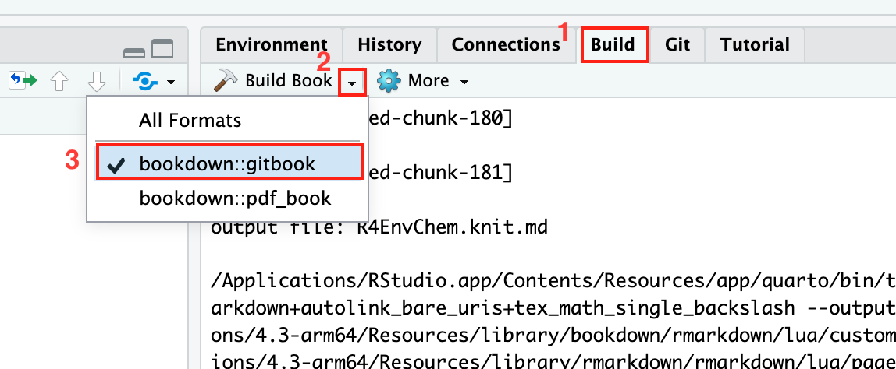

# R for Environmental Chemistry

Developing course material and workflows based in R for undergraduate UofT Environmental Chemistry courses.

Webbook found here: <https://uoftchem-teaching.github.io/R4EnvChem/>.

## How to build the webbook with bookdown library

1.  Open R4EnvChem project from RStudio.

2.  If `bookdown` library is not installed yet, run the following command in the console:

    ```         
    install.packages("bookdown")
    ```

3.  Build the book in HTML format in the upper right `build` window in RStudio .

    

    If you encounter an error with no package installed issue, install the missing packages first. During the building process, a new file `R4EnvChem.Rmd` is automatically created. When you open this file in RStuido, there is a message showing in the top that will let you install all missing packages at once.

    Once the book is built (it can take up to couple minutes), the html of the book will show up in the `Viewer` window.
    
    All the build-related files created during the process will be deleted once the HTML viewer appears. 
