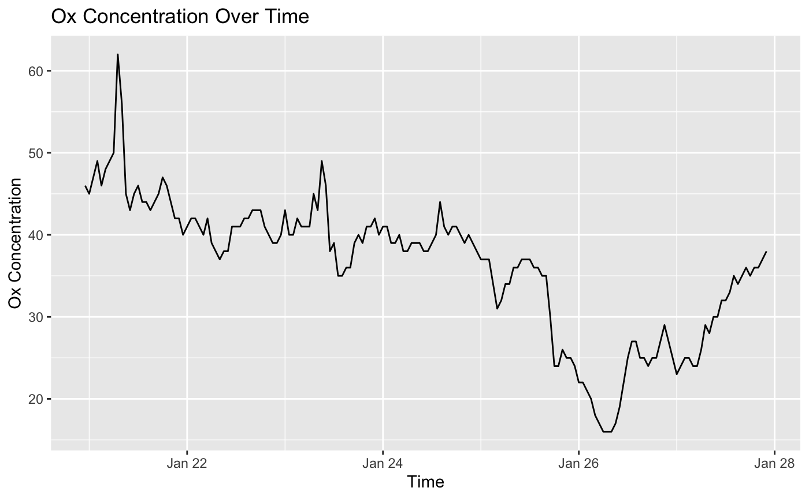
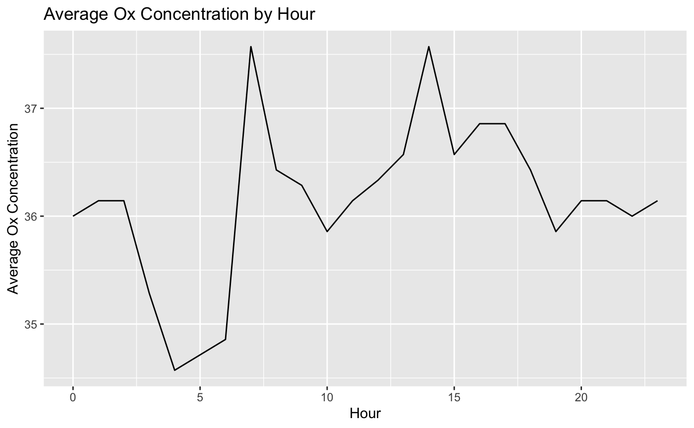
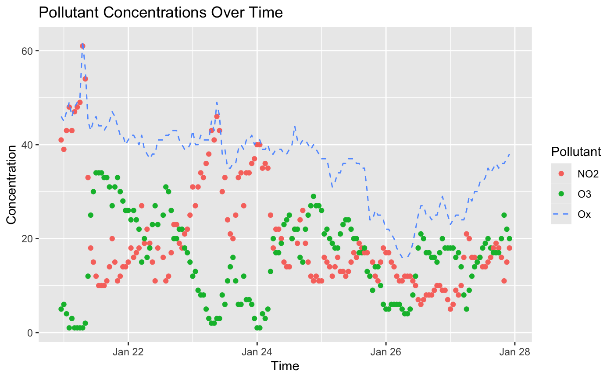

# Getting Started:

We will be using the Air Quality data as we've seen before. If you don't have the data, before diving into the exercises, follow the instructions below to download a dataset from the Exploring Air Quality Data website.

-   Visit the [Exploring Air Quality Data](https://uoft-chem.shinyapps.io/Air_Quality_App/) and go to `My Data` tab.
-   Enter your student number, and then download the CSV file.
-   Rename the downloaded file to `data.csv`.
-   Upload the file to your RStudio.

## Load Necessary Libraries

Before starting the exercises, ensure you have the necessary libraries loaded:

```{r}
# Load necessary libraries
library(tidyverse)
```

Use the `read_csv()` function from the `readr`(`tidyverse`) package to import your Air Quality dataset, and assign the imported data to a variable named `data`.

```{r}
# Complete the code below and run the cell.

# Import data from CSV file using read_csv -- your code here
data <- 
```

Before diving into the visualizations, you have an important task: calculating the Oxidant concentration, commonly known as Ox. Ox is typically calculated as the sum of the concentrations of two pollutants: Nitrogen Dioxide (NO2) and Ozone (O3). Here’s how you can approach this:

1.  **Group the Data::** Since we are interested in Ox levels over time, you’ll need to group the data by `Time`, `NO2`, and `O3`.

2.  **Summarise the Data:** Within each group, calculate the sum of the NO2 and O3 to get the total Ox concentration. Remember to handle missing values appropriately.

3.  **Filter the Data** Remove any rows where the Ox concentration is less than 0.

4.  **Create a New Dataset:** Finally, create a new dataset with this aggregated information. This dataset will be used in your upcoming visualization exercises.

```{r}
# Calculate Ox as the sum of NO2 and O3 concentrations

ox_data <- 
```

Once you have successfully created the `ox_data` dataset, you will use it to perform various visualizations to explore and understand the distribution and trends of Oxidant concentrations in different ways.

------------------------------------------------------------------------

## Exercise 1: Time Series Plot of Ox Concentrations

**Your Task:**

Create a time series plot to visualize the Ox concentrations over time.

-   Title the plot "Ox Concentration Over Time".
-   Use the `Time` for the x-axis and `Ox` for the y-axis.
-   Label the axes appropriately.

```{r}
# Code for time series plot of Ox concentrations


```

Your graph should look something like this:



------------------------------------------------------------------------

## Exercise 2: Time Series Plot of Average Ox Concentration by Hour

**Your Task:**

Create a time series plot to visualize the average Ox concentration for each hour in the dataset.

-   Title your plot "Average Ox Concentration by Hour".
-   Use the `Time` for the x-axis (ensure it's in hour intervals) and the average `Ox` for the y-axis.
-   Label the axes appropriately.

```{r}
# Code for time series plot of average Ox concentration by hour

```

Your graph should look something like this:



------------------------------------------------------------------------

## Exercise 3: Scatterplot of different Pollutants Over Time

**Your Task:**

Generate a scatterplot to observe Ox concentration over time in a line, and distinguishing between NO2 and O3 pollutants.

To observe Ox concentration over time, distinguishing between NO2 and O3 pollutants:

-   Change the data to long format using `pivot_longer()` function to include NO2 and O3 concentrations in the same column and create a new column for the type of pollutant.
-   Use `geom_point()` to create a scatterplot of pollutant concentration vs. time, colored by the type of pollutant.
-   Use `geom_line()` to add a dashed line for the overall Ox concentration.
-   Title your plot "Pollutant Concentrations Over Time".
-   label the axes appropriately and ensure the time on the x-axis is readable.

```{r}
# Code for scatterplot that shows Ox concentration vs. time colored by pollutant


```

Your graph should look something like this:


