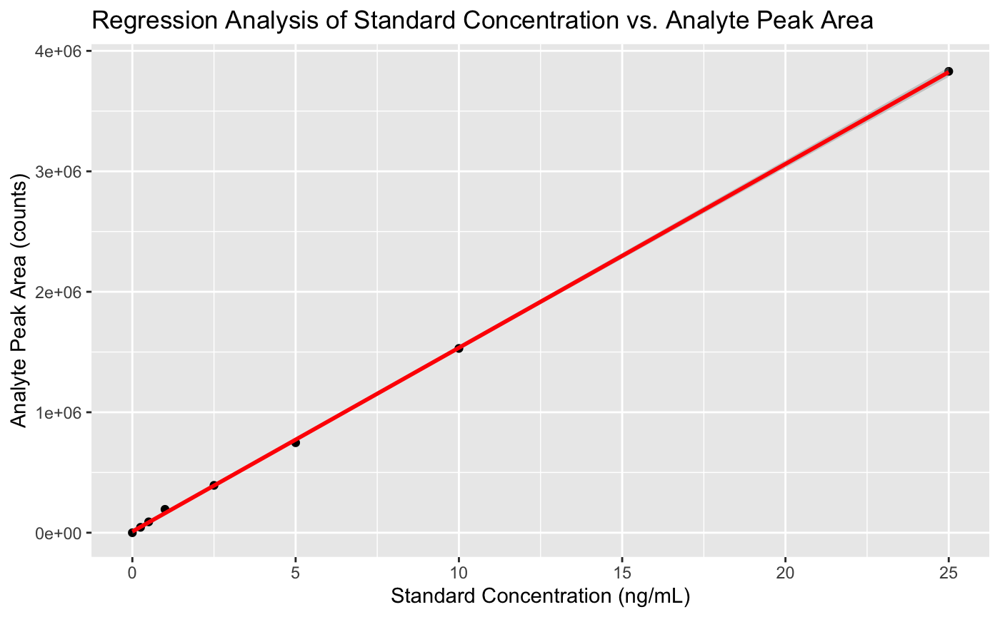

  
# Getting Started
  
Before diving into the exercises, ensure you have the OPFR dataset. If you don't, download the OPFR dataset provided in the same folder as this exercise. Try to save the file in the same folder where you saved this Rmd file.

In these exercises, you will be analyzing data collected from a study performed by CHM410 students on dust samples from their homes. The study focused on detecting organophosphate flame retardants (OPFRs), which are chemicals used to make materials fire-resistant. The dataset you will work with includes several important columns: 

- **chemical**: This column identifies the type of OPFR being analyzed. 
- **concentration**: This indicates the concentration of the OPFR in the calibration standards, which is crucial for developing a relationship between the amount of chemical present and the instrument's signal.
- **analyte_peak_area_counts**: This measures the signal intensity from the OPFR of interest, reflecting the quantity detected by the analytical instrument.
- **IS_peak_area_counts**: This measures the signal intensity from an internal standard added to each sample and standard. The internal standard is structurally similar to the target OPFR and helps correct for variations in sample analysis, such as differences in injection volume or signal suppression by other substances in the dust.

```{r}
# Run the cell.
library(tidyverse)
data <- read_csv("OPFR_concentration.csv", show_col_types = FALSE)
DT::datatable(data)
```

------------------------------------------------------------------------

# Exercise 1: Exploring and filtering the data

To start with, let's focus on a single chemical - TCEP. Then, let's plot the calibration data to see what it looks like before we start modelling.

**Your Task:** 
Filter the `data` by `chemical` so that it only contains TCEP. Store this new dataset in a variable called `TCEP`

```{r}
TCEP <- #Your code here
```

Now, create a scatterplot of the instrument response (`analyte_peak_area_counts`) vs `concentration` to ensure that the data are suitable for modelling

```{r}
# Create a scatter plot of instrument response vs concentration

```


------------------------------------------------------------------------

# Exercise 2: Creating a calibration curve

**Your Task:**
1. Fit a linear model between `concentration` (as the independent variable) and `analyte_peak_area_counts` (as the depdendent variable). 
2. Then, generate a summary (using the `summary()` function) of this calibration curve. 
3. Finally, plot the original data along with the regression line. 

1. Ensure the data format is suitable for modeling and that there are no missing values.
2. Fit a linear model and summarize it.
3. Plot the original data along with the regression line.

```{r}
# 1. Create the calibration curve
model <- #Your code here

# 2. Summarize the model and print it out 
modelSummary <- #Your code here

paste(modelSummary)

# 3. Create a scatterplot with the regression line

```

Your graph should look something like this:


#### Test Your Code (Exercise 2)

```{r,purl=FALSE}
library(testthat, quietly = TRUE)
test_that("Linear Model Test", {
  expect_true("concentration" %in% names(coef(model)))
  expect_true("analyte_peak_area_counts" %in% names(model$model))
  # Test for a significant relationship
  expect_true(summary(model)$coefficients[2, 4] < 0.05) # P-value for the slope
})
```

------------------------------------------------------------------------

# Exercise 3: Generating linear regressions for multiple analytes

Now we are going to go back to the unfiltered dataset and create calibration curves for each compound instead of just one. This unfiltered dataset is still in the variable `data`.

**Your Task:** 

For each chemical, build a linear regression model using `analyte_peak_area_counts` as the dependent variable and `concentration` as the independent variable. Finally, create a dataframe named `models` that at least has the columns `chemical`, `model`, `slope`, and `intercept`, containing the chemical name, the actual model object, the slope of that model, and the intercept of that model. It should have a total of 3 rows (one row each for each compound). Feel free to have extra columns or restructure the data at your convenience.

We recommend using the tidyverse framework for this. 

```{r}
#Build linear regression models for each chemical and store them in a dataframe called `models`. 
```


#### Test Your Code (Exercise 3)
```{r ,purl=FALSE}
library(testthat, quietly = TRUE)
test_that("Linear Model Test", {
  expect_true("TBEP" %in% models$chemical)
  expect_true(nrow(models) == 3)
  expect_true(models$intercept[1] > 5000)
  expect_true(models$slope[1] > 50000)
})
```


------------------------------------------------------------------------

# Exercise 4: Predicting concentrations for a new dataset

**Your Task:** 

Here, you will use the models you just  created to predict the `analyte_peak_area_counts` for hypothetical new samples in the `OPFR_samples.csv` file. Make sure this file is in your working directory so that the following code works. Start by loading our new data:

```{r}
# Read the new sample data from a CSV file
sample_data <- read_csv("OPFR_samples.csv")
sample_data
```

You can see that we don't have values for concentration in this dataset yet. Next, use the calibration curves saved in `models` to calculate concentrations in the `sample_data` dataset:

```{r}
# Fill in the concentration values in sample_data using coefficients you calculated.


```


#### Test Your Code (Exercise 4)
```{r, purl=FALSE}
library(testthat, quietly = TRUE)
test_that("Prediction Test", {
  expect_true(nrow(sample_data) == 33)
  expect_true(!any(is.na(sample_data)))
})
```