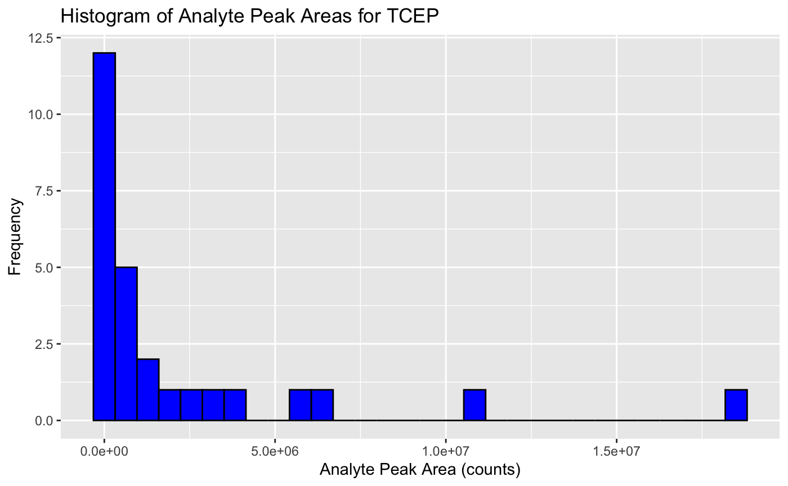

  
# Getting Started
  
Before diving into the exercises, ensure you have the OPFR dataset. Download the OPFR dataset provided in the same folder as this exercise. Try to save the file in the same folder where you saved this Rmd file.

In these exercises, you will be analyzing data collected from a study performed by CHM410 students on dust samples from their homes. The study focused on detecting organophosphate flame retardants (OPFRs), which are chemicals used to make materials fire-resistant. The dataset you will work with includes several important columns: 

- **chemical**: This column identifies the type of OPFR being analyzed. 
- **concentration**: This indicates the concentration of the OPFR in the calibration standards, which is crucial for developing a relationship between the amount of chemical present and the instrument's signal.
- **analyte_peak_area_counts**: This measures the signal intensity from the OPFR of interest, reflecting the quantity detected by the analytical instrument.
- **IS_peak_area_counts**: This measures the signal intensity from an internal standard added to each sample and standard. The internal standard is structurally similar to the target OPFR and helps correct for variations in sample analysis, such as differences in injection volume or signal suppression by other substances in the dust.

For this chapter, we will limit our focus to a single chemical (TCEP) to understand the basics of linear regression in chemical analysis. 

```{r}
# Run the cell.
library(tidyverse)
data <- read_csv("OPFR_concentration.csv", show_col_types = FALSE) %>% 
  filter(chemical == "TCEP") 
DT::datatable(data)
```

------------------------------------------------------------------------

# Exercise 1: Basic Data Exploration

**Your Task:** 

Explore the `data`. Run the following code snippet to generate a summary of the dataset.

```{r}
# Generate a summary of the dataset

```

Now, let's create a histogram of the `analyte_peak_area_counts` values to understand their distribution. Ensure your histogram is properly titled and the axes are appropriately labeled.

```{r}
# Create a histogram of the Analyte Peak Area (counts)

```

Your graph should look something like this:


------------------------------------------------------------------------

# Exercise 2: Grouping and Summarizing Data

**Your Task:** 

Group the `data` by `concentration`, then calculate the average of the `analyte_peak_area_counts` for each concentration level. Name the average column "avg_peak_area".

```{r}
# Your code to group data and calculate average peak area
grouped_data <- data %>%

# Display the grouped data
grouped_data
```

#### Test Your Code (Exercise 2)

```{r,purl=FALSE}
library(testthat, quietly = TRUE)
test_that("Grouping and Summarizing Test", {
  expect_true("concentration" %in% colnames(grouped_data))
  expect_true("avg_peak_area" %in% colnames(grouped_data))
  expect_true(nrow(grouped_data) > 1)
})
```

------------------------------------------------------------------------

# Exercise 3: Linear Modeling of Peak Area Relationships

**Your Task:**
You will fit a linear model to investigate the relationship between `concentration` and `analyte_peak_area_counts`. Use `concentration` as the predictor (independent variable) and `analyte_peak_area_counts` as the response (dependent variable).

1. Ensure the data format is suitable for modeling and that there are no missing values.
2. Fit a linear model and summarize it.
3. Plot the original data along with the regression line.

```{r}
# 1. Ensure no missing values for the modeling

# 2A. Fit a linear model

# 2B. Summarize the model and print it out

```

```{r}
# 3. Create a scatterplot with the regression line

```

Your graph should look something like this:


#### Test Your Code (Exercise 3)

```{r,purl=FALSE}
library(testthat, quietly = TRUE)
test_that("Linear Model Test", {
  expect_true("concentration" %in% names(coef(model)))
  expect_true("analyte_peak_area_counts" %in% names(model$model))
  # Test for a significant relationship
  expect_true(summary(model)$coefficients[2, 4] < 0.05) # P-value for the slope
})
```

------------------------------------------------------------------------

# Exercise 4: Advanced Data Manipulation

**Your Task:** 

Create a new column `peak_area_level` in `data` that categorizes the `analyte_peak_area_counts` into 'Low', 'Medium', or 'High', based on thresholds you define. Then, count how many occurrences fall into each category. Make sure you define the thresholds such that for each category, there is at least one occurrence.

```{r}
# Define thresholds and create the peak_area_level column
data <- data %>%
  

# Count occurrences in each peak area level category
peak_area_counts <- table(data$peak_area_level)

# Display the counts
peak_area_counts
```


#### Test Your Code (Exercise 4)
```{r, purl=FALSE}
library(testthat, quietly = TRUE)
test_that("Advanced Data Manipulation Test", {
  # Check if 'peak_area_level' column exists
  expect_true("peak_area_level" %in% colnames(data))
  data$peak_area_level
  
  # Check if all values in 'peak_area_level' are within the specified categories
  expect_true(all(data$peak_area_level %in% c("Low", "Medium", "High")))
  
  # Check for non-zero counts in each category
  expect_true("Low" %in% names(peak_area_counts))
  expect_true("Medium" %in% names(peak_area_counts))
  expect_true("High" %in% names(peak_area_counts))
})
```
