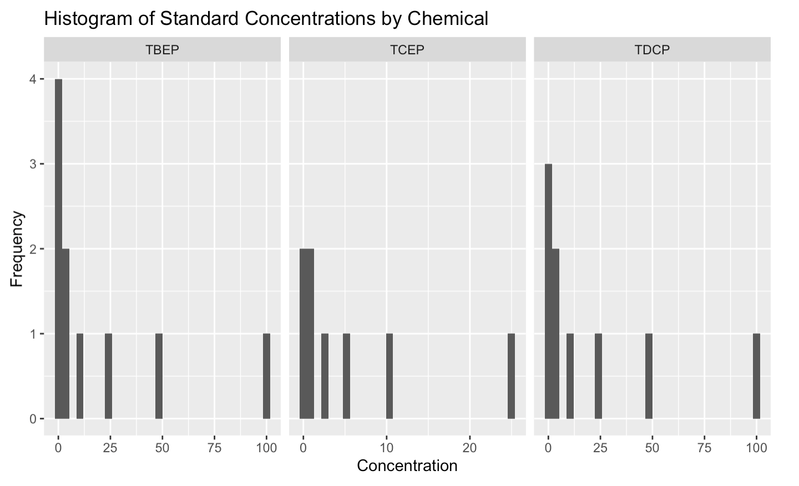
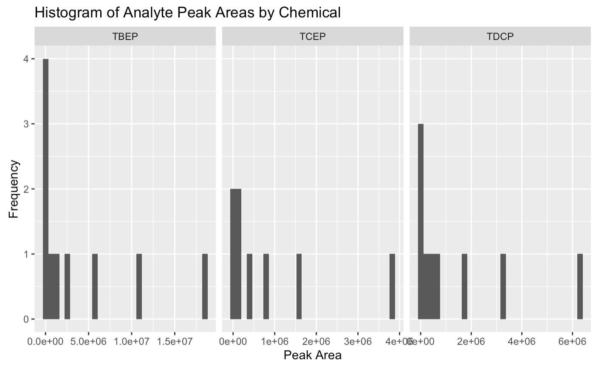

# Getting Started

We will continue working with the OPFR data from the last exercise. Previously, we limited our focus to TCEP. Now, we will expand our analysis to include multiple chemicals as seen in this chapter, applying multiple linear regression techniques to assess the influence of various factors simultaneously. 

Make sure you have the `OPFR_concentration` dataset loaded into your R environment. If you haven't yet, download the dataset and upload it to your RStudio, in the same folder as this Rmd file.


```{r}
# Run the cell below.
library(tidyverse)
data <- read_csv("OPFR_concentration.csv", show_col_types = FALSE)
DT::datatable(data)
```


# Exercise 1: Data Preparation and Exploration

**Your Task:**

Explore the `data` by creating summaries and visualizations to understand the distribution of concentrations and signal values for each chemical.

```{r}
# Generate a summary of the dataset and take a look.

```


```{r}
# Create histograms for 'concentration' and 'analyte_peak_area_counts' for each chemical

```
Your graph should look something like this:




# Exercise 2: Building Multiple Linear Regression Models

**Your Task:**

For each chemical, you will build a linear regression model to predict `analyte_peak_area_counts` from `concentration`. 
Create a dataframe named `models` that at least has the columns `chemical`, `model`, `slope`, `intercept`, total of 3 rows (one row each for each type of the chemical). Feel free to have extra columns at your convenience.
*Note:* Feel free to restructure the data at your convenience. 


```{r}
# Build linear regression models for each chemical, and the dataframe called `models`.


```


#### Test Your Code (Exercise 2)

```{r ,purl=FALSE}
library(testthat, quietly = TRUE)
test_that("Linear Model Test", {
  expect_true("TBEP" %in% models$chemical)
  expect_true(nrow(models) == 3)
  expect_true(models$intercept[1] > 5000)
  expect_true(models$slope[1] > 50000)
})
```


# Exercise 3: Applying the Model for Prediction

**Your Task:**

Here, you will use the models you've created to predict the `analyte_peak_area_counts` for hypothetical new samples. Make sure you have `OPFR_samples.csv` file in your working directory so that the following code works. Assume the following new data for predictions:

```{r}
# Read the new sample data from a CSV file
sample_data <- read_csv("OPFR_samples.csv")
sample_data

```
Do you see that we don't have any values in the `concentration` column? In the following cell, use the coefficients you saved in the `models` object from the previous exercise to fill in the missing values of `concentration` in the `sample_data`.

```{r}
# Fill in the concentration values in sample_data using coefficients you calculated.

```

#### Test Your Code (Exercise 3)

```{r, purl=FALSE}
library(testthat, quietly = TRUE)
test_that("Prediction Test", {
  expect_true(nrow(sample_data) == 33)
  expect_true(!any(is.na(sample_data)))
})
```
