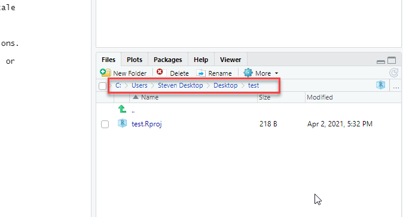
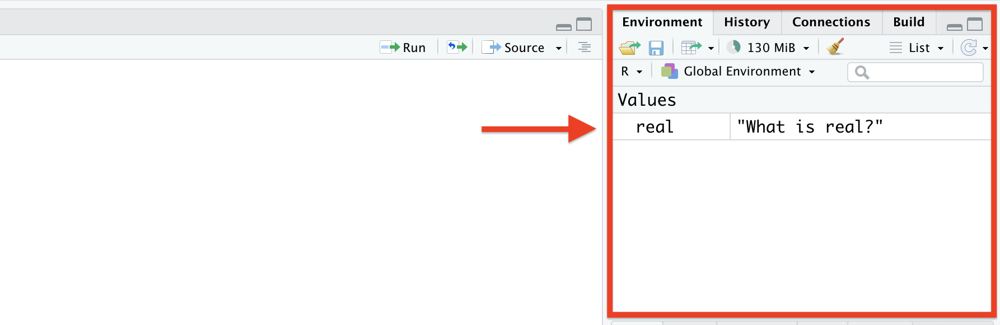
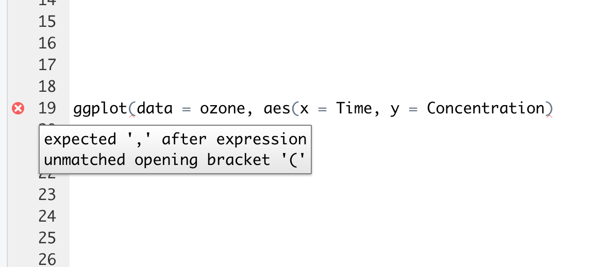

# R Workflows

Just like there's a common workflow in any chemistry lab (pre-lab, collect reagents, conduct experiment, etc.) there's a workflow when working with R. This is by no means the only way to work, but it's tried and true and will serve you well as you tackle your coursework. 

<!-- This is stuff Steven wrote, feel free to modify as you need --> 

## Paths and directories

Before you get started with running your code, it is good to know where your analysis is actually occurring, or where your **working directory** is. The working directory is the folder where R looks for files that you have asked it to import, and the folder where R stores files that you have asked it to save. 

RStudio displays the current working directory at the top of the console, as shown below, but can also be printed to the console using the command `getwd()`.


By default, R usually sets the working directory to the home directory on your computer. The `~` symbol denotes the home directory, and can be used as a shortcut when writing a path that references the home directory. 

You can change the working directory using `setwd()` and an absolute file path. Absolute paths are references to files which point to the same file, regardless of what your working directory is set to. In Windows, absolute paths begin with `"C:"`, while they begin with with a slash in Mac and Linux (i.e., `"/Users/Vinny/Documents"`). It is important to note that absolute paths and `setwd()` should **never** be used in your scripts because they hinder sharing of code -- no one else will have the same file configuration as you do. If you share your script with your TA or Prof, they will not be able to access the files you are referencing in an absolute path. Thus, they will not be able to run the code as-is in your script.

In order to overcome the use of absolute paths and `setwd()`, we strongly recommend that you conduct all work in RStudio within an **R project**. When you create an R project, R sets the working directory to a file folder of your choice. Any files that your code needs to run (i.e., data sets, images, etc.) are placed within this folder. You can then use relative paths to refer to data files in the project folder, which is much more conducive to sharing code with colleagues, TAs, and Profs. 

## Creating an RStudio project

Let's go ahead and create a new **R Project**. Go to *File*->*New Project*, or click the button highlighted in the image below. Click *New Directory*, then *New Project*. 


You may want your project directory to be a subfolder of an existing directory on your computer which already contains your data sets. If this is the case, click *Existing Directory* instead of *New Directory* at the previous step, and then select the folder of your choice.

Next, you'll be asked to choose a subdirectory name and location. Enter your selected name and choose an appropriate location for the folder on your computer. Click *Create Project*, and you should now see your chosen file path displayed in the bottom-right window:



As mentioned previously, you can also view the file path to your project directory using `getwd()`. The output should match the file path shown in the image above.

When working on assignments for coursework, it is good practice to create a new R project for each assignment you work on. You should store the data, images, and any other files required for that assignment within the folder for the designated R project. You can create subfolders for data and images, however, you may want to avoid making too many nested subfolders, as this will make your paths long and tiresome to type. 

### The value of R projects

To demonstrate the benefit of working in a project directory rather than using absolute paths, let's review a quick example. 

Let's say you have a data set called `absorbance.csv`, which is stored on your computer in the lengthy file path `/Users/Your_Name/Documents/School/Undergrad/Second_Year/CHM210/Assignment1/absorbance.csv`. You want to import the contents of this data set into R using `read_csv`.

**Improper referencing:** When working *outside* of an R project, you would need to reference the full, absolute file path in your scripts in order for R to recognize the file you are looking for. If you wanted to import the file, you would need to type something like this:

```{r eval = FALSE}
abs <- read_csv("/Users/Your_Name/Documents/School/Undergrad/Second_Year/CHM210/Assignment1/absorbance.csv")
```

While this does the job, it is extremely tedious to type the entire file path without typos, and this also hinders sharing your work with colleagues. Other students/your instructors will not have `absorbance.csv` stored in the same, lengthy file path which you have referenced above. Thus, if they try to run your script, this line of code will throw an error, as there is no file named `absorbance.csv` on their computer at the given file path.

**Proper referencing:** When working *inside* of an R project, you would set your project directory to the folder `/Assignment1`, using the pop-up windows that appear after clicking  *File*->*New Project*->*Existing Directory*. By default, whenever you open the R project, the working directory will automatically be set to `/Assignment1`, the folder containing the data set of interest. If you wanted to import the file now, you would write the following command:

```{r eval = FALSE}
abs <- read_csv("absorbance.csv")
```

This is much simpler to type, and is much more compatible with sharing your work. Even if you don't share your entire project directory with your colleagues, they should still be able to run this line of code in the script, as long as they have the `absorbance.csv` data set in their current working directory folder. 

Not only does working within an R project make your scripts much easier to share with colleagues, TAs, and Profs, but it also makes it easier for you to resume working on your code after you have closed the RStudio application. Think of your scripts as tabs in a web browser. Sometimes a project may require you to have several scripts open at once. 

If you are working *outside* of an R project and have multiple scripts open, all of the scripts will close automatically when you quit RStudio. The next time you open RStudio you'll have to manually locate and open up each of the scripts you were working on previously, which can be tedious if they're not stored in convenient locations.

If you are working *inside* of an R project and have multiple scripts open, R will leave the scripts open within the project even after you have quit RStudio. The next time you open RStudio and your project, the script tabs will remain open, allowing you to easily pick up where you left off. 

You can try this out for yourself. Open up a new script in your current project in RStudio using *File*->*New File*->*R Script*.  (If you don't have a project open currently, go to *File*->*New File*, click *New Directory*, then *New Project*.) Type in whatever you want. If you can't think of anything, here's an example:

```{r}
# R projects are life savers
# wow
# blessed
```

Save the script by going to *File*->*Save*, or by clicking the button highlighted in the image below. Keep the script open, but close RStudio.


When you re-open RStudio, the script will still be there. 

Leave the script open. Let's close the R project now. You can close the current project by going to *File*->*Close Project*, or by clicking the downwards arrow in the top right corner of RStudio, highlighted in the image below. Choose *Close Project* from the drop down menu. 


Now close RStudio. When you open RStudio again, no script will be open! The same is true when you work outside of an R project. 

## Saving things in R

As mentioned in the previous section, you can save an R script to a `.R` file by going to *File*->*Save*, or by clicking the button highlighted in Figure 3.4. Code saved to a `.R` file is considered *real*. Variables, plots, or data sets that only exist in your workspace (shown in the Environment window) are not. 

Whenever you close RStudio, any objects in R that are not considered *real* will be lost in that R session. For example, let's say you have some vectors in your workspace. Even if you are working within an R project and have saved your script, those vectors will not be remain in the workspace after you close and re-open RStudio. You would need to re-run the code you used to generate those vectors the next time you open RStudio, in order to replicate the workspace you had before you closed the application.

Let's try this out in practice. Assign something of your choice to a variable (i.e., "text must be in quotations", numbers, TRUE or FALSE), as is done below.

```{r}
real <- "What is real?"
```

The variable should now show up in your environment in RStudio, much like the image below.



When a variable exists within your workspace, you can simply type the variable name into the console to have R print out its contents (examples given in Chapter 2). However, when you close RStudio, and the variable is erased from the workspace, R will give you an error when you try to call your assigned variable. The errors will look a little bit like this:

```{r echo = FALSE, error = TRUE}
hi
```

Where `'hi'` is the name of your variable. This is common notation for errors that occur when you try to run code that references an object (variable, vector, data set, etc.) that might have once existed in your workspace, but currently does not. If you're getting an `object not found` error, this generally means you need to go back and load your data set, or re-run the code used to generate your desired variable or vector. Once you've loaded the data set, or re-created the object in the workspace, the error will go away and your code should run as expected.

While this might not seem like a major issue at this point in time, it certainly will when you start writing lengthy scripts that create variables in the early lines and then reference those variables in commands in later lines. One day you might find yourself opening up RStudio and immediately trying to run some code from the end of one of your scripts. `Object not found` is a common thing to see in response. Don't fret - run the script from beginning to end, in order, and chances are this error will go away (provided that you have included your assignment statements in your saved script).

### What should I save?

At this point in the chapter, two things should be clear: 

1. R scripts saved to `.R` files are real. 
2. Objects in your workspace/environment are not real, and will not be available to you after you close and re-open RStudio unless you re-run the code used to generate the workspace. 

So what is important to save in R, and how often should you save these files? 

It is paramount that you save the scripts you code in, and that you save them regularly. Even if you've made small notation changes to the code, it is always a good idea to save your changes to the script before closing RStudio, as there is a good chance you will not remember the minor differences upon returning. 

While it is possible to save your workspace in RStudio, we do not recommend this. It is much easier to recreate your workspace from your R scripts than it is to recreate your scripts from your workspace. That being said, it is integral to get into good script formatting habits. 

You want to make sure that even if you lose an object in your environment, your script still contains the code you used to generate that object. You also want to make sure that you generate the object before you call it in part of another command, so that when you run your scripts from top-to-bottom, the variables are generated in the workspace before they are referenced by later commands. Let's look at some examples. 

```{r}
# generate vectors
x <- c(1, 2, 3, 5, 76, 8, 2)
y <- c(T, T, T, F, F, F, F)

# turn vectors into data frame
data.frame(x,y)
```

The code above is ordered correctly. Your scripts should be ordered similar to this (with the exception that you will load R packages before you generate your variables), with your objects generated before you call them using a function.


```{r eval = FALSE, error = TRUE}
# make data frame
data.frame(x,y)

# generate vectors
x <- c(1, 2, 3, 5, 76, 8, 2)
y <- c(T, T, T, F, F, F, F)
```

The code above is ordered *incorrectly*. You can see that using `data.frame()` before generating vectors `x` and `y` has resulted in an error, similar to what we saw in the previous section. You should follow the format from the first example to avoid errors of this sort in your scripts.

#### Saving objects

In some cases, your code may be used to generate large data structures which require quite a bit of input to create. It can be quite tedious to re-run the code used to generate these large data sets every time you open RStudio, and you might find yourself wanting to save the data structure to a *real* file that you can simply import the next time you open the application. Fortunately, this is possible thanks to `save()` and `load()`.

The `save()` function saves the input object or objects (i.e., vector, matrix, or data frame) to your working directory as an `.rda` file. Let's try saving our vectors `x` and `y` from the previous examples to a file called `vec.rda`.

```{r eval = FALSE}
# save vectors
save(x, y, file = "vec.rda")
```

An `.rda` file should now exist in your project directory, as shown in the image below.


Now, let's try removing our vectors from our workspace and loading them from the `.rda` file we just generated. You can use `rm()` to remove objects from your workspace, as shown below.

```{r eval = FALSE}
rm(x, y)
```

Now that our workspace is empty, if you type `x` or `y` into the console, RStudio will not know what to return in response. We have to import the data back into our workspace so that RStudio knows what `x` and `y` contain.You can use `load()` to import the vectors to your current RStudio workspace, using the format below.

```{r eval = FALSE}
load(file = "vec.rda")
```

The vectors should now be present in the workspace again, and can be printed to the console if you type in their respective names.

## Troubleshooting error messages

In the previous section, you were introduced to your first error message in R, and we briefly discussed how to resolve the issue. 

As you become more familiar with R and start using more complex functions, you will become better acquainted with error messages in R, and how to deal with them accordingly.

We'll go through a few examples of error messages in the following sections, as well as how to read the errors, and how to fix your code to resolve the issues. 

### Script diagnostics

When writing code in the Script window, RStudio will highlight any syntax errors in your code with a red squiggly line and an 'x' in the side bar, as shown below. You can hover over the 'x' to see what is causing the error. 


In the above message, R is telling you that it is not sure what to do with `b`. As mentioned previously, variable assignment is done in the format `name <- assignment`. However, in the above example, the variable assignment statement is written as `name name <- assignment`. Since variable names cannot contain spaces, R reads `a b` as two separate input variable names, not as a single string. If you wanted to assign a value of 0 to both `a` and `b`, you would need to write the statement once per variable, as shown below.

```{r}
a <- 0
b <- 0
```

Let's look at another example. Some functions require you to write code with nested parentheses. A good example would be the `aes()` argument that is called inside of `ggplot()`, as shown below.

```{r message = FALSE, echo = FALSE}
library(readr)
library(ggplot2)

#import ozone data set
ozone <- read_csv("./data/Ozone_oxidationexp.csv")
```


```{r eval = FALSE}
#plot ozone concentration vs. time
ggplot(data = ozone, aes(x = Time, y = Concentration))
```

(For more detail about importing and using `ggplot2`, please re-visit Chapter 2, section 2.3.4, or see Chapter 11.)

If you were to forget one of the parentheses in the previous line of code, RStudio would highlight it similar to below:



Here R is telling you that you have an unmatched opening bracket. To resolve the error, simply add a closing bracket to match. 

The `expected ',' after expression` is a common error that you will see accompanying unmatched opening brackets. Sometimes you might get this error in the console after running code that is missing a bracket somewhere. It is good practice to check your parentheses a few times before running your code to make sure that all the commands are closed, and that R doesn't keep waiting for you to continue inputting code after you've click *Run*. If you notice that the `>` in your R console has turned into a `+`, this is likely because you've just run a command that is missing a closing bracket, and thus, R is not aware that your code is finished. Simply input a closing bracket into the console, and the `>` should return.

### Reading error codes

While the script window is very useful for pointing out syntax errors in your code, there are many other errors that can arise in RStudio which the script window is not able to capture. These are generally errors that arise from trying to execute your code, rather than from mistakes in your syntax.

The following is a prime example of such an error.

```{r error = TRUE}
q <- 8 + "hi"
```

Here we are trying to add a numeric value (8) to a character string ("hi"), then set the sum of the two to variable `q`. R has given us an error in return, because there is no logical way for R to add a numeric value to non-numeric text.

The error indicates that we have passed a `non-numeric argument to binary operator`, meaning we have used a non-numeric data type for an expression which is exclusively reserved for numeric data. If you try to add, divide or multiply two character strings using arithmetic operations in the console, you will get the same error. 

```{r error = TRUE}
"hey" * "hi"
```

It is important to be aware of these error codes as many functions require specific data types as their inputs. You can always look at the required data type by looking at the documentation for the function (generally, this can be viewed by typing `?function` into the console, where `function` is the name of the function). If the function requires numeric data, inputting character strings or logical values will throw the errors shown above. If the function requires logical values, inputting numeric data or character strings will throw the errors shown above. 

In order to avoid these errors, make sure that you are using the right type of data in your functions. You can always check your data type using `class()`. Some examples are shown below.

```{r}
class("hi")

class(10)

class(1L)

class(TRUE)
```


Now that you're familiar with working in RStudio, saving your projects, scripts, and data, let's move over to Chapter 4, where we'll discuss the advantages and disadvantages of using `.Rmd` documents instead of `.R` scripts.
