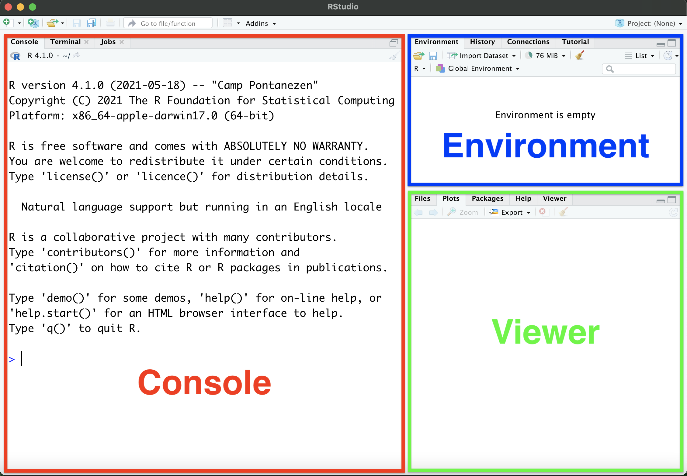
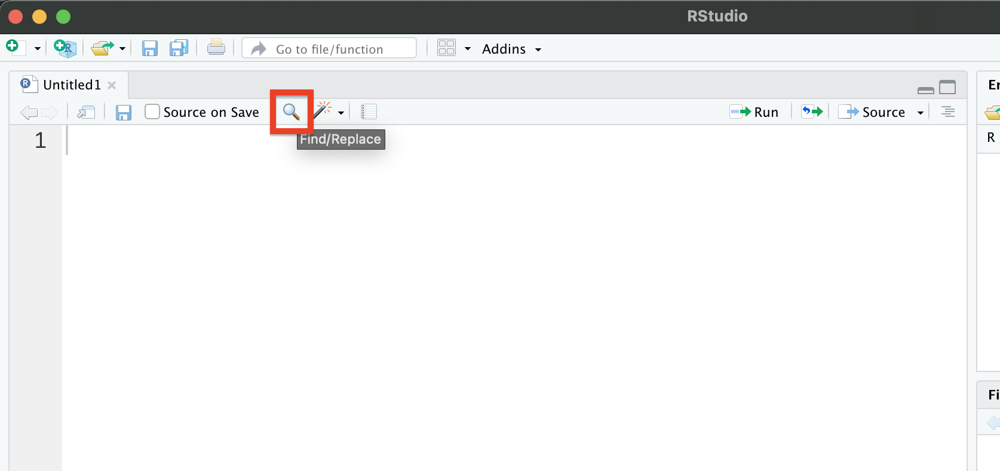
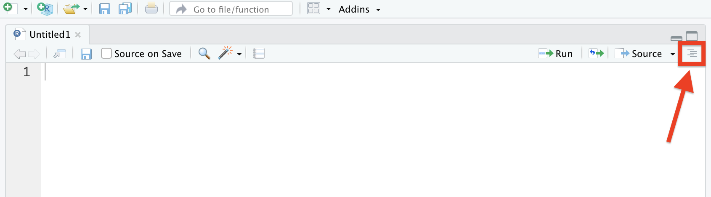

<!-- This header creates the book section -->
# (PART\*) Getting Setup in R{-}

<!-- This header creates the chapter -->
# Running R Code

## Navigating RStudio

Now you should have both R and RStudio downloaded and installed. When you open RStudio for the first time, this is what you should see:

{width = 100%}

The version of R you just installed should appear in the main window, or console, here:

{width = 100%}

(If this message does not appear, go to *Tools*->*Global Options* and make sure that the "R version" box is set to the correct folder.)

It is important to be aware of the version of R you are using, especially when using R packages which may not be compatible with outdated versions of R (more on this in subsequent sections). 

Currently, the RStudio interface has three key regions, as highlighted below.

{width = 100%}

### Console

You can run code directly by typing your R code into the console pane. The console is mainly used for installing packages (more on that later), but can also be used for quick arithmetic. Try typing "2+2" into the console, then hit Enter.

``` {r console_math}
2+2
```

While the console is useful for short-and-sweet commands, you will mainly be using the Scripts window to run chunks of code (see **2.2 Where to run code in RStudio**).

### Environment

The environment window lists all variables, packages, and functions which you have run since opening RStudio. This window is particularly useful if you want to view your data in a format similar to an Excel spreadsheet directly from RStudio, which we will discuss in Chapter 3 of this book.


### Viewer

The Viewer window has a couple of useful tabs. We will mainly use it to export plots (more on that in later chapters), but you can also open code files from the "Files" tab without having to leave RStudio (expanded on in Chapter 3). 


### Customizing RStudio

As many of us spend an absurd amount of time staring at bright screens, some of you may be interested in setting your RStudio to Dark Mode. 

You can customize the appearance of your RStudio interface by clicking *Tools*->*Global Options*, or *RStudio*->*Preferences* on Mac, then clicking "Appearance" on the left. Select your preferred Editor Theme from the list.

{width = 100%}

## Where to run code in RStudio

Files of R code are called scripts, which are saved in the `.R` format. Let's open up a new script in RStudio by going to *File*->*New File*->*R Script*, or by clicking on the highlighted button in the image below.

{width = 100%}

This should open up a new window in the RStudio interface, as shown in the following image.

{width = 100%}

Whenever you copy code blocks from this website (or other online sources), you should paste them into the Scripts window. You can then run the specific lines of code by highlighting them and pressing Ctrl+Enter (Cmd+Enter on Mac), or by clicking the "Run" button in the top right corner of the Scripts window.

### Scripts vs. console

Using the Scripts window to write, edit, and run your code has many advantages over using the console directly. Mainly, writing your code in scripts allows you to save your code in the R file format, as mentioned previously. This means you can open old files of code and easily run commands which you've previously written.

Additionally, the Scripts window allows you to review and edit your code without the risk of accidentally running an incomplete command. When typing directly into the console, any time you hit Enter, R will try to execute the line of code you have entered, whether or not you have completed the command. This is not an issue when typing your code into the Scripts window, as code in this window is only executed when the "Run" button is clicked, or when the code has been highlighted and you have pressed Ctrl+Enter (Cmd+Enter on Mac).

Scripts are also very useful when you are coding repetitive tasks. Let's say you want to run the same function on 10 different data sets. In the console, you would have to write out that function 10 times, and alter the input data set each time. In the Scripts window, you can write out the function once, then copy-paste it 9 times to subsequent lines in the script. You can then use the *Find/Replace* button, highlighted in the following image, to adjust the input data set in each call of the function. You would then run the code by highlighting all 10 lines at once, and hitting Ctrl+Enter (Cmd+Enter on Mac). 

{width = 100%}

While the value of typing your code into the Scripts window is hard to articulate without getting into some examples of the coding language, you will come to appreciate using scripts and saving them as `.R` files as you become more familiar with coding in the RStudio interface.

## Coding building blocks

Now that you know how to navigate RStudio, and the different places we can enter code, let's learn some basic coding building blocks.

As mentioned earlier, R can be used as a calculator. 

```{r}
(1000 * pi) / 2

(2 * 3) + (5 * 4)
```

### Variable assignment

You can assign the outputs of your arithmetic to variables using `<-`, as shown below. To view the contents of the variable, simply type your assigned variable name and press Enter. Note that variable names are case sensitive, so if your variable is named `x` and you type `X` into the console, R will not be able to print the contents of `x`.

```{r}
x <- 10 / 2
x
```

You can also assign single values, character strings (text) or logical statements (`TRUE` or `FALSE`) to variables using the same notation. 
 
```{r}
fifty <- 50
fifty

howdy <- "Howdy world!"
howdy

t <- TRUE
t
```

These are examples of assignment statements. We will cover more assignments of more complex objects in the following sections and in subsequent chapters.

### Naming variables

In the previous section we learned how to assign variables to names of your choice. Before you create variables of your own, it is a good idea to review what makes a good variable name and what makes a bad variable name, as well as some forbidden names in R.

Variable names can consist of letters, numbers, dots (`.`) and/or underlines (`_`). These names must begin with a letter or with the dot character, as long as not followed by a number (i.e., ".4five" is not a valid name). Variable names cannot begin with a number.

Good names for variables are short, sweet, and easy to type while also being somewhat descriptive. For example, let's say you have an air pollution data set. A good name to assign the data set to would be `airPol` or `air_pol`, as these names tell us what is contained in the data set and are easy to type. A bad name for the data set would be `airPollution_NOx_O3_June20_1968`. While this name is much more descriptive than the previous names, it will take you a long time to type, and will become a bit of a nuisance when you have to type it 10+ times to refer to the data set in a single script. 

Forbidden variable names in R are words which are reserved for other functions or coding purposes. These include, but are not limited to, `if`, `else`, `while`, `function`, `for`, `in`, `next`, `break`, `TRUE`, `FALSE`, `NULL`, `Inf`, `NA`, and `NaN`.

### Basic data structures

R has several data structures which will be briefly introduced here. There are many freely available resources online which dive more in depth into different data structures in R. If you are interested in learning more about different structures, you can check out the *Data structures* chapter of [*Advanced R*](http://adv-r.had.co.nz/Data-structures.html) by Hadley Wickham, one of the authors of the *R for Data Science* referenced in the Introduction.

Data structures in R include vectors, lists, matrices, and data frames. Vectors and lists are examples of one dimensional data structures, while matrices and data frames are examples of two dimensional data structures.

**Vectors** contain multiple elements of the same type; either numeric, character (text), logical, or integer. Vectors are created using `c()`, which is short for combine. Some examples of vectors are shown below.

```{r}
num <- c(1, 2, 3, 4, 5)
num

char <- c("blue", "green", "red")
char

log <- c(T, T, T, F, F, F)
log
```

**Lists** are similar to vectors in that they are one dimensional data structures which contain multiple elements. However, lists can contain multiple elements of different types, while vectors only contain a single type of data. You can create lists using `list()`. Some examples of lists are shown below. You can use `str()` to reveal the different components of a list, in a more detailed format than if you were to simply type the assigned name of the list.

```{r}
hi <- list("Hello", c(5,10,15,20), c(T, T, F))
str(hi)
hi
```

**Matrices** and **data frames** are two dimensional data structures, similar to tables you would create in Excel. Matrices are created using `matrix()`, and three internal arguments; `data`, `ncol`, and `nrow`. An example of a matrix is shown below.

```{r}
mat <- matrix(data = c(3, 4, 1, 6, 2, 9), ncol = 3, nrow = 2)
mat
```

Data frames are lists of equal-length vectors. While they are two dimensional data structures like matrices, data frames also share properties with one dimensional lists. Data frames are created using `data.frame()`.

### R packages and functions

While there are many functions and operations available in base R, sometimes you may need to perform a task which base R functions do not cover. Fortunately, there are many R packages freely available online, each with their own suite of functions and capabilities. Some commonly used packages for data visualization and organization include `ggplot2` and `dplyr`. These are both included in the `tidyverse` package, which will be used in subsequent chapters.

In order to use an R package, you need to install the package in R. Usually this is done in the console, using the command `install.packages()`. You would then load the package into R, using the command `library()`. The `ggplot2` package is installed and loaded below.

```{r eval = FALSE}
install.packages("ggplot2")
library(ggplot2)
```

While you only need to install a package once, you will need to reload it every time you start a new R session or open a new R project. We will expand on R sessions and R projects Chapter 3.

Now that we have installed and loaded `ggplot2`, we can use the `ggplot` function to to visualize some data. First, we're going load the `readr` package, and use the `read_csv()` function to import some ozone concentration data. We will then use `ggplot()` with `geom_point()` to plot the ozone concentration over time in a scatter plot.

```{r message = FALSE}
#load relevant packages
library(readr)
library(ggplot2)

#import ozone data set
ozone <- read_csv("./data/Ozone_oxidationexp.csv")

#plot ozone concentration vs. time
ggplot(data = ozone, aes(x = Time, y = Concentration)) +
  geom_point()
```
  
## Script formatting

You should now be familiar with how to open the Scripts window, as well as some of the advantages of typing your code into this window rather than into the console directly. Before you write your first script, let's review some basic script formatting. 

Before you enter any code into your script, it is good practice to fill the first few lines with text comments which indicate the script's title, author, and creation or last edit date. You can create a comment in a script by typing `#` before your text. An example is given below.

```{r}
#Title: Ozone time series script
#Author: Georgia Green
#Date: January 8, 2072
```

Below your script header, you should include any packages that need to be loaded for the script to run. Including the necessary packages at the top of the script allows you, and anyone you share your code with, to easily see what packages they need to install. This also means that if you decide to run an entire script at once, the necessary packages will always be loaded before any subsequent code that requires those packages to work. 

The first few lines of your scripts should look something like the following.

```{r eval = FALSE}
#Title: Ozone time series script
#Author: Georgia Green
#Date: January 8, 2072

#import packages
library(dplyr)
library(ggplot2)

```

The rest of your script should be dedicated to executable code. It is good practice to include text comments throughout the script, in between different chunks of code, to remind yourself what the different sections of code are for (i.e., `#import packages` in the above example). This also makes it easy for anyone you share your code with to understand what you're trying to do with different sections within the script.

You can also use headers and sub-headers in your scripts using `#` and `##` before your text. Headings are written with a single hashtag, followed by a space, as shown below. Subheadings are written with two hashtags, followed by a space, also shown below. 

```{r}
# Heading Text
## Subheading Text
```

Headings and subheadings are picked up by RStudio and displayed in the Document Outline box. You can open the Document Outline box by clicking the button highlighted in the image below. Use of these headings allows easy navigation of long scripts, as you can navigate between sections using the Document Outline box. 

{width = 100%}

### Script diagnostics

Writing complex code in the Script window is particularly advantageous over writing directly in the console as the script editor will highlight syntax errors in your code with a red squiggly line and an 'x' in the sidebar, as shown below. You can hover over the 'x' to see what is causing the error. 

!(RStudio highlights syntax errors in the Scripts window.)[images/Rstudio_diagnostics.png]{width = 50%}

## Viewing data and code simultaneously

Before we get into more about coding and workflows, you may want to know how to view your scripts and data side-by-side. You can open a script, plot, or data set in a new window by clicking and dragging the tab in RStudio (may not be compatible with Mac), or by clicking the button highlighted in the image below. 

{width = 100%}

Now that you're familiar with navigating RStudio and some basic coding building blocks, let's move over to Chapter 3, where we'll review a normal workflow in R.
