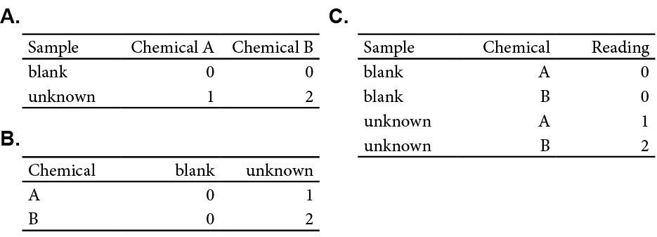

# Tidying Your Data


You might not have explicitly thought about how you store your data, whether working in *Excel* or elsewhere. Data is data after all. But having your data organized in a systematic manner that is conducive to your goal is paramount for working not only with R, but all of your experimental data. This chapter will introduce the concept of *tidy* data, and how to use some of the tools in the *dplyr* package to get there. Lastly we'll offer some tips for how you should record *your* data in the lab. A bit of foresight and consistency can eliminate hours of tedious work down the line. 

## What is tidy data?

Tidy data has "...each variable in a column, and each observation in a row..." [@wickham2014] This may seem obvious to you, but let's consider how data is often recorded in lab, as exemplified in Figure \@ref(fig:tidy-example)A. Here the instrument response of two chemicals (*A* and *B*) for two samples (*blank* and *unknown*) are recorded. Note how the samples are on each row and the chemical are columns. However, someone else may record the same data differently as shown in Figure \@ref(fig:tidy-example)B, with the samples occupying distinct columns, and the chemical rows. Either layout may work well, but analyzing both would require re-tooling your approach. This is where the concept of *tidy* data comes into play. By reclassifying our data into *observations* and *variables* we can restructure out data into a common format: the *tidy* format (Figure \@ref(fig:tidy-example)C).


```{r tidy-example, echo = FALSE, fig.cap="(A and B) The same data can be recorded in multiple formats. (C) The same data in the tidy format. Note how the tidy data typically has more rows, hence why it's sometimes refered to as 'long' data."}


```

In the *tidy* or *long* format, we reclassified out data into three variables (*Sample*, *Chemical*, and *Reading*). This makes the observations clearer as now we know we measured two chemicals (*A* and *B*) in two samples (*blank* and *unknown*) and we've explicitly declared the *Reading* variable for our measured instrument response, which was only implied in the original layouts. Moreover, we can read across a row to get the gist of one data point (i.e. "Our blank has a reading of 0 for Chemical A"). Again we haven't changed any information, we've simply reorganized our data to be clearer, consistent, and compatible with the `tidyverse` suit of tools. 

This might seem pedantic now, but as you progress you'll want to reuse code you've previously written. This is greatly facilitated by making every data set as consistently structured as possible, and the *tidy* format is an ideal starting place. 

## Tools to tidy your data

Now one of the more laborious parts of data science is tidying your data. If you can follow the tips in the [Tips for recording data] section, but the truth is you often won't have control. To this end, the `tidyverse` offers several tools, notable `dplyr` (pronounces 'd-pliers'), to help you get there. 

Let's revisit our spectroscopy data from the previous chapter:


```{r atr-ex-import2, echo=TRUE, message=FALSE}

atr_plastics <- read_csv("data/ATR_plastics.csv")

# This just outputs a table you can explore within your browser
DT::datatable(atr_plastics)


```


As we can see this our ATR spectroscopy results of several plastics, as recorded for a *CHM 317* lab, is structured similarly to the example in Figure \@ref(fig:tidy-example)A. The ATR absorbance spectra of the four plastics are recorded in separate columns. Again, this format makes intuitive sense when recording in the lab, and for working in Excel, but isn't the friendliest with R. When making plots with `ggplot`, we can only specify one `y` variable. In the example plot below it's the absorbance spectrum of `Polystyrene`. However, if wanted to plot the other spectra for comparison, we'd need to repeat our `geom_point` call.

```{r}
# Plotting Polystyrene absorbance spectra
ggplot(data = atr_plastics, 
       aes( x = wavenumber,
            y = Polystyrene)) +
  geom_point()

# Plotting Polystyrene and Polyethylene absorbance spectra
ggplot(data = atr_plastics, 
       aes( x = wavenumber,
            y = Polystyrene)) +
  geom_point() +
  geom_point(data = atr_plastics, 
             aes(x = wavenumber, 
                 y = Polyethylene))
```


### Making data 'longer'

While the code above works, it's not particularly handy and undermines much of the utility of `ggplot` because the data *isn't* tidy. Fortunately the `pivot_longer` function can easily restructure our data into the *long* format to work with `ggplot`. Let's demonstrate that: 

```{r}

atr_long <- pivot_longer(atr_plastics, cols = -wavenumber, 
               names_to = "sample",
               values_to = "absorbance")

# head() only prints the first couple of lines
head(atr_long)
```

Let's break down the code we've executed via the `pivot_longer` function:

1. `cols = -wavenumber` specifies that we're selecting every other column *but* wave number. 
    - we could have just as easily specified each column individually using `cols = c("EPDM",...)` but it's easier to use `-` to specify what we *don't* want to select. 
2. `names_to = "sample"` specifies that the column header (i.e. names) be converted into an observation under the `sample` column.
3. `values_to = "absorbance"` specifies that the absorbance values under each of the selected headers be placed into the `aborsbance` column. 

Now that we've reclassified out data into the 'longer', we can exploit the explicitly introduced *sample* variable to easily plot all of our spectra:

```{r}
ggplot(data = atr_long, 
       aes(x = wavenumber, 
           y = absorbance, 
           colour = sample)
       ) +
  geom_point()
```


We'll talk more about `ggplot` in the [Visualizations] chapter, but for now you can see how our code could scale to accommodate any number of different samples, whereas the previous attempt to plot the "wide" data would require an explicit call to each column. 

`pivot_longer` has many other features that you can take advantage of. We highly recommend reading the examples listed on the [pivot_longer page](https://tidyr.tidyverse.org/reference/pivot_longer.html) to get a better sense of the possibilities. For example it's common to record multiple observations in a single column header, i.e. `Chemical_A_0_mM`. We can exploit common naming conventions like this to easily split up these observations as shown below. 

```{r, echo = FALSE}

example <- data.frame("wavelength_nm" = c(488, 572) ,
                      "Chemical_A_0_mM" = c(0,0),
                      "Chemical_A_1_mM" = c(1,5),
                      "Chemical_B_0_mM" = c(2,7),
                      "Chemical_B_1_mM" = c(NA,20)
                      )

```


```{r}
head(example)


example_long <- pivot_longer(example,
   cols = starts_with("Chemical"),
   names_prefix = "Chemical_",
   names_to = c("Chemical", "Concentration", "Conc_Units"),
   names_sep = "_",
   values_to = "Absorbance",
   values_drop_na = TRUE
 )

head(example_long)
  
```

### Making data 'wider'

Sometimes packages or circumstances will require you reformat your data into a matrix or 'wide' format (notable the `matrixStats` and `matrixTests` packages). You can accomplish this using the `pivot_wider` function, which operates inverse to the `pivot_longer` function described above. For example the input `names_from` is used to specify which variables are to be converted to headers. You can read up on the `pivot_wider` function [here](https://tidyr.tidyverse.org/reference/pivot_wider.html)

### Selection helpers

As you've already seen, there are multiple ways to select columns and variables with the `dplyr` package. For a complete rundown of other useful helper functions please see [Subset columns using their names and types](https://dplyr.tidyverse.org/reference/select.html). `starts_with()` for selecting columns from a prefix, and `contains()` for selecting columns that contain a string are two of the most useful. 

### Seperating columns

Sometimes your data has already been recorded in a tidy-ish fashion, but there may be multiple observations recorded under one apparent variable, something like `1 mM` for concentration. As it stands we cannot easily access the numerical value in the concentration recording because R will encode this as a string due to the `mM`. We can **separate** data like this using the `seperate` function, which operates similarly to how `pivot_longer` breaks up headers. 

```{r, echo = FALSE}

sep_example <- data.frame("sample" = c("Toronto_O3_1","Toronto_O3_2", "Toronto_NO2_1"), 
                          "reading" = c("10", "22", "30"))

```

```{r}
# Example with multiple encoded observations
sep_example
```

The example above is something you'll come across in the lab, most often with the sample names you'll pass along to your TA where you crammed as much information as possible into that name so you and your TAs know exactly what's being analyzed. In this example, the sample name contains the location (`Toronto`), the chemical measured (`O3` or `NO2`) and the replicate number (i.e. `1`). Using the `seperate` function we can split up these three observations so we can properly group our data later on in our analysis.

```{r}
# Separating observations

sep_data <- separate(sep_example,
    col = sample, 
    into = c("location", "chemical", "replicateNum"),
    sep = "_",
    remove = TRUE, 
    convert = TRUE)

sep_data

```
Again, let's break down what we did with the `separate` function: 

1. `col = sample` specifies we're selecting the `sample` column
2. `into = c(...)` specifies what columns we're separating our name into. 
3. `sep = "_"1` specifies that each element is separated by an underscore (`_`); you can use `sep = " "` if they were separated by spaces. 
4. `remove = TRUE` removes the original sample column, no need for duplication; setting this to `FALSE` would keep the original column. 
5. `convert = TRUE` converts the new columns to the appropriate data format. In the original column ,the replicate number is a character value because it's part of a string, `convert` ensures that it'll be converted to a numerical value. 

Another example why it's paramount to **be consistent when recording data**. 

### Uniting/combining columns 

The opposite of the `separate` function is the `unite` function. You'll use it far less often, but you should be aware of it as it may come in handy. You can use it for combining strings together, or prettying up tables for publication/presentations as shown in [Summarizing Data]. 

```{r, warning=FALSE}
# Uniting observations

united_data <- unite(sep_data,
                     col=sample_reunited,
                     location:chemical:replicateNum, 
                     sep = "_",
                     remove = TRUE)

united_data

```

You can read more about the `unite` function [here](https://tidyr.tidyverse.org/reference/unite.html).

### Renaming columns/headers

Sometimes a name is lengthy, or cumbersome to work with in R. While something like `This_is_a_valid_header` is valid and compatible with R and tidyverse functions, you may want to change it to make it easier to work with (i.e. less typing). Simply use the `rename()` function:

```{r, echo = FALSE}
badHeader <- data.frame("UVVis_Wave_Length_nM" = c(500, 501),
                        "Absorbance" = c(1, 0.999))

```

Inspect the original column names:
```{r}
colnames(badHeader)
```

Use `rename()` to change the column name and save the result to a new dataframe:
```{r}
renamed_data <- rename(badHeader, wavelength_nM = UVVis_Wave_Length_nM)

# Inspect the column names of the renamed dataframe
colnames(renamed_data)
```

### Chaining multiple operations

So far we learned some standalone functions that can tidy up your data. But what if you want to do multiple of these operations to a dataset? 

Let's start by talking about the seemingly intuitive but tedious approach. We can transform data by breaking down the process into individual steps:

```{r}
selected_data <- select(atr_plastics, wavenumber, EPDM, `Sample: Shopping bag`)
longer_data <- pivot_longer(selected_data, cols = -wavenumber, names_to = "Material_Type", values_to = "Value")
atr_plastics_transformed <- rename(longer_data, Wave_Num = wavenumber)

atr_plastics_transformed

```

Now, let's see how we can transform the same `atr_plastics` tibble using the `%>%` operator by chaining operations.

```{r}
atr_plastics_transformed <- atr_plastics %>%
    select(wavenumber, EPDM, `Sample: Shopping bag`) %>%
    pivot_longer(cols = -wavenumber, names_to = "Material_Type", values_to = "Value") %>%
    rename(Wave_Num = wavenumber)

atr_plastics_transformed
```

We will formally introduce the unfamiliar operator `%>%` (pipe) in the next chapter (check out 12.6 if interested). For now, just remember that there is a way to chain your functions like the above example!


## Tips for recording data

In case you haven't picked up on it, tidying data in R is much easier if the data is recorded consistently. You can't always control how your data will look, but in the event that you can (i.e. your inputting the instrument readings into *Excel* on the bench top) here are some tips to make your life easier: 

- *Be consistent*. If you're naming your samples make sure they all contain the same elements in the same order. The sample names `Toronto_O3_1` and `Toronto_O3_2` can easily be broken up as demonstrated in [Separating columns]; `O3_Toronto_1`, `TorontoO32`, and `Toronto_1` can't be. 
- *Use as simple as possible headers*. Often you'll be pasting instrument readings into one `.csv` using *Excel* on whatever computer records the instrument readings. In these situations it's often much easier to paste things in columns. Recall the capabilities of `pivot_longer` and how you can break up names as described in [Making data 'longer']. `Chemical_A_1` and `Chemical_B_2` are headers that are descriptive for your sample and can be easily pivoted into their own columns. `Chemical A 1 ( I think?!)` is a header that isn't.
- *Make sure data types are consistent within a column*. This harks back to the [Importing data into R] chapter, but a single non-numeric character can cause R to misinterpret an entire column leading to headaches down the line. 
- *Save your data in UTF-8 format*. Excel and other programs often allow you to export your data in a variety of `.csv` encodings, but this can affect how R reads when importing your data. Make sure you select `UTF-8` encoding when exporting your data. 

## Further reading

As always, the *R for Data Science* book goes into more detail on all of the elements discussed above. For the material covered here you may want to read [Chapter 9: Tidy Data](https://r4ds.had.co.nz/tidy-data.html).

`r if (knitr:::is_html_output()) '## Chapter References'`

```{r child='end-of-chapter-exercise-temp.Rmd'}
```